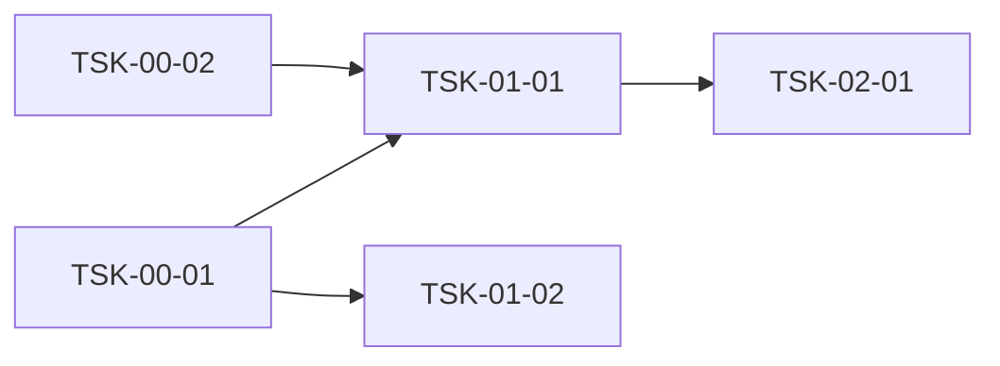

# 출력 형식 상세 (dflow-wbs 동봉 정본)

플러그인 `dev:wbs-wsf` 원본(dev 1.7.1)에서 발췌·정리한 것이다. 원본과 달라진 점:
**상태 어휘와 category 값은 SKILL.md 가 우선한다** — 상태는 항상 `[ ]`(전이 정본 = D'Flow),
category 는 7종 약어(`dev`/`defect`/`infra`/`feat`/`design`/`research`/`itest`).
원본의 `development`·`infrastructure`·`integration-test` 표기는 여기서 이미 치환했다.

## Task 속성 목록

| 구분 | 필드 | 포맷 |
|------|------|------|
| **단일행 스칼라** | category, domain, model, status, priority, assignee, schedule, tags, depends, blocked-by, note, entry-point, prd-ref | `- field: value` |
| **리스트** (CSV 또는 bullet) | requirements, acceptance, constraints, test-criteria, tech-spec, api-spec, data-model, ui-spec | `- field: v1, v2` 또는 다음 줄에 `  - item` |

- **리스트 필드 파싱 규칙** (`wbs-parse.py parse_list_field`):
  - `- field: -` → 빈 리스트
  - `- field: a, b, c` → 인라인 CSV, `["a", "b", "c"]`
  - `- field:` + 다음 줄의 `  - item` 라인들 → bullet 리스트 (다음 `- name:` 필드나 빈 줄에서 종료)
- **단일행 필드**는 값에 콤마가 있어도 분할하지 않는다(`get_field`). 리스트 성격 값은 반드시 리스트 필드로 선언하라.
- JSON 출력의 키는 하이픈이 언더스코어로 치환된다 (`blocked-by` → `blocked_by`, `entry-point` → `entry_point`).
- `entry-point`는 domain 이 `fullstack` 또는 `frontend`인 Task 에서 **필수**.

## Task 블록 형식 (기능 Task 예)

```markdown
### TSK-02-01: {Task명}
- category: dev
- domain: fullstack
- model: {opus 또는 sonnet}
- status: [ ]
- priority: high
- assignee: -
- schedule: {시작일} ~ {종료일}
- tags: {관련 태그}
- depends: -
- blocked-by: -
- entry-point: {메뉴/사이드바/라우트 — fullstack·frontend 필수, backend는 '-'}
- note: -

#### PRD 요구사항
- prd-ref: {PRD 섹션 참조 | program:{프로그램ID}}
- requirements:
  - {요구사항 1}
  - {요구사항 2}
- acceptance:
  - {인수조건 1}
  - {인수조건 2}
- constraints:
  - {제약사항}
- test-criteria:
  - {검증 기준 (선택)}

#### 기술 스펙 (TRD)
- tech-spec:
  - {기술 스택}
- api-spec:
  - {API 엔드포인트, 스키마}
- data-model:
  - {엔티티, 필드, 관계}
- ui-spec:
  - {UI 구성 요소 (fullstack/frontend 한정)}
```

⚠️ 4단계(`#### TSK-`)에서는 명세 블록 헤딩이 `#####` 다 — SKILL.md `### 명세 블록 파싱 계약` 규칙 1.

## 통합테스트 Task 형식

```markdown
## WP-{마지막 번호}: 통합테스트
- schedule: {시작일} ~ {종료일}
- description: 기능 간 시나리오 E2E·성능·권한 교차 검증 (개별 기능 재검증 아님)

### TSK-{NN}-01: {시나리오 묶음명 — 예: 등록→집계→리포트 흐름}
- category: itest
- domain: test
- model: sonnet
- status: [ ]
- priority: high
- assignee: -
- schedule: {시작일} ~ {종료일}
- tags: integration, e2e
- depends: {시나리오가 관통하는 대표 기능 Task들}
- entry-point: -

#### PRD 요구사항
- requirements:
  - {기능 간 흐름 시나리오}
- acceptance:
  - {시나리오 통과 기준}
  - 발견 결함은 해당 기능 WP에 defect Task로 등록됨
```

## 의존 그래프 챕터

> 의존 그래프 검증 결과를 이 섹션에 기록한다. 파일의 **가장 마지막 챕터**로 배치한다(모든 WP·Task 블록 뒤). Mermaid 블록은 `mermaid` 펜스를 사용한다.

### 그래프 (Mermaid)



노드 스타일 규칙:
- 계약 전용 Task 는 `style TSK-00-02 fill:#e8f5e9,stroke:#2e7d32`
- 구현 포함 선행 Task 는 `style TSK-00-03 fill:#fff3e0,stroke:#e65100`
- 리뷰 후보(아래 `review_candidates`)는 `style TSK-XX stroke:#c62828,stroke-width:2px`

### 통계

| 항목 | 값 | 임계값 |
|------|-----|--------|
| 최장 체인 깊이 | {max_chain_depth} | 3 초과 시 검토 (공정 양끝 +2 는 구조 비용 허용) |
| 전체 Task 수 | {total} | — |
| Fan-in ≥ 3 Task 수 | {fan_in_ge_3_count} | 계약 추출 후보 (모듈 계약·itest Task 는 구조적 예외) |
| Diamond 패턴 수 | {diamond_count} | 자주 발생 시 apex 계약 추출 |

**Fan-in Top 5**: `| Task | Fan-in | 계약 추출 가능? |` 표.

**Diamond 패턴**: `| Apex | 분기 | Merge |` 표.

### 리뷰 후보 (review_candidates)

각 후보에 대해 "계약 추출로 해소 가능한지" 또는 "진짜 구현 의존이라 유지하는지"를 명시한다.

| Task | 신호 | 판정 | 근거 |
|------|------|------|------|
| TSK-02-03 | depends=5 | 유지 | 실제 5개 시스템 상태 변경을 원자적으로 조합해야 함 |
| TSK-02-07 | fan-in=6 | 분리 | `session` 타입만 공유 → 계약 전용 Task 신설 |

**후보가 없으면 "검토 결과 후보 없음"이라고 명시한다.** 이 섹션을 비워두지 않는다.
