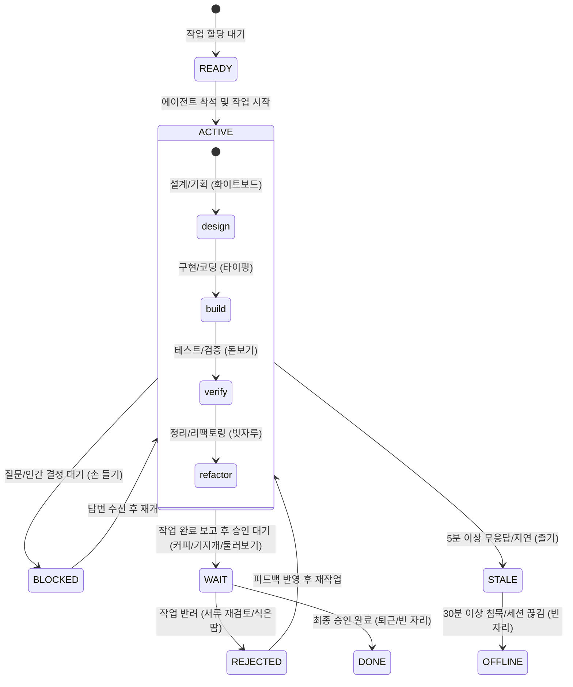

# 에이전트 좌석표 스프라이트 제작 가이드 (Sprite Guide)

외부 툴(AI 이미지/비디오 생성기, 픽셀 아트 툴 등)에서 애니메이션을 제작할 때 참고할 수 있도록, **가상 오피스의 모든 업무 상황(State)과 캐릭터별 상세 연출 가이드**를 정리한 문서입니다.

---

## 1. 필수 기술 규격 (Quick Spec)

| 항목 | 규격 | 비고 |
|---|---|---|
| **포맷** | 투명 배경 PNG (`RGBA`) | 픽셀 아트(Pixel Art) 스타일 |
| **기본 프레임 셀** | **96 × 96 px** | 정사각형 1셀 기준 |
| **4프레임 시트** | **384 × 96 px** | 가로 1열 스트립 (`96 × 4`) |
| **6프레임 시트** | **576 × 96 px** | 가로 1열 스트립 (`96 × 6`) |
| **빈 의자 (`empty.png`)** | **96 × 96 px** | 1프레임 정지 이미지 |
| **기본 구도** | 책상 앞 착석, 좌측 모니터 응시 | 우측 좌석은 CSS `transform: scaleX(-1)`로 자동 반전 |

---

## 2. 가상 오피스 전체 상황 (Situations & States)

가상 오피스 좌석표에서는 AI 에이전트의 실제 작업 라이프사이클에 따라 **총 8가지 상태**가 발생합니다.



---

## 3. 상황별 상세 연출 & 프롬프트 가이드

### ① 업무 중 상황 (ACTIVE) — 4프레임 (`384 × 96 px`)
에이전트가 실제 작업을 수행하는 4단계 Phase입니다.

| 상황 (Phase) | 파일명 | FPS | 상황 설명 및 감정 | 연출 & 프롬프트 키워드 |
|---|---|:---:|---|---|
| **설계/기획** | `design.png` | 6 | 작업 시작 전 요구사항을 분석하고 아키텍처를 구상하는 단계 | 한 손에 **화이트보드(또는 설계도/차트)**를 들고 펜으로 짚어가며 고민하는 모습 |
| **구현/코딩** | `typing.png` | 8 | 실제로 코드를 집중해서 작성하는 메인 빌드 단계 | 키보드 위에서 손가락이 바쁘게 움직이고, 모니터 불빛을 받으며 집중하는 표정, 눈 깜빡임 |
| **검증/테스트** | `verify.png` | 4 | 단위 테스트를 돌리고 코드 결함이나 버그를 찾는 단계 | 큰 **돋보기**를 들고 모니터를 가까이 들여다보며 눈을 가늘게 뜨고 확인하는 모습 |
| **리팩토링** | `refactor.png` | 6 | 코드 정리, 린트 수정, 찌꺼기 파일 정리 단계 | 작은 **빗자루나 먼지떨이**를 들고 모니터/책상 주변을 쓱싹쓱싹 쓸어내는 청소 모션 |

---

### ② 승인 대기 상황 (WAIT) — 6프레임 (`576 × 96 px`)
작업을 모두 마치고 PR을 올린 뒤, **사람(팀장/리뷰어)의 승인을 기다리며 휴식**하는 여유로운 상황입니다. 웹 화면에서는 10초마다 세 가지 동작이 랜덤/순환 재생됩니다.

| 상황 | 파일명 | FPS | 상황 설명 및 감정 | 연출 & 프롬프트 키워드 |
|---|---|:---:|---|---|
| **커피 타임** | `idle_coffee.png` | 4 | 한숨 돌리며 따뜻한 차나 커피를 마시는 여유 | 김이 모락모락 피어오르는 머그잔을 두 손으로 감싸 쥐고 호로록 마시는 모션 |
| **기지개** | `idle_stretch.png` | 4 | 오래 앉아 굳은 몸을 스트레칭하는 모습 | 양팔을 머리 위로 쭉 뻗으며 등을 젖혀 기지개를 켜고 하품하는 모습 |
| **둘러보기** | `idle_look.png` | 3 | 모니터에서 눈을 떼고 사무실 주변을 두리번거림 | 고개를 좌우로 천천히 돌려 사무실을 구경하거나 멍때리며 윙크/눈 깜빡이는 모습 |

---

### ③ 문제 및 대기 상황 (BLOCKED, STALE, REJECTED) — 4프레임 (`384 × 96 px`)

| 상황 | 파일명 | FPS | 상황 설명 및 감정 | 연출 & 프롬프트 키워드 |
|---|---|:---:|---|---|
| **질문 / 결정 대기<br>(BLOCKED)** | `blocked.png`<br>*(스펙 권장)* | 4 | "어느 DB를 쓸까요?", "외부 API 키가 필요합니다"처럼 **사람에게 질문하고 답을 기다리는 상황** | 책상에서 **한 손(또는 양손)을 번쩍 들고** 눈을 반짝이며 질문/발언을 요청하는 모션 (화면에선 물음표 말풍선과 함께 뜸) |
| **무응답 / 지연<br>(STALE)** | `stale.png` | 2 | 명령 실행 중 멈췄거나 5분 이상 신호가 끊긴 상태 | 고개를 푹 숙이고 책상에 엎드리거나, 꾸벅꾸벅 졸면서 머리 위에 `zzz` 거품이 떠오르는 모습 |
| **작업 반려<br>(REJECTED)** | `rejected.png` | 6 | PR이 Reject되어 피드백을 보고 당황/재작업해야 하는 상태 | 빨간색 'REJECT' 도장이 찍힌 서류를 들고 삐질삐질 식은땀을 흘리거나 머리를 긁적이는 모습 |

---

### ④ 빈 자리 상황 (READY, OFFLINE, DONE) — 1프레임 (`96 × 96 px`)
- **`empty.png`**: 캐릭터가 앉아있지 않은 빈 의자와 책상만 있는 정지 이미지입니다.
  - **READY**: 새 작업 할당 대기 중 (책상에 점선 표시)
  - **OFFLINE**: 30분 이상 접속 끊김으로 자리를 비운 상태 (붉은 경고 테두리)
  - **DONE**: 작업 승인 완료로 퇴근한 상태

---

## 4. 캐릭터 4종 외형 가이드 (`<character_name>`)

기준 원본 이미지: `assets/sprites/<character_name>/base.png`

```text
1. cat_dev (삼색 냥이 개발자)
   - 종족/외형: 삼색 고양이 (Calico cat), 통통한 뺨, 호기심 많은 눈망울
   - 복장: 둥근 뿔테 안경, 초록색 워크 셔츠/자켓, 목에 사원증 스트랩
   - 소품: 물고기 모양 머그잔

2. monitor_bot (CRT 모니터봇)
   - 종족/외형: 레트로 컴퓨터 모니터 머리 (화면에 ^v^ 녹색 발광 픽셀 표정), 상단 스프링 안테나
   - 복장: 코발트 블루 후드티, 회색 로봇 장갑 손
   - 책상: 레트로 기계식 키보드와 마우스

3. human_dev (인간형 테크 개발자)
   - 종족/외형: 갈색 헝클어진 머리, 짙은 뿔테 안경, 피곤하지만 집중한 인상
   - 복장: 짙은 다크 네이비 후드티, 넥밴드 무선 이어폰
   - 책상: 텐키리스 키보드

4. dome_bot (미니 돔 안드로이드)
   - 종족/외형: 투명한 유리 돔 헬멧 속에 빛나는 눈을 가진 귀여운 안드로이드
   - 복장: 깔끔한 화이트 셔츠에 단정한 스트라이프 넥타이 (모범생 오피스 룩)
   - 책상: 깔끔한 알루미늄 슬림 키보드
```

---

## 5. 저장 경로 및 구조

완성된 이미지는 아래 경로에 그대로 복사/덮어쓰기하면 웹에 즉시 반영됩니다:

```text
public/sprites/
├── empty.png                         # 빈 의자 (96x96)
└── <character_name>/                 # cat_dev, monitor_bot, human_dev, dome_bot
    ├── manifest.json                 # 애니메이션 메타데이터
    │
    │── [ACTIVE: 384x96 (4프레임)]
    ├── typing.png                    # 코딩/빌드
    ├── design.png                    # 기획/설계도
    ├── verify.png                    # 검증/돋보기
    ├── refactor.png                  # 정리/빗자루
    │
    │── [WAIT: 576x96 (6프레임)]
    ├── idle_coffee.png               # 커피 마시기
    ├── idle_stretch.png              # 기지개 켜기
    ├── idle_look.png                 # 좌우 둘러보기
    │
    │── [ISSUE: 384x96 (4프레임)]
    ├── stale.png                     # 무응답 졸기
    ├── rejected.png                  # 반려 서류 식은땀
    └── blocked.png                   # 손 들고 질문 (신규 추가 권장)
```

---

## 6. 프레임 합치기 스크립트 (CLI One-liner)

외부 생성기에서 프레임별 낱개 이미지(`01.png`, `02.png`, ...)로 뽑은 경우, 터미널에서 바로 가로 스트립 PNG로 합치는 명령어:

```bash
# Python을 이용한 가로 스트립 시트 생성
python3 -c "
from PIL import Image; import glob
files = sorted(glob.glob('frame_*.png'))
imgs = [Image.open(f).resize((96, 96)) for f in files]
strip = Image.new('RGBA', (96 * len(imgs), 96), (0,0,0,0))
for i, im in enumerate(imgs): strip.paste(im, (i * 96, 0))
strip.save('result_strip.png')
print(f'완료: {strip.size[0]}x{strip.size[1]} ({len(imgs)}프레임)')
"
```
