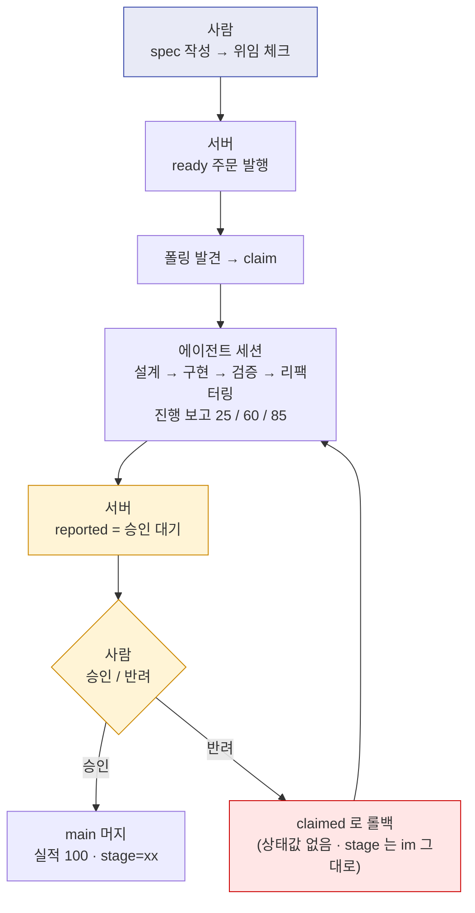
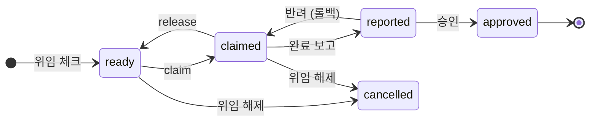
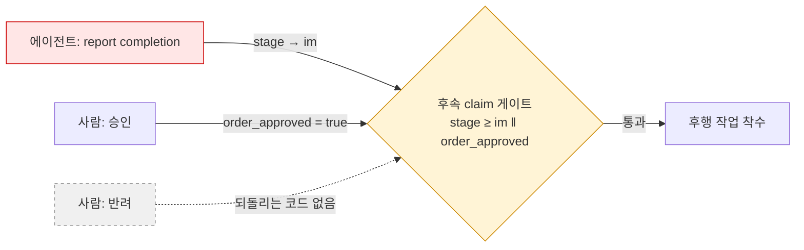
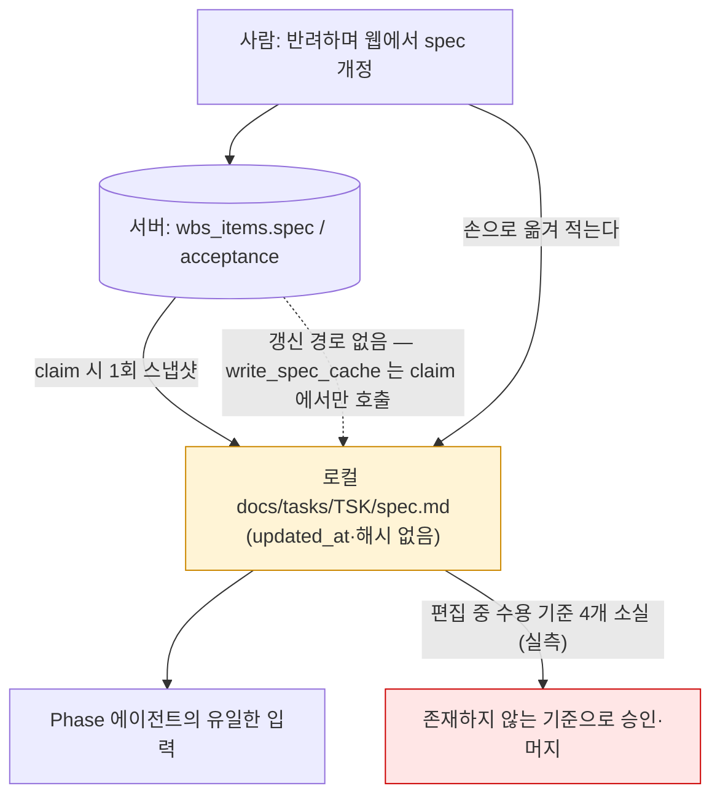
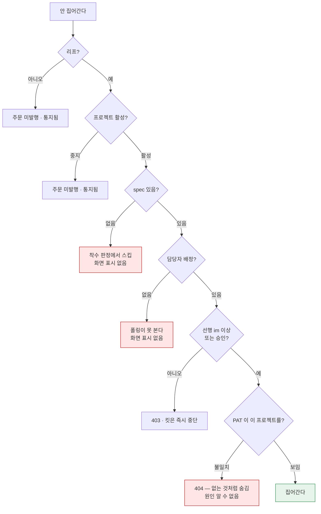

# 에이전트에게 개발을 시킨다 — 설정·프로세스와 문제점

작성 2026-08-26 · 대상 독자: D'Flow 에이전트 루프를 쓰거나 넓히려는 사람

> **이 문서가 다루는 것**: D'Flow 가 WBS 작업을 "주문"으로 발행하고 Claude Code 세션이 그것을
> 집어 설계→구현→검증→보고까지 돌린 뒤 사람이 승인하는 방식. 그 **설정·사용법·프로세스**와,
> 두 번의 실제 리허설에서 드러난 **내재적 문제·사용상 문제**.
>
> **검증 방법**: 두 개의 다중 에이전트 워크플로(각 15 에이전트, 총 630회 도구 호출, 226만 토큰).
> 조사자가 낸 문제 49건은 **반대편에서 따로 검증했다** — "이건 문제가 아니다"에서 출발해 반증을
> 시도했다. 결과는 확정 19 · 부분확정 28 · **반증 2** · 검증 중 신규 발견 27 이다. 각 항목이 **이번만 생긴 일인지, 계속 생길 일인지, 설계상 피할 수 없는 일인지**를
> 갈라서 판정했고, "이번만"으로 판정된 1건은 본문에서 뺐다.
> 그중 **핵심 10건은 문서 작성자가 직접 재현**했다(§9 재현 로그). 재현하면서 조사에서 나온 항목 두
> 건을 정정했다 — 하나는 더 심각한 쪽으로, 하나는 측정 오류였다.

---

## 0. 한 페이지 요약

**실증된 것**: mes-runlog 리허설에서 작업 8건이 전부 완주해 main 에 머지됐다. 결과물로 테스트 149건과
E2E 5건이 함께 나왔고, 품질을 강제하는 장치가 없는데도 산출물은 쓸 만한 수준이었다.
**이 방식은 작동한다.** 단 그 8건은 서로 다른 8개 버전의 프로세스로 돌았다(§8) —
"이 프로세스가 검증됐다"가 아니라 "이 방향이 굴러간다"까지가 실증 범위다.
그리고 기준을 "1건 이상"처럼 최소치로 적으면 **에이전트는 딱 그만큼만 채운다.**

**그러나 8건 중 사람 개입 없이 끝난 사이클은 0건이고**, 승인 클릭을 제외한 "계획에 없던 개입"이
필요했던 사이클이 **6건**이다. 사이클이 걸쳐 있던 20시간에서 사람이 손을 뗀 밤 시간을 빼면, 에이전트가 실제로 일한 시간은 그
활동 구간의 **48%**뿐이다. 나머지 절반은 승인 대기와 수습이다.

문제 74건을 "왜 생기나"로 묶으면 뿌리는 여섯이다:

| | 근본 원인 | 한 줄 |
|---|---|---|
| **A** | 검사를 못 해도 "통과"로 나온다 | 도구가 아무것도 못 읽었을 때도 초록을 준다 |
| **B** | 성적표를 시험 본 쪽이 쓴다 | 한 사이클에서 바깥이 알려주는 사실은 딱 두 개다 |
| **C** | 서버가 "반려"를 상태로 안 갖고 있다 | 없는 상태를 피해 가려다 안전장치가 느슨해졌다 |
| **D** | 도중에 말을 걸 수 없다 | 물어보기도, "그거 틀렸는데요"도 보낼 방법이 없다 |
| **E** | 요구사항이 착수 순간 사진 찍혀 굳는다 | 원본은 git 밖에 있고, 고친 내용이 되돌아오지 않는다 |
| **F** | WBS 가 실제 실적을 못 받는다 | 아무 근거도 없는 25/60/85 가 주간보고 숫자가 된다 |

**결론**: 네 조건이 맞으면 쓸 만하다 — ① 새 파일을 더해 가는 작업 ② 테스트를 돌릴 준비가 이미
된 리포 ③ "다 됐다"를 테스트로 판정할 수 있는 작업 ④ **사람이 자리에 있을 것**. ④는 권고가 아니라
조건이다.

반대로 이런 데서는 실제로 사고가 났다 — **다 됐는지를 테스트로 못 가리는 작업**(화면·디자인),
**세션이 실행할 수 없는 걸 요구하는 작업**(CI·배포·성능), **최소치로 적은 수용 기준**.
**사람 없는 야간 무인 폴링**은 성격이 다르다: 사고가 난 게 아니라 애초에 그걸 감당할 러너가 없다.

그리고 **기존 코드를 고치는 작업은 두 리허설을 합친 12건 중 한 건도 없었다** — 지금의 통과 기준
("테스트 개수가 줄지 않았을 것")이 한 번도 시험대에 오른 적이 없다는 뜻이다.

---

## 1. 구조 — 누가 무엇을 하는가



노란 두 칸이 **사람을 기다리는 구간**이다. 승인은 비동기 이벤트라 세션 안에서 기다릴 수 없다 —
리허설에서 이 대기가 2분에서 11시간 22분까지 벌어졌다(§4).

세 층이 각각 다른 것을 강제한다.

| 층 | 강제하는 것 | 강제하지 못하는 것 |
|---|---|---|
| 서버 | 배정자 일치, 선행 stage, 상태 전이 CAS, 소유(claimed_by_user_id) | 스펙 실재, 수용 기준 검증, 보고 내용의 진실성 |
| 킷(스킬) | Phase 순서, 게이트 집행 절차, 커밋 규칙 | 아무것도 — **전부 산문이다**(§3-A) |
| 사람 | 승인/반려 | 사이클 도중 개입(채널이 없다 — §3-D) |

### 주문 상태 — 그리고 존재하지 않는 상태



**`rejected` 라는 상태는 없다.** 반려는 `claimed` 로 롤백될 뿐이라 일반 claimed 와 구분되지 않고,
화면의 "반려됨" 라벨은 도달 불가능한 죽은 키다. 폴링은 `reports[-1].review_action` 을 파서 추정한다.
그리고 `approved` 는 "활성 주문"에 포함되지 않아 백필이 **끝난 항목에 주문을 다시 낸다**(§3-C).

---

## 2. 설정 — 0에서 첫 위임까지

### 2.1 서버 쪽 (D'Flow 관리자)

| 항목 | 값·위치 | 근거 |
|---|---|---|
| 전체 스위치 | `AGENT_API_ENABLED=true` — 아니면 **모든 API 가 404**(아예 없는 것처럼 숨긴다) | `src/lib/agent/externalApi.ts:13,142` |
| 레거시 시크릿 | `AGENT_API_SECRET` — 있으면 v1 경로가 열린다. PAT 만 쓸 거면 불필요 | `externalApi.ts:149-150` |
| 프로젝트 활성 | 위임 체크가 **자동으로** 켠다. 수동 스위치는 "에이전트 중지"뿐 | `src/app/actions/wbsSpec.ts:250-253`, `agentWork.ts:33` |
| 권한 | 위임·활성·승인 전부 **프로젝트 관리자** | `wbsSpec.ts:227`, `agentWork.ts:35` |

### 2.2 토큰(PAT)

`/account` → 발급. 스코프는 이제 **둘뿐**이다: `work:read`(조회) · `work:claim`(claim/release/
완료보고/WBS import). `work:report` 는 2026-08-25 에 폐지돼 `work:claim` 에 흡수됐다 —
이미 발급된 옛 토큰의 `work:report` 는 서버가 `work:claim` 과 동등하게 받아준다
(`externalApi.ts:LEGACY_EQUIVALENT`). 평문은 발급 직후 1회만 보인다.

`agent_runners` 테이블에 **RLS 정책이 0건**이다 — 발급 서버 액션이 유일한 관문이다
(`src/app/actions/agentTokens.ts` 주석).

### 2.3 킷(스킬) 설치 — 에이전트를 돌릴 PC

대상 리포 루트에 `.claude/skills/dflow-*` 를 둔다(원본은 wbs-web 에 있고 `scripts/kit-build.sh` 로 배포한다).
그다음 리포 루트 `.env` 에 아래 셋을 넣는다:

```bash
DFLOW_API_BASE=https://dflow-staging.vercel.app     # 또는 운영 URL
DFLOW_PATS=dflow_pat_xxxxxxxxxxxx_yyyy...           # 여러 개면 개행 구분
DFLOW_PROJECT_MAP=/절대/리포경로=<프로젝트UUID>
```

⚠ **문서에 없는 필수 사항 둘** — 둘 다 이번 조사에서 확인됐다.
1. 어느 스킬 문서도 "`.env` 를 소싱하라"고 말하지 않는데 `dflow.sh` 는 env 없이 첫 줄에서 죽는다.
   Bash 도구 호출 사이에는 셸 환경이 유지되지 않으므로, 매 호출마다 명령 앞에 `.env` 소싱을 붙여야 한다.
2. **`dflow.sh doctor` 는 아무것도 검사하지 않는다** — 토큰이 1개면 검사 루프가 0회 돌고 exit 0.
   §9-① 에서 직접 재현했다. 설치 확인 수단이 실제로는 없다.

### 2.4 입력(WBS) 준비 — 여기가 진짜 설정이다

에이전트가 집어갈 수 있는 항목의 조건: **리프**(하위 없음) + `dev_workflow` ON + `tags:agent` +
**`spec` 본문 존재** + **담당자 배정**. 이 중 담당자가 빠지면 폴링이 영원히 못 본다 —
`poll.sh:101` 이 `--scope assigned` 로 고정돼 있고 `--scope` 는 옵션 파서에 아예 없다(§9-⑦).

실제 입력 규모: 리허설에서 항목당 spec 은 **6~14줄**이었다. 그 입력에서 design.md **179~905줄**이
나온다. **열 배에서 백 배 넘게 불어난다** — 여기가 §3-D 의 출발점이다.

---

## 3. 근본 원인 여섯 — 74건이 여기서 나온다

### A. 검사를 못 해도 "통과"로 나온다

이 킷의 검사 도구들은 **입력을 한 줄도 못 읽었을 때** 그 사실을 말할 방법이 없다.
그래서 `exit 0`(정상 종료)이 "검사해 봤는데 괜찮다"가 아니라 **"할 말이 없다"**에 가깝다.

가장 날카로운 사례 — `wbs-validate.py` 의 Task 인식 정규식은 `^#{3,5}\s+TSK-...:` 인데
nlevel 계약은 Task 를 `- [ ] TSK-` 리스트 항목으로 쓴다. 실제 형식의 파일을 넣으면:

```json
{"ok": true, "summary": {"total": 0, "task_count": 0}, "issues": []}   EXIT=0
```

**한 글자도 못 읽은 것과 아무 문제 없는 것이 똑같은 화면으로 나온다.** 그런데
`dflow-export/SKILL.md:46` 은 이것을 "### 1. 검증 게이트 (실패 시 중단)"으로 세워 두었다.
(§9-③ 재현. 참고로 헤딩 형식으로 넣으면 `ok:false` + exit 1 로 정상 동작한다 — 즉 exit code
계약 자체는 살아 있고, **0건 파싱만 초록으로 새는 것**이 결함이다. 조사 단계에서 "exit code 가
아예 작동 안 한다"는 더 센 주장이 나왔으나 파이프 없이 다시 재서 정정했다.)

같은 형태가 층마다 반복된다:

- `doctor` 가 인증·계약 검증을 **0회** 하고 초록 (§9-①)
- 계약 버전 검사가 `"2.0"` 을 보는데 서버 쪽 실제 값은 `2.1` (`dflow.sh:277` vs `externalApi.ts:121`)
- `poll.sh:114` 의 `jq` 파이프는 `dflow.sh` 가 죽어도 종료 코드가 jq 의 것으로 잡혀서 "태그 없음"으로 조용히 넘어간다
- nlevel 검증기 15종 검사에 `requirements`·`acceptance` 검사가 없는데 SKILL.md 는 있다고 보증한다

**결과**: 문서가 "여기서 멈춰라"라고 적어도, 도구가 초록을 주는 한 사람도 LLM 도 "초록이니 통과"라고
판단한다. 그 판단은 도구가 아무것도 못 읽은 경우에 그대로 틀린다. 자동화는 확인 부담을 도구로
넘기려는 것인데, 이 설계에서는 도구가 실패를 좀처럼 알리지 않는다. 부담이 그대로 남고 거기에
**도구 출력을 해석하는 부담이 더해진다.**

### B. 성적표를 시험 본 쪽이 쓴다

한 사이클이 남기는 기록은 설계 문서든 상태 파일이든 커밋 메시지든 전부 **에이전트가 직접 쓴 것**이다.
바깥에서 오는 사실은 딱 둘 — **테스트가 통과했는지**, 그리고 **사람이 승인 버튼을 눌렀는지**.

- 에이전트 세션의 총괄이 테스트를 직접 돌리는 규칙(`dev-discipline.md:11-12`)이 있어서 "제가 다 했습니다"라는
  자기 보고를 한 겹 걷어낼 수 있다. 그런데 **무엇과 비교할지(기준 숫자)**와 **무엇을 테스트하기로 했는지(범위)**는 여전히
  같은 에이전트가 쓴 문서에서 온다.
- 기준선이 특히 약하다. 기준선을 브랜치 전환 직후에 재는 탓에 설치된 의존성은 이전 브랜치 것
  그대로인데, 기준선 절차에는 설치·동기화 단계가 없다. 실제로 TSK-02-01 이 zod 미설치로 2파일 적재에 실패했다 — 이번엔 사람이
  알아챘지만, 못 알아챘다면 기준선이 낮아진 채로 "테스트 개수가 줄지 않았다"·"새로 실패한 테스트 0" 두 조건이 그대로 성립한다.
  **오차 방향이 항상 관대한 쪽이다.**
- 게이트 판정이 흔적을 남기지 않는다. 서버로 가는 것은 percent 와 요약 문자열뿐이고, exit code·
  로그를 담을 필드가 없다. `evidence.checks` 는 스키마가 받는데 **채워 넣는 코드가 0건**이다.
- **승인 화면에 뜨는 건 결국 에이전트가 쓴 요약 한 단락뿐이다.** `evidence` 는 저장되지만 승인 화면 select 에
  없고(§9-⑤), 링크는 리포 루트 하나뿐이다. 승인하는 시점의 main 에는 심사할 브랜치의 커밋이 아직 들어와 있지 않다.

가장 나쁜 결말: TSK-03-01 의 design.md 는 "이 세션은 CI 실행 권한이 없어 수용 기준 2(CI 녹색)를
**미확정으로 남긴다**"고 정직하게 신고했다. 그 미확정을 실을 필드가 보고 스키마에 없고 Phase 5 에
점검 단계도 없다. 16:14 보고 → 16:45 승인·머지 → **16:54 CI 첫 실행 실패**.
**에이전트의 정직함이 아무것도 막지 못하는 구조다.**

### C. 서버가 "반려"를 상태로 안 갖고 있다 — 피해 가려다 안전장치가 느슨해졌다

- **반려에 상태값이 없다.** `rejectAgentCompletion` 은 status 를 `claimed` 로 되돌리고,
  `0057` check 제약에 `rejected` 가 없다. 그래서 화면의 `ORDER_STATUS_LABEL.rejected`
  ("반려됨 — 재작업 중")는 **도달 불가능한 죽은 키**다.
- 그래서 감지가 **흔적을 뒤져 짐작하는 일**이 된다. 폴링은 `.reports[] | select(kind=="completion")
  | last | .review_action` 을 판다. 승인도 마찬가지로 "목록에서 사라짐"으로 감지한다.
- **제일 비싼 대가**: 없는 상태를 피해 가려다 안전장치를 느슨하게 만들었다. 2026-08-25 의 수정이
  claim 선행 게이트를 `stage ≥ im || order_approved` 로 바꿨는데, stage 축은 이미
  **에이전트가 스스로 낸 완료 보고**가 여는 쪽이다. 그리고 **반려는 stage 를 되돌리지 않는다**
  (`agentWork.ts` 반려 경로에 `transitionStage` 호출 0건 — §9-④). 결과적으로
  "사람이 승인했다"가 아니라 **"에이전트가 스스로 끝났다고 말했다"만으로 하류가 열린다.**



두 갈래 중 **stage 쪽은 검사받는 쪽이 스스로 연다.** 그리고 사람의 반려는 어느 축도 닫지 못한다 —
그래서 **반려된 코드 위에서 후행 체인이 계속 자란다**(별도 조사에서 critical 로 확정).
- **심사 이력이 화면에서 사라진다.** `review_note`·`review_action` 은 select 되지만
  렌더하는 컴포넌트가 **0건**이다(§9-⑥). 심사자가 쓴 반려 사유는 저장은 되지만 어느 화면에도 나타나지 않는다.

**같은 뿌리에서 나온 서버 측 확정 결함 넷** (두 번째 조사에서 별도 확인):

| 증상 | 왜 생기나 |
|---|---|
| **승인이 끝난 항목에 주문이 다시 발행된다** | 백필이 `dev_workflow=true` 리프 전체를 훑는데, 활성 주문으로 치는 상태가 `ready/claimed/reported` 뿐이라 **approved 는 "주문 없음"으로 취급**된다. 다른 항목을 위임하거나 "에이전트 재개"를 누르면 **완료된 일이 다시 주문으로 나간다** (§9-⑨) |
| **위임 체크 해제가 돌던 사이클을 파괴한다** | `claimed` 주문까지 취소하는데, 에이전트에게는 아무 통지가 없다. 다음 보고가 409 로 튕기면서 사이클이 거기서 막힌다 |
| **프로젝트 "에이전트 중지"가 진행 중 주문을 고아로 만든다** | 라우트 게이트가 `requireAgentProject` 로 404 를 주므로, 작업 중이던 에이전트에게는 **주문이 존재하지 않는 것처럼** 보인다 |
| **진행률이 뒤로 갈 수 있다** | 이미 100% 인 항목에 25 를 보고하면 **실적이 내려간다**. `applyAgentProgress` 는 범위(0~99)만 검사한다 |

### D. 도중에 말을 걸 수 없다

에이전트가 서버에 보낼 수 있는 건 착수·진행·완료·반납 넷뿐이고, 보고 종류도 진행/완료 둘뿐이다.
**"이거 물어봐도 돼요?"나 "이 요구사항 틀린 것 같은데요"를 보낼 칸이 아예 없다.**

실측 두 건이 이 부재를 못박는다. TSK-01-03 의 설계는 spec 이 지시한 사유 코드 `PM` 이 그 리포에
존재하지 않아 그대로 구현하면 요구사항이 영구 no-op 이 된다고 판정하고 "Build 착수 전 PM 확인을
받는다"고 적었다. **그 확인 요청은 서버로 가지 않았다.** 같은 작업에서 반려 사유가 코드와 어긋난다는
반증(§3-E 참조)도 완료 보고 요약에 한 글자도 없다.
**에이전트가 만든 것 중 제일 값진 것 — "시킨 사람이 틀렸다"는 근거 있는 지적 — 이
리포 안 문서에만 남고 아무에게도 안 간다.**

대가는 이렇게 나온다: 설계 단계의 오해는 **사이클을 통째로 태우고 나서야 반려로 드러난다.**
스펙 6~14줄이 설계 문서 179~905줄로 불어나는 만큼, 아무도 안 본 결정이 그대로 코드가 된다.

### E. 요구사항이 착수 순간 굳고, 고쳐도 돌아오지 않는다

- spec 캐시를 쓰는 함수는 **claim 에서만** 호출된다. 그런데 반려된 주문은 `claimed` 로 롤백돼
  재claim 이 불가하고, 재작업 절차는 "claim 을 다시 하지 않는다"를 못박는다. 즉
  **서버에서 spec 이 개정되는 모든 경우(=모든 반려)에 대해, 캐시를 정합하게 만드는 정의된 방법이 없다.**
- **더 근본적인 건 갱신 명령이 없다는 것보다, 바뀌었는지조차 알 수 없다는 것이다.** 캐시 템플릿에 `updated_at`·버전·본문 해시가
  하나도 없다. 그래서 스킬이 요구하는 "스펙이 바뀌었는지 최종 확인"을 기계가 대신 못 하고, 사람이 두
  문서를 눈으로 맞대 보게 된다. 빠뜨려도 아무 신호가 없다.


- 실제 손실이 diff 로 남았다: 재작업 중 spec 캐시가 손으로 편집되며 **`## 수용 기준` 4개 항목과
  요구사항 원본을 가리키는 링크가 삭제**됐다. 소실된 것에 유일한 성능 기준("설비 20대×92일 응답 1초 이내")이
  포함된다. 그 작업은 **존재하지 않는 완료 기준에 대해 승인·머지됐다.**
  반려는 품질을 올리라고 있는 장치인데, **반려를 거친 작업일수록 검수 기준이 오히려 허술해진다.**
- 되돌아오지 않는 쪽도 실측된다. 출하 코드가 PRD 공식과 모순인 채 남았고, 그 PRD 는
  **git 추적 밖**이라 diff 로도 안 드러난다(§9-⑧). 다음 사이클의 에이전트가 그 PRD 를 읽으면
  반려당한 공식을 그대로 재생산한다.

### F. WBS 가 실제 실적을 못 받는다

- 진행 보고 페이로드는 `{agent, kind, percent, summary}` 뿐 — evidence 도 links 도 안 담는다
  (서버 스키마는 둘 다 받는데도). 25/60/85 는 Phase 경계 관례일 뿐 어떤 커밋도 지목하지 않는다.
  그런데 서버는 그 숫자로 `wbs_items.actual_pct` 를 갱신하고 스냅샷 시계열에 박는다 —
  **아무 근거에도 안 걸린 숫자가 주간보고와 진척 지표의 원재료가 된다.**
- `actual_start`/`actual_end` 류 컬럼이 **0건**이다. 승인이 하는 일은 `updateActual(item, 100)`
  한 줄. **에이전트가 실행한 작업은 계획 대비 실적을 낼 방법이 아예 없다.**
- 토큰·경과시간 계측이 킷 전체에 0건 — **사이클당 비용을 알 방법이 없다.**

---

## 4. 실증 데이터 — mes-runlog 8작업

| 지표 | 값 |
|---|---|
| 완주율 | **8/8** 머지 (state.json 전부 `phase=merged`, 산출물 누락 0건) |
| 사람 개입 없이 끝난 사이클 | **0건** — 승인이 설계상 필수 정지점 |
| 승인 외 "계획에 없던" 개입 | **6/8** (서버 코드 수정, 미존재 API 판정, 에이전트 즉사 후 재실행, pane 회수, 교착 수동 해소 등) |
| 폴링 자동 착수 3건 | **3건 전부** 계획 외 개입 필요. 깨끗했던 2건은 둘 다 사람이 직접 착수시킨 수동 경로 |
| 사이클 실행시간 | 21~61분, 중앙값 36.5분, 합계 5시간 4분 |
| 벽시계 대비 | 20시간 05분 중 야간 9시간 27분 제외 → 활동 10시간 38분, **에이전트 실행은 그 48%** |
| 승인 지연 | 2분 ~ **11시간 22분** (340배). 사람이 앞에 있으면 2~3분, 야간이면 10시간+ |
| 교착 | 1건, 1시간 52분 (승인이 반쪽만 적용돼 서버 게이트가 후속을 막음) |
| 커밋 구성 | 71건 중 **42건(59%)이 state 기록용 chore**. 실산출 20건 |
| 문서 대 코드 | design.md 합계 **3,319줄** vs 프로덕션 소스 2,398줄 (**38% 초과**) |
| 반려 | 1/8. 반려 사유 3절 중 **실제로 코드 변경이 필요했던 것은 1절** |
| 테스트 | vitest 149 + Playwright 5. 단 **UI 1,054줄에 대한 단위 테스트는 5케이스** (spec 이 요구한 "1건 이상"의 하한을 정확히 충족) |
| 작업 종류 | dev 5 · design 1 · infra 1 · itest 1 — **`defect` 0건, 기존 코드 수정 0건** |

**mes-base(첫 리허설) 4건은 08-22 보고 이후 오늘까지 승인 0·머지 0.** 4건이 나흘째 묶여 있다.

---

## 5. 사용상 문제 — 처음 쓰는 팀이 막히는 지점

| # | 증상 | 실제 원인 | 심각도 |
|---|---|---|---|
| 1 | `doctor` 가 초록인데 아무것도 안 됨 | 단일 토큰에서 검사 루프 0회 실행, exit 0 (§9-①) | **critical** |
| 2 | `dflow.sh` 가 첫 줄에서 죽음 | 어느 문서도 `.env` 소싱을 안 알려줌 | high |
| 3 | ref 오타가 "기능 꺼짐(exit 7)"으로 보고됨 | 에러 코드 매핑 오류 — 원인 진단 불가 | high |
| 4 | 위임 체크했는데 폴링이 영원히 못 봄 | **담당자 미배정**. `poll.sh` 가 `--scope assigned` 고정, 옵션도 없음 (§9-⑦) | high |
| 5 | 선행 미충족이 즉시 중단으로 처리됨 | `dependency_not_met` 이 403 이라 재시도 대신 중단 분기로 감 | high |
| 6 | 반려했는데 사유가 화면에서 사라짐 | 저장은 되지만 렌더러 0건 (§9-⑥) | high |
| 7 | 승인 화면에서 코드를 볼 수 없음 | 링크가 리포 루트, 증적(SHA) 미표시, 심사 시점 main 에 대상 커밋 없음 | high |
| 8 | 배포 킷이 없는 설치 경로·폐지된 스코프를 안내 | 누출 검사가 `SKILL.md`·`*.sh` 만 봄 — README·references 사각지대 | medium |
| 9 | 다른 PC 에서 clone 하면 재현 불가 | `.gitignore` 가 `.claude/skills/` 제외 + PRD·WBS 미추적 (§9-⑧) | medium |
| 10 | **반려 표시한 작업이 영구 정지** | 폴링 스윕이 `phase=reported` 만 훑는다. 오늘 킷에 추가한 `phase=rejected` 가 그 필터에 걸려 **다시는 감지되지 않는다** (§9-⑩) | high |
| 11 | 다중 프로필인데 한 명만 감시됨 | `poll.sh` 가 `dflow.sh` 에 `--as` 를 넘기지 않아 항상 첫 토큰으로만 조회 | high |
| 12 | 부트스트랩 `--push` 가 404 | 위임 체크와 달리 `/api/v1/wbs/import` 는 프로젝트를 자동 활성하지 않음 | medium |

### "위임했는데 에이전트가 안 집어간다" — 진단 순서

가장 자주 막히는 지점이다. 아무 말 없이 멈추는 경우가 여섯 가지인데, 그중 셋은 화면에 표시조차 안 뜬다.



붉은 셋은 **화면에 아무 표시도 안 뜨는 경우**다. 담당자 미배정이 특히 흔하다 — 위임 체크는 성공으로
보이고 주문도 실제로 발행되는데, 폴링만 그것을 못 본다.

### 보안·권한에서 눈여겨볼 것

**레거시 시크릿 하나만 쥐면 모든 프로젝트에서 아무 사용자 행세를 할 수 있다**(확정). `AGENT_API_SECRET` 이
설정돼 있으면 그 문자열을 가진 쪽은 ① 스코프 판정을 통째로 건너뛰고(`requireScope` 가 legacy 에서
즉시 통과) ② 프로젝트 한정도 받지 않으며(`patProjectAllowed` 가 legacy 에 무조건 true)
③ 신원은 요청 body 의 `user_email` **자기신고**다. 서버는 그 이메일 계정의 멤버십만 확인한다.
PAT 만 쓸 생각이면 **이 env 를 아예 두지 않는 것**이 위험을 줄이는 가장 확실한 방법이다.

곁들여, `GET /api/v1/agent/me` 는 스코프를 전혀 요구하지 않는다. **살아 있는 PAT 이 아무거나
하나 있으면** 접근 가능한 프로젝트 목록을 통째로 뽑아볼 수 있다. 만료 임박 알림 타입
(`system.pat_expiring`)은 카탈로그에만 있고 실제로 발행하는 코드가 없는 죽은 타입이다.

---

## 6. 지금 고칠 것 — 배선·표현식 결함 (데이터는 이미 있다)

| 대상 | 조치 |
|---|---|
| `doctor` 루프 0회 실행 | `printf \| while` → here-string |
| 계약 버전 오탐 | `"2.0"` → `"2.1"` |
| `wbs-validate` 0건 초록 | `task_count == 0` 이면 비-0 종료 |
| 승인 화면에 증적 없음 | `agentWork.ts:275` select 에 `evidence` 추가 + 패널 렌더 |
| 반려 사유 비표시 | `review_note`·`review_action` 렌더 (이미 select 됨) |
| 미배정 주문 미탐지 | `poll.sh` 옵션 파서가 `--scope` 를 전달하도록 |
| 태그 조회 무음 실패 | `poll.sh` jq 파이프 rc 검사 |
| `dependency_not_met` | 403 → 409, 또는 킷 매핑에 예외 |
| 킷 누출 검사 사각 | `kit-build.sh` grep 에 `README.md`·`references/*.md` 포함 |
| `.env` 소싱 | 에이전트용 문서 6곳에 접두 소싱 예시 |
| **`phase=rejected` 감지 사각**(오늘 생긴 구멍) | `poll.sh:72` 스윕 필터를 `reported` **또는** `rejected` 로 |
| `poll.sh` 가 프로필을 안 넘김 | `dflow.sh` 호출에 `--as` 전달 |
| 진행률이 뒤로 감 | `applyAgentProgress` 에 "현재값보다 낮으면 거부" 추가 |
| 완료 항목 재발행 | 백필의 활성 판정에 `approved` 포함, 또는 `stage=xx` 항목 제외 |

## 7. 설계를 바꿔야 할 것 — 상태 모델·스키마·프로토콜

1. **`rejected` 를 정식 상태값으로 추가.** 이것 하나면 폴링과 스킬에 똑같이 적어 둔 파싱 규칙을 통째로 걷어낼 수 있다.
2. **spec 캐시에 `updated_at`·본문 해시 + 갱신 동사.** 갱신 명령보다 **"개정됐는가"를 기계가
   답할 수 있게 하는 것**이 먼저다.
3. **보고 스키마에 `question`/`objection` kind.** 지금은 "Build 착수 전 PM 확인" 같은 판정이 갈 곳이 없다.
   단 `evidence.checks` 처럼 자리만 만들고 생산자를 안 만들면 비어서 간다.
4. **반려 시 stage 되잠금** — 또는 반려된 선행 위에 쌓인 스택 표시. 지금은 사람이 반려해도
   하류 게이트가 계속 열려 있다.
5. **게이트의 3값 계약** — `pass / fail / unchecked`. 이것 없이는 A 그룹의 개별 수정이 두더지 잡기다.
   병행해서 **"무엇이 실행됐는가"(수집된 테스트 파일 수·케이스 수)를 기준선에 넣는다** —
   잠복이 길었던 결함 둘이 모두 "실행되지 않은 것"이라 실행 결과로는 안 보였다.
6. **검증 단계에 "코드를 일부러 망가뜨려 보기"(mutation check) 규칙 추가.** 리허설에서 커버리지
   구멍 2건을 잡아낸 유일한 수단이었는데, 정작 킷 어디에도 그 문자열이 없다.
7. **실적 컬럼 신설**(`actual_start`/`actual_end`) — 최소한 progress 보고에 evidence·links 전달.
8. **요구사항 원본이 git 에 들어 있는지 확인하는 절차** — 지금은 원본이 git 밖에 있어도 아무도 모른다.

---

## 8. 판정 — 쓸 만한 곳, 위험한 곳, 아직 모르는 곳

### 쓸 만하다 (실증됨)

**넷이 다 맞아야 한다**: ① 새 파일을 더해 가는 작업 ② 테스트를 돌릴 준비가 이미 된 리포
③ "다 됐다"를 테스트로 판정할 수 있는 작업 ④ **사람이 자리에 있을 것**.

근거: 8/8 머지·충돌 0, 테스트 968줄 대 구현 459줄, 케이스 이름이 수용 기준에 직접 매핑,
성능 기준을 에이전트가 스스로 "seed 로는 측정 불가"를 발견하고 7,360 이벤트를 배치 시딩해 실측.
유일한 반려도 정확히 처리됐다 — 사람의 반려 사유가 코드와 어긋났는데 에이전트가 기존 테스트로
반증하고 진짜 요구를 추출해 18분 만에 `+14/-2` 로 고쳤다.

**④는 권고가 아니라 조건이다.** 사이클이 21~61분인데 승인 지연이 10시간을 넘으면
**승인 안 난 결과물 위에 다음 작업을 쌓는 것 말고는 방법이 없다.**

### 위험하다 (반례 실증됨)

- **완료가 테스트로 표현되지 않는 작업(UI·디자인).** 8건 전량 승인·머지 후 사람이 별도로
  595줄(`globals.css` +388)을 넣어야 했다. 게이트는 전부 초록이었다. **wbs-web 자신의 작업 규칙**이 이미 같은 함정을 적어 두고 있다 — 2026-07-27 사고 때 vitest 2,438건이 전부 통과했다.
- **세션이 실행할 수 없는 환경을 요구하는 작업(CI·배포·성능·외부 연동).** §3-B 의 CI 사례.
- **하한형 수용 기준.** "1건 이상"이라고 쓰면 에이전트는 정확히 하한을 채운다.
- **사람이 자리를 비운 무인 폴링.** 킷 자신이 "낮 시간 반자동 전용"으로 범위를 좁혀 놨고,
  그 경계를 넘기는 러너는 **존재하지 않는다.** 감지에 쓰는 정보가 전부 그 PC 안에만 있어서, 다른 PC 가
  집어간 주문이 승인됐는지 반려됐는지는 영영 못 본다.

### 알 수 없다 (미검증 — "위험"이라고 쓰면 근거 없음)

**브라운필드 수정 · 결함 수정 · 삭제/정리 · 크로스 Task 리팩토링 — 12건 중 0건.**
Build 커밋이 전부 새 줄만 더하는 형태(1,540 insertions / **0 deletions** 등)라, 통과 기준
("테스트 총수가 줄지 않았을 것")이 **틀릴 수가 없는 상태로 통과해 왔다.** 기준 숫자는
1→13→45→85→149→164 로 **한 번도 줄지 않고 늘기만 했다.**

유일한 힌트는 TSK-03-01 이 스스로 적어 둔 모순이다. 수용 기준은 "여기서 발견한 결함은 고치지
말라"인데 통과 기준은 "새로 실패한 테스트 0건"이다. **진짜 제품 결함을 잡아내는 순간 통과할
방법이 사라진다.**
이번엔 결함이 안 나와 해당 없음으로 지나갔다.

> **넓히기 전에 할 일 하나**: 새 기능 추가가 아니라 **`defect` 작업 1건을 기존 코드 위에서
> 돌려 보는 것.** 그것 하나가 지금의 통과 기준을 **처음으로 진짜 시험대에 올린다.**

### 마지막 경고 — 8건은 같은 프로세스로 돌지 않았다

리허설 8건은 **서로 다른 8개 버전의 프로세스로 돌았다.** 08-23 이후 킷 커밋이 14건이고,
사이클 사이 틈에 정확히 끼워졌다(승인 스윕 흡수 → 1분 뒤 다음 사이클 시작, 반려 감지 추가 →
33분 뒤 다음 사이클). 그래서 "8건이 같은 프로세스로 돌았다"는 성립하지 않고,
**루프가 스스로 얼마나 빨리 나아지는지도 잴 수 없다** — 킷을 언제 고쳤는지가 몇 번째 사이클인지와 짝지어 기록되지 않았다.

---

## 9. 재현 로그 — 문서 작성자가 직접 확인한 10건

에이전트가 낸 조사 결과를 그대로 싣지 않으려고, 이 문서의 결론이 걸린 주장은 직접 재현했다.

**① `doctor` 검사 0회** — 개행 없는 단일 토큰을 `printf '%s' | while IFS= read -r` 에 넣으면
본문이 0회 실행된다(빈 출력 실측). 파이프라인 종료 코드는 `while` 것이라 exit 0.
→ `dflow.sh:269-270`. **확인.**

**② 계약 버전 불일치** — `dflow.sh:277` 이 `"2.0"` 을 검사, `externalApi.ts:121` 은 `'2.1'`.
①과 겹쳐 단일 토큰에서는 경고조차 출력되지 않는다. **확인.**

**③ `wbs-validate` 0건 초록** — nlevel 리스트 형식 투입 → `{"ok":true,"task_count":0}` EXIT=0.
헤딩 형식 투입 → `ok:false` EXIT=1. 즉 exit 계약은 살아 있고 **0건 파싱만 새는 것**.
조사 단계의 "exit code 가 아예 작동 안 함" 주장은 파이프(`| head`)로 종료 코드가 가려진
측정 오류였다 — **정정함.**

**④ 반려가 stage 를 되돌리지 않음** — `agentWork.ts` 의 `transitionStage` 호출 2건은 import 와
승인 경로. 반려 함수 본문(201~232행)에 **0건**. **확인.**

**⑤ 승인 화면에 증적 없음** — `agentWork.ts:275` select 는
`id, kind, percent, summary, links, agent, review_action, review_note, created_at` —
**`evidence` 없음.** 저장은 report 라우트에서 됨. **확인.**

**⑥ 심사 이력 렌더 0건** — `grep -rn "review_note\|review_action" src/components` → **0건**.
select 는 되는데 화면에 그리는 곳이 없다. **확인.**

**⑦ 폴링 scope 고정** — `poll.sh:101` `list --scope assigned` 하드코딩, 옵션 파서에 `--scope` 없음.
→ 담당자 미배정 주문은 구조적으로 안 보인다. **확인.**

**⑧ 재현 불가능한 리포** — mes-runlog `.gitignore:39` 가 `.claude/skills/` 제외,
`git status --porcelain docs` → `?? docs/runlog/` `?? docs/retro/`.
git 이 추적하는 docs 는 `docs/tasks/*` 뿐인데 design.md 들이 미추적 PRD 를 `file:line` 으로 인용한다.
**확인.**
**⑨ 완료된 항목의 주문 재발행** — 백필은 `wbs_items` 에서 `dev_workflow=true` 만 걸러 훑고
(`ensureOrder.ts:165`), 활성 주문 판정은 `ready/claimed/reported` 다. **`approved` 는 활성이
아니므로 "주문 없음"으로 판정돼 새 주문이 나간다.** 에이전트가 이미 끝난 일을 다시 집는다.
**확인.**

**⑩ `phase=rejected` 가 감지 사각지대에 빠진다 — 오늘 우리가 만든 구멍** —
`poll.sh:72` 의 승인·반려 스윕은 `[ "$_phase" = "reported" ] || continue` 로 시작한다.
오늘 킷에 추가한 반려 재작업 경로가 `state.json` 을 `phase=rejected` 로 바꾸는 순간,
그 작업은 **이후 어떤 폴링 주기에도 다시 잡히지 않는다.** 세션이 재작업을 끝내지 못하고 죽으면
영구 정지다. 반려 감지(exit 10)를 넣으면서 생긴 부작용이고, 필터 한 줄로 고칠 수 있다. **확인.**

---

## 부록 — 이 검토의 한계

- 표본은 리허설 2건(그린필드 8 + 문서 4)이다. 운영 프로젝트에서의 거동은 이 문서의 범위 밖이다.
- 성능·부하·보안 침투 관점은 조사하지 않았다.
- 조사에 쓴 에이전트 자신이 이 방식의 산출물이다. 그래서 결론이 걸린 주장은 §9 에서 직접
  재현했고, 재현하지 않은 항목은 본문에 근거(`파일:라인`)를 그대로 남겼다.
