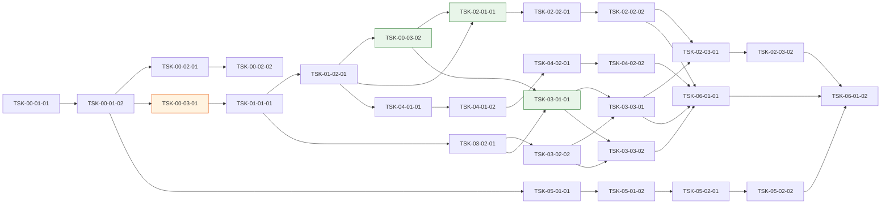

# WBS - MES 기반구축 (mes-base)

> version: 1.0
> depth: 4
> start-date: 2026-08-17
> target-date: 2026-10-19
> updated: 2026-08-14

---

## Dev Config

### Domains
| domain | description | unit-test | e2e-test | e2e-server | e2e-url |
|--------|-------------|-----------|----------|------------|---------|
| backend | Server API | `your-unit-test-cmd` | `your-e2e-test-cmd` | - | - |
| frontend | Client UI | `your-unit-test-cmd` | `your-e2e-test-cmd` | `your-dev-server-cmd` | `http://localhost:3000` |
| fullstack | Full stack | - | - | - | - |
| database | Data layer | - | - | - | - |
| infra | 공유 계약·공통 자원·표준 문서 | - | - | - | - |
| test | 통합테스트 | - | - | - | - |

### Design Guidance
| domain | architecture |
|--------|-------------|
| backend | Your backend architecture description |
| frontend | Your frontend architecture description. 라우팅과 메뉴 연결: 신규 페이지는 즉시 라우터에 등록하고 메뉴/사이드바의 진입점을 같은 Task에서 추가한다. 라우터·메뉴 배선을 분리된 후속 Task로 미루면 orphan page가 발생한다. |

### Quality Commands
| name | command |
|------|---------|
| lint | `your-lint-cmd` |
| typecheck | `your-typecheck-cmd` |
| coverage | `your-coverage-cmd` |

### Cleanup Processes
node, vitest

## WP-00: 프로젝트 초기화·개발 기반
- schedule: 2026-08-17 ~ 2026-09-15

### ACT-00-01: 기술스택 검토·확정
- schedule: 2026-08-17 ~ 2026-08-21

#### TSK-00-01-01: 기술스택 후보 조사·비교
- category: research
- domain: infra
- model: sonnet
- status: [ ]
- priority: critical
- assignee: -
- schedule: 2026-08-17 ~ 2026-08-19
- tags: foundation, techstack
- depends: -
- blocked-by: -
- entry-point: -
- note: -

##### PRD 요구사항
- prd-ref: input:1(기술스택 검토·확정)
- requirements:
  - 프론트엔드·백엔드·DB·배포 인프라 후보를 각 2개 이상 조사한다
  - 라이선스·인력 수급·MES 특성(실시간성·설비 연동) 관점 비교표를 작성한다
- acceptance:
  - 후보 비교표(평가 기준·가중치 포함)가 산출된다
  - 각 후보의 탈락/채택 근거가 문서에 남는다
- constraints:
  - 기존 사내 표준 스택과의 호환성을 우선 검토한다
- test-criteria: -

##### 기술 스펙 (TRD)
- tech-spec: -
- api-spec: -
- data-model: -
- ui-spec: -

#### TSK-00-01-02: 기술스택 확정·아키텍처 결정 기록
- category: research
- domain: infra
- model: opus
- status: [ ]
- priority: critical
- assignee: -
- schedule: 2026-08-20 ~ 2026-08-21
- tags: foundation, techstack, adr
- depends: TSK-00-01-01
- blocked-by: -
- entry-point: -
- note: 아키텍처·전 공정 파급 결정 — opus 유지

##### PRD 요구사항
- prd-ref: input:1(기술스택 검토·확정)
- requirements:
  - 비교표 기반으로 최종 스택을 확정하고 ADR(Architecture Decision Record)로 기록한다
  - 확정 결과를 decisions.md 에 적재한다
- acceptance:
  - 확정 스택 목록(버전 포함)과 결정 근거 ADR 이 존재한다
  - 이해관계자 승인 기록이 남는다
- constraints: -
- test-criteria: -

##### 기술 스펙 (TRD)
- tech-spec: -
- api-spec: -
- data-model: -
- ui-spec: -

### ACT-00-02: 개발표준 수립
- schedule: 2026-08-24 ~ 2026-08-28

#### TSK-00-02-01: 코딩·네이밍·형상관리 표준 수립
- category: research
- domain: infra
- model: sonnet
- status: [ ]
- priority: critical
- assignee: -
- schedule: 2026-08-24 ~ 2026-08-26
- tags: foundation, standards
- depends: TSK-00-01-02
- blocked-by: -
- entry-point: -
- note: -

##### PRD 요구사항
- prd-ref: input:2(개발표준 수립)
- requirements:
  - 확정 스택 기준 코딩 컨벤션·네이밍 규칙·디렉토리 구조 표준을 작성한다
  - 브랜치 전략·커밋 규칙 등 형상관리 표준을 작성한다
- acceptance:
  - 개발표준 문서가 산출되고 lint 설정으로 강제 가능한 항목이 표시된다
- constraints:
  - 표준은 템플릿 프로그램(TSK-02-03-01)에 그대로 반영 가능해야 한다
- test-criteria: -

##### 기술 스펙 (TRD)
- tech-spec: -
- api-spec: -
- data-model: -
- ui-spec: -

#### TSK-00-02-02: 품질 게이트·리뷰 프로세스 정의
- category: research
- domain: infra
- model: sonnet
- status: [ ]
- priority: high
- assignee: -
- schedule: 2026-08-27 ~ 2026-08-28
- tags: foundation, standards, quality
- depends: TSK-00-02-01
- blocked-by: -
- entry-point: -
- note: -

##### PRD 요구사항
- prd-ref: input:2(개발표준 수립)
- requirements:
  - 코드리뷰·테스트 커버리지·정적분석 게이트 기준을 정의한다
  - CI 파이프라인에서 강제할 항목과 수동 검수 항목을 구분한다
- acceptance:
  - 품질 게이트 기준표가 산출되고 CI 반영 대상이 확정된다
- constraints: -
- test-criteria: -

##### 기술 스펙 (TRD)
- tech-spec: -
- api-spec: -
- data-model: -
- ui-spec: -

### ACT-00-03: 개발환경 초기화·전사 공유 계약
- schedule: 2026-08-24 ~ 2026-09-15

#### TSK-00-03-01: 프로젝트 스캐폴드 + DB 연결 + CI 구축
- category: infra
- domain: infra
- model: sonnet
- status: [ ]
- priority: critical
- assignee: -
- schedule: 2026-08-24 ~ 2026-08-28
- tags: foundation, setup
- depends: TSK-00-01-02
- blocked-by: -
- entry-point: -
- note: -

##### PRD 요구사항
- prd-ref: -
- requirements:
  - 확정 스택으로 리포지토리 스캐폴드를 생성한다
  - 개발 DB 연결·환경변수 체계를 구성한다
  - CI 파이프라인(빌드·lint·테스트)을 구축한다
- acceptance:
  - 빈 프로젝트가 빌드·배포 파이프라인을 통과한다
  - 팀원이 로컬에서 30분 내 개발환경을 재현할 수 있다
- constraints: -
- test-criteria:
  - CI 초록 상태 1회 이상 확인

##### 기술 스펙 (TRD)
- tech-spec:
  - TSK-00-01-02 에서 확정된 스택
- api-spec: -
- data-model: -
- ui-spec: -

#### TSK-00-03-02: 전사 공유 계약 — 공통코드·조직·사용자·권한 스키마 (계약 전용)
- category: infra
- domain: database
- model: opus
- status: [ ]
- priority: critical
- assignee: -
- schedule: 2026-09-11 ~ 2026-09-15
- tags: foundation, contract
- depends: TSK-01-02-01
- blocked-by: -
- entry-point: -
- note: 전 모듈이 공유하는 계약 — 판단 비용 커서 opus

##### PRD 요구사항
- prd-ref: -
- requirements:
  - 공통 ERD(TSK-01-02-01) 기준 공통코드·조직·사용자·권한 DDL 을 확정한다
  - 전 모듈이 공유하는 타입·인터페이스 정의를 확정한다
- acceptance:
  - DDL·타입 정의가 리포에 커밋되고 이후 변경은 변경관리 절차를 탄다
  - 실행 로직 없음 (contract-only)
- constraints:
  - 계약 동결 후 변경은 파급 모듈 전체 합의 필요
- test-criteria: -

##### 기술 스펙 (TRD)
- tech-spec: -
- api-spec: -
- data-model:
  - 공통코드, 조직, 사용자, 역할·권한 엔티티
- ui-spec: -

## WP-01: 전체 기본설계
- schedule: 2026-08-31 ~ 2026-09-10

### ACT-01-01: 전사 아키텍처 설계
- schedule: 2026-08-31 ~ 2026-09-04

#### TSK-01-01-01: 전사 아키텍처·모듈 경계 설계
- category: design
- domain: infra
- model: opus
- status: [ ]
- priority: critical
- assignee: -
- schedule: 2026-08-31 ~ 2026-09-04
- tags: foundation, architecture
- depends: TSK-00-03-01
- blocked-by: -
- entry-point: -
- note: -

##### PRD 요구사항
- prd-ref: -
- requirements:
  - 포털·공통자원·MDM·AI 파일럿의 모듈 경계와 통신 방식을 설계한다
  - 인증·인가 흐름과 배포 토폴로지를 설계한다
- acceptance:
  - 아키텍처 청사진 문서가 산출된다
  - 핵심 엔티티·관계 수준까지만 설계하고 컬럼 상세는 각 기능 Task 에 위임한다
- constraints:
  - 선행 설계는 얇게 — 2개 이상 모듈이 공유하는 것만 다룬다
- test-criteria: -

##### 기술 스펙 (TRD)
- tech-spec: -
- api-spec: -
- data-model: -
- ui-spec: -

### ACT-01-02: 공통 DB(ERD) 설계
- schedule: 2026-09-07 ~ 2026-09-10

#### TSK-01-02-01: 공통 엔티티 ERD 설계 — 사용자·조직·공통코드·메뉴·권한
- category: design
- domain: database
- model: opus
- status: [ ]
- priority: critical
- assignee: -
- schedule: 2026-09-07 ~ 2026-09-10
- tags: foundation, erd
- depends: TSK-01-01-01
- blocked-by: -
- entry-point: -
- note: 그룹 설계에서 분리한 계약 파이프라인 — 계약 Task 의 유일한 선행

##### PRD 요구사항
- prd-ref: -
- requirements:
  - 전 모듈이 공유하는 공통 엔티티의 ERD 를 설계한다
  - 메뉴·권한 구조는 포털 설계(TSK-03-02-01)와 정합해야 한다
- acceptance:
  - ERD 산출물이 존재하고 전사 공유 계약(TSK-00-03-02)의 입력이 된다
- constraints: -
- test-criteria: -

##### 기술 스펙 (TRD)
- tech-spec: -
- api-spec: -
- data-model:
  - 사용자, 조직, 공통코드, 메뉴, 역할·권한
- ui-spec: -

## WP-02: 공통 자원·템플릿
- schedule: 2026-09-16 ~ 2026-10-14

### ACT-02-01: 공통 모듈 계약 (계약 전용)
- schedule: 2026-09-16 ~ 2026-09-18

#### TSK-02-01-01: 공통 자원 인터페이스·타입 계약 (계약 전용)
- category: infra
- domain: database
- model: sonnet
- status: [ ]
- priority: critical
- assignee: -
- schedule: 2026-09-16 ~ 2026-09-18
- tags: common, contract
- depends: TSK-01-02-01, TSK-00-03-02
- blocked-by: -
- entry-point: -
- note: -

##### PRD 요구사항
- prd-ref: -
- requirements:
  - 공통 컴포넌트·유틸·API 클라이언트의 공개 인터페이스와 타입을 정의한다
- acceptance:
  - 인터페이스 정의가 커밋되고 템플릿·포털이 이를 참조한다
  - 실행 로직 없음 (contract-only)
- constraints: -
- test-criteria: -

##### 기술 스펙 (TRD)
- tech-spec: -
- api-spec:
  - 공통 API 클라이언트 시그니처, 에러 규약
- data-model: -
- ui-spec: -

### ACT-02-02: 공통 자원 설계·구현
- schedule: 2026-09-21 ~ 2026-10-02

#### TSK-02-02-01: 공통 컴포넌트·유틸 설계
- category: design
- domain: infra
- model: sonnet
- status: [ ]
- priority: high
- assignee: -
- schedule: 2026-09-21 ~ 2026-09-23
- tags: common
- depends: TSK-02-01-01
- blocked-by: -
- entry-point: -
- note: -

##### PRD 요구사항
- prd-ref: input:3(공통 자원 설계·구현)
- requirements:
  - 공통 UI 컴포넌트(그리드·폼·조회조건 등)·유틸·에러 처리 규약을 설계한다
- acceptance:
  - 공통 자원 목록과 각 자원의 책임·사용법 설계서가 산출된다
- constraints:
  - 계약(TSK-02-01-01)에 정의된 인터페이스를 벗어나지 않는다
- test-criteria: -

##### 기술 스펙 (TRD)
- tech-spec: -
- api-spec: -
- data-model: -
- ui-spec:
  - 공통 그리드, 공통 폼, 조회조건 패널, 공통 다이얼로그

#### TSK-02-02-02: 공통 자원 구현 — UI 컴포넌트·유틸·API 클라이언트
- category: infra
- domain: infra
- model: sonnet
- status: [ ]
- priority: high
- assignee: -
- schedule: 2026-09-24 ~ 2026-10-02
- tags: common
- depends: TSK-02-02-01
- blocked-by: -
- entry-point: -
- note: 화면 진입점 없는 공유 라이브러리 — domain infra

##### PRD 요구사항
- prd-ref: input:3(공통 자원 설계·구현)
- requirements:
  - 설계된 공통 컴포넌트·유틸·API 클라이언트를 구현한다
  - 각 자원에 단위 테스트를 작성한다
- acceptance:
  - 공통 자원이 패키지로 제공되고 테스트가 통과한다
  - 사용 예제가 문서화된다
- constraints: -
- test-criteria:
  - 단위 테스트 통과, lint·typecheck 통과

##### 기술 스펙 (TRD)
- tech-spec:
  - 확정 스택의 컴포넌트 라이브러리 위에 구축
- api-spec: -
- data-model: -
- ui-spec: -

### ACT-02-03: 템플릿 프로그램 제작
- schedule: 2026-10-05 ~ 2026-10-14

#### TSK-02-03-01: 표준 CRUD 템플릿 화면 제작
- category: dev
- domain: fullstack
- model: sonnet
- status: [ ]
- priority: high
- assignee: -
- schedule: 2026-10-05 ~ 2026-10-09
- tags: common, template, ui
- depends: TSK-02-02-02, TSK-03-03-01
- blocked-by: -
- entry-point: /templates/crud-sample (메뉴: 개발표준 > 템플릿 프로그램)
- note: -

##### PRD 요구사항
- prd-ref: input:4(템플릿 프로그램 제작)
- requirements:
  - 조회·등록·수정·삭제 표준 패턴 화면을 공통 자원 기반으로 제작한다
  - 포털 메뉴·권한 체계에 연결된 상태로 제작한다 (본보기 목적)
- acceptance:
  - 템플릿 화면이 포털 메뉴에서 진입 가능하고 CRUD 전 과정이 동작한다
  - 개발표준·공통 자원 사용법이 코드에 그대로 반영되어 있다
- constraints:
  - 개발표준(TSK-00-02-01) 위반 0건
- test-criteria:
  - 단위·E2E 테스트 통과

##### 기술 스펙 (TRD)
- tech-spec:
  - 공통 자원 패키지, 표준 API 규약
- api-spec:
  - 표준 CRUD API 패턴 (목록·단건·생성·수정·삭제)
- data-model:
  - 샘플 엔티티 1종
- ui-spec:
  - 조회조건 + 그리드 + 상세 폼 표준 배치

#### TSK-02-03-02: 템플릿 개발 가이드 문서·샘플 검증
- category: design
- domain: infra
- model: sonnet
- status: [ ]
- priority: medium
- assignee: -
- schedule: 2026-10-12 ~ 2026-10-14
- tags: common, template, docs
- depends: TSK-02-03-01
- blocked-by: -
- entry-point: -
- note: -

##### PRD 요구사항
- prd-ref: input:4(템플릿 프로그램 제작)
- requirements:
  - 템플릿을 복제해 신규 화면을 만드는 절차 가이드를 작성한다
  - 가이드대로 제3자가 따라 했을 때 재현되는지 검증한다
- acceptance:
  - 개발 가이드 문서가 산출되고 재현 검증 기록이 남는다
- constraints: -
- test-criteria: -

##### 기술 스펙 (TRD)
- tech-spec: -
- api-spec: -
- data-model: -
- ui-spec: -

## WP-03: 포털·메뉴·권한
- schedule: 2026-09-07 ~ 2026-09-29

### ACT-03-01: 포털 모듈 계약 (계약 전용)
- schedule: 2026-09-16 ~ 2026-09-18

#### TSK-03-01-01: 메뉴·권한 스키마 + 타입 계약 (계약 전용)
- category: infra
- domain: database
- model: sonnet
- status: [ ]
- priority: critical
- assignee: -
- schedule: 2026-09-16 ~ 2026-09-18
- tags: portal, contract
- depends: TSK-03-02-01, TSK-00-03-02
- blocked-by: -
- entry-point: -
- note: -

##### PRD 요구사항
- prd-ref: -
- requirements:
  - 포털 설계 기준 메뉴·권한 상세 DDL 과 인가 인터페이스 타입을 확정한다
- acceptance:
  - DDL·타입 정의가 커밋되고 포털 구현·템플릿이 이를 참조한다
  - 실행 로직 없음 (contract-only)
- constraints:
  - 전사 공유 계약(TSK-00-03-02)의 권한 엔티티를 확장만 하고 변경하지 않는다
- test-criteria: -

##### 기술 스펙 (TRD)
- tech-spec: -
- api-spec: -
- data-model:
  - 메뉴, 메뉴-권한 매핑, 역할-메뉴 매핑
- ui-spec: -

### ACT-03-02: 포털·메뉴·권한 설계
- schedule: 2026-09-07 ~ 2026-09-16

#### TSK-03-02-01: 포털 IA·메뉴 구조·권한 모델 설계
- category: design
- domain: infra
- model: opus
- status: [ ]
- priority: critical
- assignee: -
- schedule: 2026-09-07 ~ 2026-09-11
- tags: portal, design
- depends: TSK-01-01-01
- blocked-by: -
- entry-point: -
- note: 권한 모델은 보안 핵심 — opus

##### PRD 요구사항
- prd-ref: input:5(포털·메뉴·권한 설계)
- requirements:
  - 포털 정보구조(IA)·메뉴 트리·화면 배치 원칙을 설계한다
  - 역할 기반 권한 모델(메뉴 접근·기능 단위 인가)을 설계한다
- acceptance:
  - 포털 설계서(IA·메뉴 트리·권한 모델)가 산출된다
  - 공통 ERD(TSK-01-02-01)의 메뉴·권한 엔티티와 정합한다
- constraints: -
- test-criteria: -

##### 기술 스펙 (TRD)
- tech-spec: -
- api-spec: -
- data-model: -
- ui-spec:
  - 포털 셸 레이아웃(헤더·사이드바·콘텐츠 영역) 와이어프레임

#### TSK-03-02-02: 권한 매트릭스·역할 정의 확정
- category: design
- domain: infra
- model: sonnet
- status: [ ]
- priority: high
- assignee: -
- schedule: 2026-09-14 ~ 2026-09-16
- tags: portal, design, authz
- depends: TSK-03-02-01
- blocked-by: -
- entry-point: -
- note: -

##### PRD 요구사항
- prd-ref: input:5(포털·메뉴·권한 설계)
- requirements:
  - 역할 × 메뉴/기능 권한 매트릭스를 작성하고 현업 확인을 받는다
- acceptance:
  - 확정 권한 매트릭스가 산출되고 구현(TSK-03-03-02)의 입력이 된다
- constraints:
  - 보안 가드는 fail-closed 원칙으로 설계한다
- test-criteria: -

##### 기술 스펙 (TRD)
- tech-spec: -
- api-spec: -
- data-model: -
- ui-spec: -

### ACT-03-03: 포털·메뉴·권한 구현
- schedule: 2026-09-21 ~ 2026-09-29

#### TSK-03-03-01: 포털 셸·메뉴 네비게이션 구현
- category: dev
- domain: fullstack
- model: sonnet
- status: [ ]
- priority: critical
- assignee: -
- schedule: 2026-09-21 ~ 2026-09-29
- tags: portal, ui
- depends: TSK-03-01-01, TSK-03-02-02
- blocked-by: -
- entry-point: / (메뉴: 포털 홈)
- note: -

##### PRD 요구사항
- prd-ref: input:6(포털·메뉴·권한 구현)
- requirements:
  - 포털 셸(헤더·사이드바·콘텐츠 영역)과 메뉴 트리 렌더링을 구현한다
  - 메뉴 데이터는 계약(TSK-03-01-01) 스키마 기준 DB 에서 로드한다
- acceptance:
  - 로그인 후 역할에 맞는 메뉴 트리가 표시되고 화면 진입이 동작한다
- constraints: -
- test-criteria:
  - 단위·E2E 테스트 통과

##### 기술 스펙 (TRD)
- tech-spec:
  - 공통 자원 인터페이스 계약(TSK-02-01-01) 참조
- api-spec:
  - 메뉴 조회 API, 세션·프로필 API
- data-model:
  - 메뉴, 역할-메뉴 매핑 (계약 참조)
- ui-spec:
  - 셸 레이아웃, 메뉴 트리, 브레드크럼

#### TSK-03-03-02: 권한 가드·역할별 접근 제어 구현
- category: dev
- domain: fullstack
- model: opus
- status: [ ]
- priority: critical
- assignee: -
- schedule: 2026-09-21 ~ 2026-09-25
- tags: portal, authz
- depends: TSK-03-01-01, TSK-03-02-02
- blocked-by: -
- entry-point: /admin/roles (메뉴: 시스템관리 > 역할·권한 관리)
- note: 보안 핵심 — opus

##### PRD 요구사항
- prd-ref: input:6(포털·메뉴·권한 구현)
- requirements:
  - 서버 측 인가 가드(라우트·API)와 역할·권한 관리 화면을 구현한다
  - 권한 매트릭스(TSK-03-02-02)를 그대로 반영한다
- acceptance:
  - 비인가 접근이 서버 측에서 차단된다 (fail-closed)
  - 역할·권한 관리 화면에서 역할-메뉴 매핑을 변경할 수 있다
- constraints:
  - 프론트 메뉴 숨김만으로 인가를 대신하지 않는다
- test-criteria:
  - 역할별 접근 차단 테스트 통과

##### 기술 스펙 (TRD)
- tech-spec: -
- api-spec:
  - 인가 가드 미들웨어, 역할·권한 CRUD API
- data-model: -
- ui-spec:
  - 역할·권한 관리 화면

## WP-04: 표준화(MDM)
- schedule: 2026-09-11 ~ 2026-10-02

### ACT-04-01: 표준화(MDM) 설계
- schedule: 2026-09-11 ~ 2026-09-24

#### TSK-04-01-01: 마스터데이터 표준 체계 설계 — 분류·코드 체계·명명 규칙
- category: design
- domain: database
- model: opus
- status: [ ]
- priority: high
- assignee: -
- schedule: 2026-09-11 ~ 2026-09-17
- tags: mdm, design
- depends: TSK-01-02-01
- blocked-by: -
- entry-point: -
- note: 전 모듈 데이터 정합의 뿌리 — opus

##### PRD 요구사항
- prd-ref: input:7(표준화(MDM) 설계)
- requirements:
  - 마스터데이터 대상 도메인(품목·설비·공정·거래처 등)을 식별한다
  - 분류 체계·코드 채번 규칙·명명 규칙을 설계한다
- acceptance:
  - MDM 표준 체계 설계서가 산출된다
  - 공통코드 엔티티(TSK-01-02-01)와의 관계가 정의된다
- constraints: -
- test-criteria: -

##### 기술 스펙 (TRD)
- tech-spec: -
- api-spec: -
- data-model:
  - 마스터 분류 체계, 코드 채번 규칙
- ui-spec: -

#### TSK-04-01-02: 마스터 항목 표준안 작성
- category: design
- domain: database
- model: sonnet
- status: [ ]
- priority: high
- assignee: -
- schedule: 2026-09-18 ~ 2026-09-24
- tags: mdm, design
- depends: TSK-04-01-01
- blocked-by: -
- entry-point: -
- note: -

##### PRD 요구사항
- prd-ref: input:7(표준화(MDM) 설계)
- requirements:
  - 도메인별 마스터 항목(속성·필수 여부·코드값)을 표준안으로 작성한다
- acceptance:
  - 도메인별 마스터 항목 표준안이 산출되어 확정 검토 입력이 된다
- constraints:
  - 표준 체계(TSK-04-01-01)의 분류·명명 규칙을 따른다
- test-criteria: -

##### 기술 스펙 (TRD)
- tech-spec: -
- api-spec: -
- data-model: -
- ui-spec: -

### ACT-04-02: 표준화(MDM) 확정
- schedule: 2026-09-25 ~ 2026-10-02

#### TSK-04-02-01: 표준안 이해관계자 검토·확정
- category: research
- domain: database
- model: sonnet
- status: [ ]
- priority: high
- assignee: -
- schedule: 2026-09-25 ~ 2026-09-29
- tags: mdm, decision
- depends: TSK-04-01-02
- blocked-by: -
- entry-point: -
- note: -

##### PRD 요구사항
- prd-ref: input:8(표준화(MDM) 확정)
- requirements:
  - 현업·IT 이해관계자 검토를 거쳐 표준안을 확정한다
  - 확정 결과와 반려·수정 이력을 decisions.md 에 적재한다
- acceptance:
  - 확정 서명(승인 기록)이 남고 변경은 이후 변경관리 절차를 탄다
- constraints: -
- test-criteria: -

##### 기술 스펙 (TRD)
- tech-spec: -
- api-spec: -
- data-model: -
- ui-spec: -

#### TSK-04-02-02: 확정 표준 반영 — 공통코드 시드 데이터 구축
- category: infra
- domain: database
- model: sonnet
- status: [ ]
- priority: high
- assignee: -
- schedule: 2026-09-30 ~ 2026-10-02
- tags: mdm, seed
- depends: TSK-04-02-01
- blocked-by: -
- entry-point: -
- note: -

##### PRD 요구사항
- prd-ref: input:8(표준화(MDM) 확정)
- requirements:
  - 확정 표준을 공통코드·마스터 시드 데이터로 구축한다 (전사 공유 계약 스키마 기준)
- acceptance:
  - 시드 스크립트가 리포에 커밋되고 개발 DB 에 적재된다
- constraints:
  - 전사 공유 계약(TSK-00-03-02) 스키마를 변경하지 않는다
- test-criteria:
  - 시드 적재 후 정합성 검사 통과

##### 기술 스펙 (TRD)
- tech-spec: -
- api-spec: -
- data-model:
  - 공통코드 시드, 마스터 초기 데이터
- ui-spec: -

## WP-05: MES 내 AI 검토·파일럿
- schedule: 2026-08-24 ~ 2026-09-21

### ACT-05-01: AI 적용 검토
- schedule: 2026-08-24 ~ 2026-09-02

#### TSK-05-01-01: MES AI 적용처 발굴·기술 검토
- category: research
- domain: infra
- model: opus
- status: [ ]
- priority: medium
- assignee: -
- schedule: 2026-08-24 ~ 2026-08-28
- tags: ai, research
- depends: TSK-00-01-02
- blocked-by: -
- entry-point: -
- note: 적용처 선정은 사업 파급 큰 판단 — opus

##### PRD 요구사항
- prd-ref: input:9(MES 내 AI 검토·파일럿)
- requirements:
  - MES 업무(품질 판정·설비 이상 감지·생산 계획·문서 검색 등)에서 AI 적용 후보를 발굴한다
  - 후보별 기대 효과·데이터 가용성·기술 성숙도를 평가한다
- acceptance:
  - AI 적용 후보 평가서가 산출된다
- constraints:
  - 확정 기술스택과 통합 가능한 방식만 후보로 올린다
- test-criteria: -

##### 기술 스펙 (TRD)
- tech-spec: -
- api-spec: -
- data-model: -
- ui-spec: -

#### TSK-05-01-02: 파일럿 대상 선정·계획 확정
- category: research
- domain: infra
- model: sonnet
- status: [ ]
- priority: medium
- assignee: -
- schedule: 2026-08-31 ~ 2026-09-02
- tags: ai, decision
- depends: TSK-05-01-01
- blocked-by: -
- entry-point: -
- note: -

##### PRD 요구사항
- prd-ref: input:9(MES 내 AI 검토·파일럿)
- requirements:
  - 평가서 기반으로 파일럿 1건을 선정하고 범위·성공 기준·일정을 확정한다
  - 결정을 decisions.md 에 적재한다
- acceptance:
  - 파일럿 계획서(범위·성공 기준·측정 방법)가 산출된다
- constraints: -
- test-criteria: -

##### 기술 스펙 (TRD)
- tech-spec: -
- api-spec: -
- data-model: -
- ui-spec: -

### ACT-05-02: AI 파일럿
- schedule: 2026-09-03 ~ 2026-09-21

#### TSK-05-02-01: AI 파일럿 구현
- category: dev
- domain: backend
- model: opus
- status: [ ]
- priority: medium
- assignee: -
- schedule: 2026-09-03 ~ 2026-09-16
- tags: ai, pilot
- depends: TSK-05-01-02
- blocked-by: -
- entry-point: -
- note: 파일럿 성격상 포털·공통 계약과 독립 실행 — 계약 depends 없음

##### PRD 요구사항
- prd-ref: input:9(MES 내 AI 검토·파일럿)
- requirements:
  - 선정 시나리오를 파일럿 계획서의 성공 기준에 맞춰 구현한다
  - 실데이터(또는 대표 샘플)로 동작을 검증한다
- acceptance:
  - 성공 기준 대비 측정 결과가 산출된다
- constraints:
  - 파일럿 코드는 본 개발 코드베이스와 분리된 실험 영역에 둔다
- test-criteria:
  - 계획서의 정량 성공 기준 측정 완료

##### 기술 스펙 (TRD)
- tech-spec:
  - 파일럿 계획서에서 확정한 AI 스택
- api-spec: -
- data-model: -
- ui-spec: -

#### TSK-05-02-02: 파일럿 결과 평가·확대 적용안 수립
- category: research
- domain: infra
- model: sonnet
- status: [ ]
- priority: medium
- assignee: -
- schedule: 2026-09-17 ~ 2026-09-21
- tags: ai, decision
- depends: TSK-05-02-01
- blocked-by: -
- entry-point: -
- note: -

##### PRD 요구사항
- prd-ref: input:9(MES 내 AI 검토·파일럿)
- requirements:
  - 측정 결과를 성공 기준과 대조해 본 사업 확대 여부를 판단한다
  - 확대 시 필요한 아키텍처·데이터 준비 사항을 정리한다
- acceptance:
  - 평가 보고서와 확대 적용안(또는 중단 근거)이 산출된다
- constraints: -
- test-criteria: -

##### 기술 스펙 (TRD)
- tech-spec: -
- api-spec: -
- data-model: -
- ui-spec: -

## WP-06: 통합테스트
- schedule: 2026-10-05 ~ 2026-10-19
- description: 기능 간 시나리오 E2E·권한 교차 검증 (개별 기능 재검증 아님)

### ACT-06-01: 기반 통합 검증
- schedule: 2026-10-05 ~ 2026-10-19

#### TSK-06-01-01: 포털·권한·공통자원·MDM 통합 시나리오 검증
- category: itest
- domain: test
- model: sonnet
- status: [ ]
- priority: critical
- assignee: -
- schedule: 2026-10-05 ~ 2026-10-09
- tags: integration, e2e
- depends: TSK-03-03-01, TSK-03-03-02, TSK-02-02-02, TSK-04-02-02
- blocked-by: -
- entry-point: -
- note: -

##### PRD 요구사항
- prd-ref: -
- requirements:
  - 로그인 → 역할별 메뉴 → 화면 진입 → 공통코드 조회의 관통 흐름을 검증한다
  - 역할 교차 시나리오(권한 없는 메뉴·API 접근 차단)를 검증한다
  - MDM 시드 데이터가 공통코드 조회 화면·API 에 정합하게 노출되는지 검증한다
- acceptance:
  - 통합테스트 결과서가 산출된다
  - 발견 결함은 해당 기능 WP 에 defect Task 로 등록된다
- constraints: -
- test-criteria:
  - 전 시나리오 통과 또는 결함 Task 등록 완료

##### 기술 스펙 (TRD)
- tech-spec: -
- api-spec: -
- data-model: -
- ui-spec: -

#### TSK-06-01-02: 템플릿 기반 표준 개발 리허설 (관통 검증)
- category: itest
- domain: test
- model: sonnet
- status: [ ]
- priority: high
- assignee: -
- schedule: 2026-10-15 ~ 2026-10-19
- tags: integration, rehearsal
- depends: TSK-02-03-02, TSK-06-01-01, TSK-05-02-02
- blocked-by: -
- entry-point: -
- note: -

##### PRD 요구사항
- prd-ref: -
- requirements:
  - 템플릿 가이드대로 신규 화면 1개를 실제로 만들어 메뉴 등록 → 권한 부여 → 배포까지 관통한다
  - 기반구축 산출물 전체(표준·공통자원·포털·MDM·AI 평가)의 검수 목록을 확정한다
- acceptance:
  - 리허설 화면이 표준 절차만으로 완성된다 (수작업 우회 0건)
  - 본 개발 착수 가능 판정 기록이 남는다
- constraints: -
- test-criteria:
  - 리허설 소요 시간·이탈 항목 기록

##### 기술 스펙 (TRD)
- tech-spec: -
- api-spec: -
- data-model: -
- ui-spec: -

## 입력 항목 매핑

사용자 입력 9개 활동 → WBS 배치. 상태·전이·배정 정본은 D'Flow — 이 파일은 import 부트스트랩용.

| # | 입력 항목 | 배치 | Task |
|---|---|---|---|
| 1 | 기술스택 검토·확정 | ACT-00-01 | TSK-00-01-01, TSK-00-01-02 |
| 2 | 개발표준 수립 | ACT-00-02 | TSK-00-02-01, TSK-00-02-02 |
| 3 | 공통 자원 설계·구현 | ACT-02-02 | TSK-02-02-01, TSK-02-02-02 |
| 4 | 템플릿 프로그램 제작 | ACT-02-03 | TSK-02-03-01, TSK-02-03-02 |
| 5 | 포털·메뉴·권한 설계 | ACT-03-02 | TSK-03-02-01, TSK-03-02-02 |
| 6 | 포털·메뉴·권한 구현 | ACT-03-03 | TSK-03-03-01, TSK-03-03-02 |
| 7 | 표준화(MDM) 설계 | ACT-04-01 | TSK-04-01-01, TSK-04-01-02 |
| 8 | 표준화(MDM) 확정 | ACT-04-02 | TSK-04-02-01, TSK-04-02-02 |
| 9 | MES 내 AI 검토·파일럿 | WP-05 | TSK-05-01-01 ~ TSK-05-02-02 |

입력 외 골격 Task(스캐폴드·전사 설계·ERD·계약·통합테스트)는 WSF 샌드위치 구조 비용이다.

## 의존 그래프

### 그래프 (Mermaid)

### 통계

dep-analysis.py --graph-stats 실측 (2026-08-14):

| 항목 | 값 | 임계값 |
|------|-----|--------|
| 최장 체인 깊이 | 12 | 기능 구간 내부 ≤ 3 충족 — 초과분은 공정 양끝(선행 공정형 활동 사슬 + 후행 itest 2단) 구조 비용 |
| 전체 Task 수 | 28 | — |
| Fan-in ≥ 3 Task 수 | 2 (TSK-00-01-02, TSK-01-02-01) | 아래 표 — 둘 다 계약 파이프라인 노드, 추출 불필요 |
| Diamond 패턴 수 | 4 | 아래 표 |

최장 체인(노드 기준 10): TSK-00-01-01 → 00-01-02 → 00-03-01 → 01-01-01 → 01-02-01 → 00-03-02 → 03-01-01 → 03-03-01 → 06-01-01 → 06-01-02.
선행 구간이 긴 것은 이번 입력 자체가 공정형 활동(검토 → 확정 → 스캐폴드 → 설계 → ERD → 계약)이라 생기는 구조 비용이고,
기능 구간 내부(모듈 계약 → 구현)는 2로 임계 3 이내다. 통합테스트 Task 로 모이는 의존은 모듈 수만큼 구조적으로 커지므로
계약 추출 재검토 대상에서 제외한다 (모듈 계약 예외와 같은 논리).

**Fan-in Top 5** (dep-analysis 기준: 해당 Task 를 선행으로 갖는 후속 수)

| Task | Fan-in | 계약 추출 가능? |
|------|--------|----------------|
| TSK-00-01-02 | 3 | 불필요 — 기술스택 확정은 전 공정의 결정 노드 (그 자체가 계약 역할) |
| TSK-01-02-01 | 3 | 불필요 — 공통 ERD 는 이미 분리된 계약 파이프라인 |
| TSK-00-03-02 | 2 | 이미 계약 Task |
| TSK-01-01-01 | 2 | 유지 — 얇은 선행 설계, 산출물이 문서라 계약 분리 실익 없음 |
| TSK-02-02-02 | 2 | 불필요 — 인터페이스는 TSK-02-01-01 로 이미 분리됨 |

**Diamond 패턴**

| Apex | 분기 | Merge |
|------|------|-------|
| TSK-03-01-01 | TSK-03-03-01 / TSK-03-03-02 | TSK-06-01-01 |
| TSK-03-02-01 | TSK-03-01-01 / TSK-03-02-02 | TSK-03-03-01 |
| TSK-03-02-01 | TSK-03-01-01 / TSK-03-02-02 | TSK-03-03-02 |
| TSK-03-02-02 | TSK-03-03-01 / TSK-03-03-02 | TSK-06-01-01 |

포털 WP 내부 다이아몬드 4건은 전부 "설계 → (계약·매트릭스) → 구현 2건 → itest" 의 정상 합류이며 apex 가 이미 설계·계약 Task 라 추가 추출 대상이 아니다.

### 리뷰 후보 (review_candidates)

| Task | 신호 | 판정 | 근거 |
|------|------|------|------|
| TSK-06-01-01 | 선행 4건 합류 | 유지 | itest 는 기능 체인 말단을 모으는 구조적 fan-in |
| TSK-02-03-01 | 모듈 밖 의존 (TSK-03-03-01) | 유지 | 템플릿은 포털 메뉴·권한에 연결된 본보기여야 하므로 진짜 구현 의존 |

그 외 검토 결과 후보 없음.
