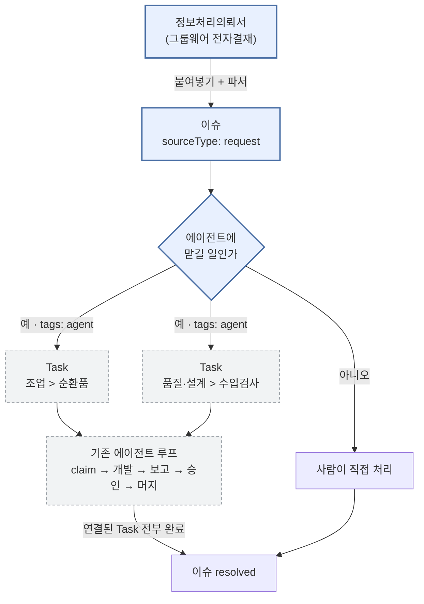
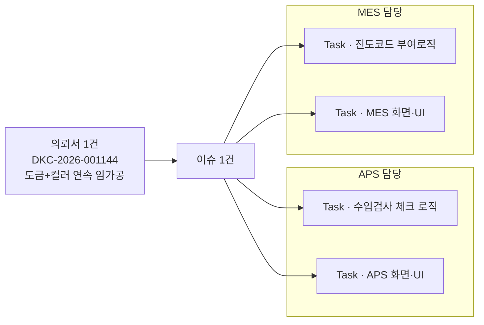
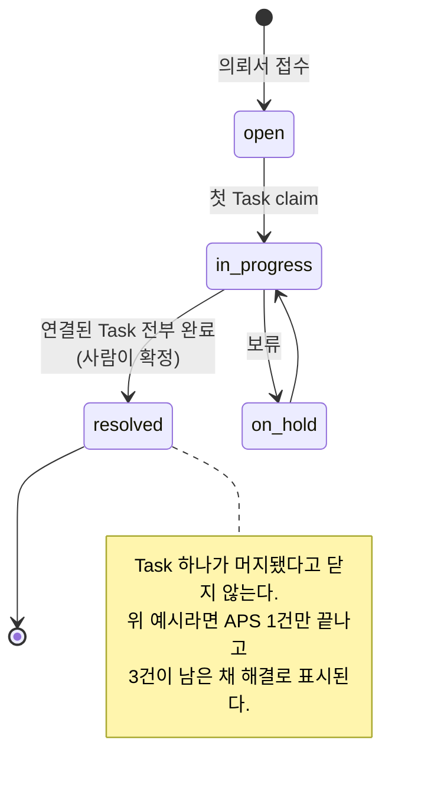
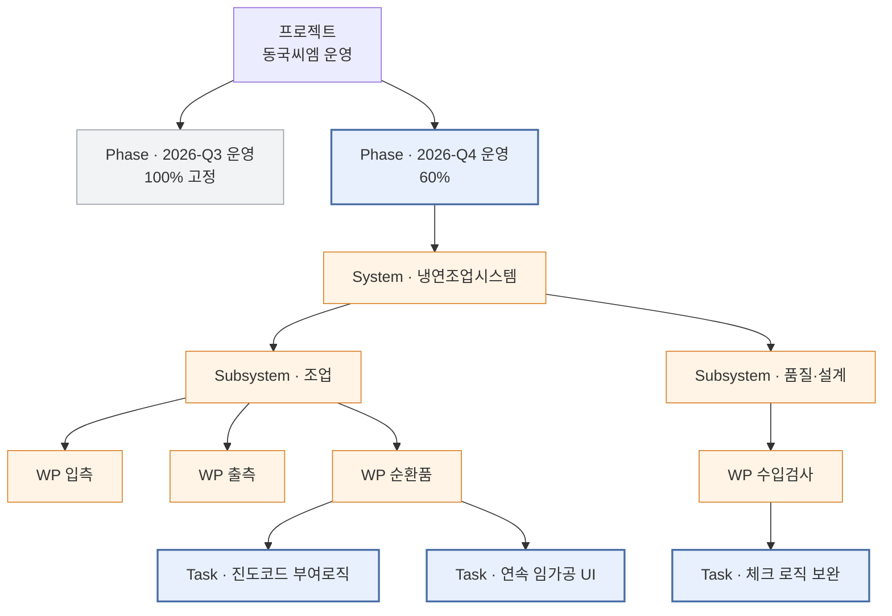
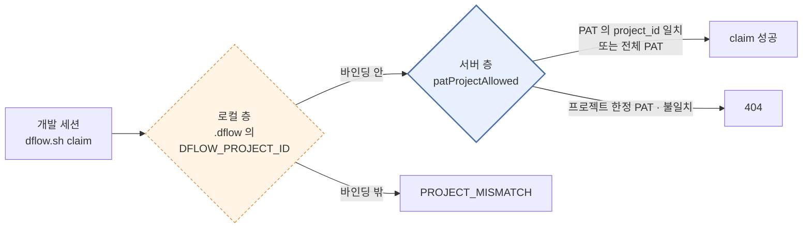

# D'Flow SM(유지보수) 국면 운영 설계

작성일 2026-09-21. 상태: 설계 합의 완료, 구현 미착수.

## 1. 배경

지금까지의 D'Flow 는 개발 국면을 전제로 만들어졌다. WBS 가 계획으로 내려오고, Task 가
완료를 향해 수렴하며, 자격증명은 프로젝트 기간만 살면 된다. 개발이 끝나고 SM 으로 넘어가면
세 전제가 모두 깨진다.

| | 개발 국면 | SM 국면 |
|---|---|---|
| 일의 출처 | WBS 에서 계획으로 내려온다 | 의뢰서·장애로 불시에 올라온다 |
| WBS | 완료를 향해 수렴한다 | 끝나지 않고 계속 자란다 |
| 자격증명 | 프로젝트 기간만 살면 된다 | 몇 년을 살아야 한다 |

이 문서는 그 셋에 대한 답이다.

## 2. 범위

**대상** — 낮 시간에 처리 가능한 결함·개선 요청.

**대상 아님** — 야간·휴일 장애 대응. `dflow-poll` 은 설계상 낮 시간 반자동 전용이고
`poll.sh` 가 `--until` 을 강제한다. 에이전트 루프가 SM 당직을 대신하지 않는다.
이 경계를 문서 첫머리에 두는 이유는, 이 안을 "SM 자동화"로 읽으면 실제보다 많은 것을
약속한 셈이 되기 때문이다.

## 3. 전체 흐름



점선 테두리는 **이미 있는 것**이고, 실선은 새로 만드는 부분이다.
에이전트 루프 자체는 손대지 않는다.

설계의 핵심은 **기존 에이전트 루프를 고치지 않는다**는 것이다. claim·승인·머지·크레딧·
의존성이 전부 Task 를 전제로 이미 돌아가므로, 이슈를 Task 로 바꿔 넣기만 하면 그대로 작동한다.

## 4. 접수 — 정보처리의뢰서 → 이슈

### 4.1 매핑

| 의뢰서 | 이슈 필드 | 비고 |
|---|---|---|
| 제목 | `title` | 그대로 |
| 의뢰내용 및 기대효과 | `body` | 원문 보존. 요약하지 않는다 |
| 완료요청일 | `dueDate` | SM 의 납기 신호 |
| 기안일 | `startDate` | 접수일. 지연 판정은 `dueDate` 만 쓰므로(`issues.ts:116`) 착수일로 오해되지 않는다 |
| 업무분야 대분류 | `megaCode` | `냉연조업시스템` → **05 조업**. 아래 §6.1 |
| 업무분야 중분류 | `majorName` · `subProcess` | Major 기준정보에 맞춰 배치. `생산관제` |
| 업무분야 괄호 | `relatedSystems` | `냉연MES` |
| 처리부서 | `ownerDepartment` | **마지막 처리부서**. 신청부서가 아니다 |
| 문서번호 + 전자 문서 ID | `sourceDetail` | 역추적·중복 방지 |
| 사업장 | (매핑 없음) | 프로젝트가 **사업장 × 운영 국면** 단위다. §6.1 |
| — | `sourceType` | `request` 를 새로 추가 |
| — | `severity` | 의뢰서에 없다. `medium` 기본, 사람이 조정 |

### 4.2 `sourceType: request` 추가

`ISSUE_SOURCE_TYPES`(`src/lib/domain/issueAnalysis.ts:20`)는 지금 `minutes`·`interview`·
`deliverable`·`as_is_analysis`·`data_analysis`·`other` 6종이고 의뢰서에 맞는 값이 없다.
`other` 로 뭉뚱그리면 SM 에서 가장 중요한 통계인 "정식 의뢰로 들어온 일이 몇 건인가"를
낼 수 없다. 7번째로 `request` 를 넣는다. `ISSUE_SOURCE_META` 의 라벨 키도 함께 추가한다.

### 4.3 결재선은 텍스트로만 보관한다

의뢰서에는 기안자·승인자가 여럿 등장하고, 이들은 D'Flow 사용자가 아닐 가능성이 높다.
이름으로 사용자를 추측해 `assigneeMemberIds` 에 넣으면 동명이인·오배정이 생기고
권한 판정과도 엮인다.

이름·부서·직책·승인 시각은 `sourceDetail` 에 원문 그대로 남기고 **사용자 계정과 연결하지
않는다.** 담당자 지정은 D'Flow 안에서 사람이 따로 한다. 보안 가드 fail-closed 원칙과 같은 방향이다.

### 4.4 중복 방지 — 전자 문서 ID 가 자연키

`[전자 문서 ID : NNNNNNN]` 은 그룹웨어가 발급한 유일 식별자다. 같은 의뢰서를 두 사람이
등록하거나 한 사람이 두 번 붙여 넣는 일은 반드시 생긴다.

회의록 → 이슈 경로가 이미 `blockHash`·`sourceKey` 로 같은 문제를 푼다
(`src/lib/domain/issueMinuteSource.ts`). 같은 방식으로 전자 문서 ID 로 기존 이슈를 먼저 찾고,
있으면 새로 만들지 않고 그 이슈로 안내한다.

### 4.5 입력 방식

| | 장점 | 단점 |
|---|---|---|
| **① 붙여넣기 + 규칙 파서** (채택) | 외부 의존 없음. 양식이 고정이라 라벨 기반 추출이 확실하다 | 사람이 화면을 긁어야 한다 |
| ② 그룹웨어 API 연동 | 완전 자동 | 사내 시스템 인증·접근이 통제 밖이다. 양식 변경에 깨진다 |
| ③ PDF·이미지 업로드 + LLM 추출 | 원본 그대로 받는다 | 호출 비용. 추출 실패를 사람이 알아채기 어렵다 |

①을 1차로 하고 **원본은 `issueAttachments` 로 함께 보관**한다(이미 있는 기능).
파싱된 필드가 틀려도 원본이 남아 있으면 사람이 고칠 수 있다.

②는 그쪽 시스템의 개방 여부가 결정하므로, 나중에 붙일 수 있도록 파서 뒤쪽을 같은 함수로 둔다.

### 4.6 파싱 실패를 성공으로 위장하지 않는다

에러 처리 3원칙에 직접 걸린다. 라벨을 못 찾았을 때 빈 값으로 채워 등록하면
납기 없는 이슈, 부서 없는 이슈가 조용히 쌓인다.

- 제목·본문·전자 문서 ID 셋 중 하나라도 못 찾으면 **등록하지 않고** 무엇을 못 찾았는지 보여준다
- 나머지 필드는 못 찾으면 비워 두되 "추출하지 못했다"를 화면에 표시한다
- 등록 전 사람이 확인하는 단계를 반드시 거친다 — 자동 등록하지 않는다

### 4.7 `megaCode` 를 채우면 세 필드가 함께 필요하다

`issues` check 제약(`0055_issue_analysis_metadata.sql:141`)이 이렇게 묶여 있다.

```sql
mega_code is null
or (btrim(sub_process) <> '' and btrim(owner_department) <> '' and source_type is not null)
```

서브시스템 배치를 위해 `megaCode` 를 채우는 순간 `subProcess`·`ownerDepartment`·`sourceType`
셋이 전부 있어야 한다. 의뢰서에서는 넷이 모두 나온다 — 업무분야 중분류, 마지막 처리부서,
그리고 `request`. **따라서 이 셋 중 하나라도 추출하지 못하면 `megaCode` 도 비워 두고
미분류로 접수한다.** 억지로 채워 제약을 피하면 분류가 틀린 채 굳는다.

## 5. 변환 — 이슈 → Task

### 5.1 연결은 1:N 이다 — 이슈 하나에 Task 여럿

**이것이 이 절의 핵심 결정이다.** 정보처리의뢰서는 요청 문서이고, 그 단위는 Task 보다 굵다.
설계 근거로 쓴 실제 의뢰서(DKC-디지털혁신팀 2026-001144)만 해도 본문이 이렇게 갈라진다.



APS 쪽 변경과 MES 쪽 변경은 다른 코드베이스·다른 담당이고, 적어도 둘, 실제로는 넷으로 쪼개진다.
**`issues.task_id` 같은 단일 컬럼으로는 이 문서 하나도 담지 못한다.**

따라서 연결은 **이슈 1 : Task N** 으로 한다. FK 는 Task 쪽에 두거나,
`issue_minute_sources` 와 같은 모양의 조인 테이블을 쓴다. 후자를 권한다 —
회의록 연결에서 이미 검증된 패턴이고, 연결 시각·생성자 같은 메타를 함께 남길 수 있다.

### 5.2 필요한 것 둘

- **연결 테이블** — `issue_tasks`(이슈 1 : Task N). 지금 두 서브시스템은 서로를 모른다.
- **변환 동작** — 이슈 화면의 "작업으로 올리기". 본문에서 갈라낸 항목마다 Task 를 만들고,
  제목·`dueDate`·`severity` 를 물려준 뒤 연결한다. 쪼개는 일은 사람이 한다 —
  본문 구조가 문서마다 달라 자동 분할은 조용히 틀린다.

단건 Task 생성 경로는 이미 있다 — `addWbsItem`·`addSubAct`(`src/app/actions/wbs.ts:239,283`).
`/api/v1/wbs/import` 는 부트스트랩용 대량 경로이고, 이 설계는 그것을 쓰지 않는다.

### 5.3 상태 동기화는 단방향, 그리고 전부 완료일 때만

연결된 Task 가 **전부** 완료되면 이슈를 `resolved` **후보**로 올리고, 확정은 사람이 한다.
첫 Task 가 머지됐다고 이슈를 닫으면, 위 예시에서 APS 한 건만 끝난 채 나머지 세 건이 남은
의뢰서가 해결로 표시된다. 진행 중에는 첫 Task 가 claim 되는 시점에 이슈를
`in_progress` 로 올린다.



**그 반대 방향은 하지 않는다.**
양방향으로 만들면 두 상태 기계(`open`/`in_progress`/`resolved`/`on_hold` 와 Task stage)가
서로를 밀어 순환이 생긴다. 이슈를 사람이 직접 닫는 경우는 Task 를 취소 처리한 뒤 닫는다.

## 6. WBS — 운영은 별도 프로젝트, 5단 구조

### 6.1 개발 프로젝트와 운영 프로젝트를 나눈다

운영은 개발 프로젝트 안의 한 갈래가 아니라 **별도의 D'Flow 프로젝트**다.

```
D'Flow
├ 프로젝트 「동국씨엠 구축」   ← 개발. 완료 후 100% 로 굳는다
└ 프로젝트 「동국씨엠 운영」   ← SM. 분기마다 자란다
```

이렇게 나누면 세 가지가 저절로 풀린다.

- **완료 기록이 흐려지지 않는다.** 개발 프로젝트는 100% 로 닫힌 채 보존된다.
  기존 기능 WP 에 결함 Task 를 붙이는 방식(현 `dflow-wbs` 의 "결함 되돌림" 규칙)을
  SM 으로 연장하면 닫힌 WP 가 몇 년간 계속 다시 열리는데, 그 문제가 사라진다.
- **진척률이 섞이지 않는다.** 두 프로젝트의 대시보드가 각자 자기 것을 보여준다.
- **자격증명 경계가 국면과 일치한다.** 운영 PAT 은 운영 프로젝트 한정으로 발급하면 되고,
  개발 PAT 은 인계 시점에 폐기한다(§8.3).

### 6.2 계층 — 리포 levels 계약을 그대로 쓴다

이 리포의 levels 계약(`wbs-nlevel-md-contract.md:176`)은 7단을 정의하고
Activity·SubTask 는 선택이다. 운영 프로젝트는 그중 다섯을 쓴다.

| 단 | 계약 이름 | 운영에서의 값 | 정본 |
|---|---|---|---|
| 1 | Phase | 2026-Q4 운영 | 사람이 분기 초에 연다 |
| 2 | System | 냉연조업시스템 | 의뢰서 업무분야 대분류 |
| 3 | Subsystem | 조업 | `ISSUE_MEGA_AREAS` 고정 8종 |
| 4 | WP | 입측 · 출측 · 순환품 | `issue_major_processes` (0062) |
| 5 | Task | 진도코드 부여로직 보완 | 이슈에서 변환 |

Activity(5단)와 SubTask(7단)는 생략한다. **진도를 입력하는 층은 Task 하나이고 위는 전부
rollup** 이라는 계약도 그대로다. 운영 전용 트리 로직을 따로 만들지 않으므로
`dflow-wbs-nlevel`·levels frontmatter·진도 rollup·주간보고 단위가 개조 없이 작동한다.



### 6.3 3·4단은 기존 이슈 분류를 그대로 쓴다

새 분류 체계를 만들지 않는다. 두 계층 모두 이미 있고 DB 정본도 서 있다.

**Subsystem = Mega Process** (`src/lib/domain/issueAnalysis.ts:4`, 고정 8종)

| 코드 | 이름 | 코드 | 이름 |
|---|---|---|---|
| 00 | 기준관리 | 04 | 생산계획 |
| 01 | 손익관리 | 05 | 조업 |
| 02 | 영업 | 06 | 출하 |
| 03 | 품질·설계 | 07 | 원가 |

**WP = Major Process** (`issue_major_processes`, 0062). 프로젝트×Mega 범위의 기준정보이고
이름은 자유 입력이다 — 조업 아래 입측·출측·순환품이 여기 들어간다.
`major_seq` 는 DB 트리거만 발급하므로 체번이 갈라지지 않는다.

**이슈가 `megaCode` 와 `majorId` 를 이미 갖고 있으므로, 이슈 분류가 그대로 Task 가 들어갈
자리를 정한다.** 분류를 두 번 하지 않아도 되는 것이 이 구조의 가장 큰 이득이다.

⚠️ `issue_major_processes` 는 **프로젝트별** 기준정보다. 프로젝트를 나누는 이상
운영 프로젝트에서 Major 를 다시 정의해야 한다 — 개발 프로젝트의 것이 따라오지 않는다.
인계 절차에 넣는다(§6.7).

### 6.4 노드는 접수된 것만 만든다

Subsystem 8종과 그 아래 WP 를 분기마다 미리 깔지 않는다. 그 분기에 해당 이슈가 처음 들어올 때
노드를 만든다. 빈 노드를 쌓으면 트리가 금세 읽을 수 없게 되고, **진척률에 0% 노드가
섞여 들어간다.**

Task 배치는 이슈의 `megaCode`·`majorId` 로 자동 결정된다 — 현 분기 Phase 아래에서
System·Subsystem·WP 노드를 찾고, 없으면 만든 뒤 그 아래에 붙인다.
분류가 비어 있는 미분류 이슈는 사람이 분류한 뒤에야 Task 로 올릴 수 있다.

### 6.5 왜 분기인가

주기를 분기로 잡은 이유는 계층이 깊어졌기 때문이다. 월 단위로 하면 System·Subsystem·WP 노드가
1년에 열두 벌 생긴다. 분기면 네 벌이고, SM 의 납기 감각(의뢰서의 완료요청일은 대개 2~4주)과도
어긋나지 않는다.

닫힌 분기 Phase 는 100% 로 고정되어 더 움직이지 않는다.

### 6.6 진척률의 의미

진척은 건수가 아니라 가중 평균이다(`src/lib/domain/rollup.ts:17`). 다만 `weight` 가 전부
비어 있으면 균등 가중이 되므로, **SM Task 에 weight 를 주지 않으면 결과적으로 건수 비율과
같아진다.** 이 설계는 weight 를 주지 않는 쪽을 택한다. SM 작업은 규모 산정이 어렵고,
균등 가중이 "이번 분기 접수분 중 얼마나 끝났나"라는 읽기를 가장 정직하게 만든다.

계층이 늘면서 읽을 수 있는 눈금도 늘어난다.

- Phase — 이번 분기 전체가 얼마나 처리됐나
- Subsystem — 조업 쪽이 품질 쪽보다 밀려 있나
- WP — 조업 중에서도 순환품이 문제인가

**Subsystem·WP 별 부하가 드러나므로 SM 인력 배치의 근거가 된다.**

주의할 것 하나 — 프로젝트 전체 진척률은 루트(Phase) 가중 평균이므로
(`src/lib/domain/rollup.ts:17`), **분기가 쌓일수록 닫힌 분기들이 값을 끌어올려
현재 부하를 가린다.** 운영 프로젝트에서는 전체 진척률을 관리 지표로 쓰지 않고
**현 분기 Phase 의 값만 본다.**

### 6.7 개발 → 운영 인계

프로젝트를 나누므로 인계 절차가 필요하다.

1. 운영 프로젝트를 만들고 levels 를 선언한다(Phase·System·Subsystem·WP·Task)
2. **Major Process 기준정보를 운영 프로젝트에서 다시 정의한다** — 프로젝트별이라 넘어오지 않는다
3. 개발 프로젝트의 미해결 이슈를 운영 프로젝트로 옮긴다
4. 첫 분기 Phase 를 연다
5. 운영 프로젝트 한정 PAT 을 발급하고 `.dflow` 를 갈아끼운다. 개발 PAT 은 폐기한다(§8.3)

## 7. 에이전트 위임 범위

지금과 같은 `tags: agent` 신호를 그대로 쓴다. 사람은 이슈를 Task 로 올릴 때 태그를 붙일지만
정하고, 착수 판단은 에이전트가 한다.

| 맡긴다 | 맡기지 않는다 |
|---|---|
| 재현 가능한 결함 | 야간·휴일 장애 |
| 범위가 코드에 닫히는 개선 요청 | 원인이 데이터·운영 환경에 있는 사건 |
| 문구·설정 수정 | 고객 커뮤니케이션이 본체인 건 |

## 8. 자격증명 수명

SM 리포는 몇 년을 간다. 현재 180일 만료는 반년마다 전 리포를 다시 세팅하라는 뜻이고,
그 부담은 만료 직전에 몰아서 재발급하는 행태를 부른다.

### 8.1 만료 — 10년까지 열되 무기한은 두지 않는다

무기한은 `expires_at timestamptz not null`(`supabase/migrations/0078_agent_runners.sql:26`)
이라 스키마와 `tokenUsable()` 검사 계약을 함께 고쳐야 하는데, 얻는 것이 장기 만료와 같다.

- `MAX_EXPIRES_DAYS` 180 → **3650(10년)**
- 선택지 `[90, 365, 3650]`, **기본값 365**
- 10년은 SM 리포용으로 의식적으로 고르게 한다

### 8.2 위생은 사용 흔적으로 관리한다

`last_seen_at` 이 호출마다 갱신되므로(`src/lib/agent/externalApi.ts:177`),
토큰 목록에서 오래 잠든 것을 눈에 띄게 표시한다. **만료일로 일괄 압박하는 것보다
안 쓰는 토큰을 찾아 끊는 쪽이 실효가 크다.**

실제 안전판은 이미 있다 — 즉시 폐기(`revoked_at`), 일시 정지(`enabled`),
계정 삭제 시 자동 소멸(`owner_user_id on delete cascade`).

### 8.3 PAT 은 프로젝트를 지정해 발급한다

`patProjectAllowed`(`src/lib/agent/externalApi.ts:209`)가 서버에서 강제하는 **유일한
프로젝트 경계**다. `.dflow` 의 `DFLOW_PROJECT_ID` 는 클라이언트 측 오작업 방지 장치일 뿐
파일 한 줄을 고치면 뚫린다.



점선은 **파일 한 줄로 뚫리는 층**, 실선은 서버가 강제하는 층이다.
전체 PAT 을 쓰면 오른쪽 관문이 항상 통과되어 왼쪽 한 겹만 남는다.

전체 PAT(`project_id = null`)으로 리포를 세팅하면 `.dflow` 오기입 하나가 곧 다른 프로젝트
개발이 된다. 프로젝트 한정 PAT 이면 같은 실수를 서버가 404 로 걸러낸다.
10년짜리 토큰을 허용하는 만큼 이 경계는 더 중요해진다.

### 8.4 스코프는 발급 규칙으로 없앤다

자기 발급 PAT 에 조회 전용은 의미가 없다 — 개발하려고 받는 토큰이다.
발급 폼에서 체크박스를 빼고 **항상 `['work:read','work:claim']` 두 개**로 발급한다.
`requireScope` 는 `work:claim` 이 `work:read` 를 함의하지 않으므로
(`src/lib/agent/externalApi.ts:199`) 반드시 둘 다 넣어야 한다.

서버의 `requireScope` 검사와 `agent_runners.scopes` 컬럼은 **그대로 둔다.**
이 테이블은 사용자 PAT 과 머신 러너(`kind in ('user_pat','runner')`)가 공용이고,
러너 쪽에는 권한이 더 좁은 것이 생길 수 있다.

### 8.5 설정 파일은 `.dflow` 로 분리한다

`.env` 에 섞여 있으면 기존 파일에 키를 병합해야 하는데, `install.sh` 는 `.env` 가 없을 때만
초안을 만들고 있으면 경고만 찍는다(`kit/install.sh:37-41`). Next.js 리포는 대개 `.env` 를
이미 가지고 있으므로 현장에서는 경고 경로를 탄다.

전용 파일로 분리하면 병합 문제가 사라지고, **발급 화면이 완성된 내용을 통째로 내줄 수 있다.**
`DFLOW_API_BASE`(페이지 origin)·`DFLOW_PATS`(발급 응답)·`DFLOW_AS`(prefix)·
`DFLOW_PROJECT_ID`(방금 고른 프로젝트) 네 값을 그 순간 서버가 전부 알고 있다.
특히 프로젝트 UUID 를 사람이 옮겨 적지 않게 되어 **오기입이 탐지 대상이 아니라 불가능한 일이 된다.**

경로는 이미 변수다 — `DFLOW_ENV_FILE` 기본값 두 곳(`dflow.sh:55`, `poll.sh:76`)을
`./.dflow` 로 바꾸는 것이 변경의 본체다. 함께 처리할 것:

- `.gitignore` — 이 리포는 `.env*` 로 덮고 있어 `.dflow` 는 걸리지 않는다
- **이행** — `.dflow` 가 없고 `.env` 에 `DFLOW_*` 가 있으면 읽되 한 번 알린다(한동안 유지)
- **권한** — 토큰 전용 파일이므로 생성 시점부터 `umask 077`

평문 토큰이 `~/Downloads` 에 파일로 남아 클라우드 백업·브라우저 기록을 타지 않도록,
파일 다운로드가 아니라 **화면에서 블록을 복사**하는 형태로 한다.

## 9. 데이터 모델 변경 요약

| 변경 | 위치 | 마이그레이션 |
|---|---|---|
| `sourceType` 에 `request` 추가 | `issueAnalysis.ts` + `issues` check 제약 | **필요** (0055:135 에 값 목록이 박혀 있다) |
| `issue_tasks` 연결 테이블 (1:N) | 새 테이블 | **필요** |
| Subsystem·WP 계층 | **변경 없음** — `ISSUE_MEGA_AREAS` + `issue_major_processes` 재사용 | 불필요 |
| 운영 프로젝트 · levels 선언 | 운영 데이터 (코드 변경 아님) | 불필요 |
| `MAX_EXPIRES_DAYS` 180 → 3650 | `src/app/actions/agentTokens.ts:21` | 불필요 |
| 발급 스코프 고정 | `agentTokens.ts` + `MyTokensSection.tsx` | 불필요 |
| `.env` → `.dflow` | `dflow.sh`·`poll.sh`·`install.sh`·`lead-worktree.sh`·킷 템플릿 | 불필요 |

마이그레이션은 코드와 별도 커밋으로 하고, 스테이징 리허설을 거친다(G1·G4 훅).

## 10. 후속으로 남기는 것

- **기간 WP 자동 생성** — 1차는 사람이 만든다
- **야간 대응** — 이 설계의 밖이다
- **SM 지표**(평균 해결 시간, 재발률, 의뢰 부서별 분포) — 이슈 데이터가 쌓인 뒤에 본다
- **그룹웨어 API 연동** — 상대 시스템의 개방 여부가 정한다
