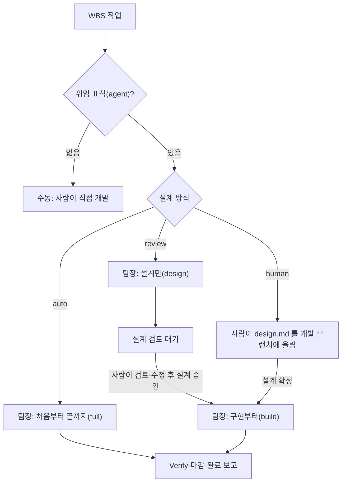
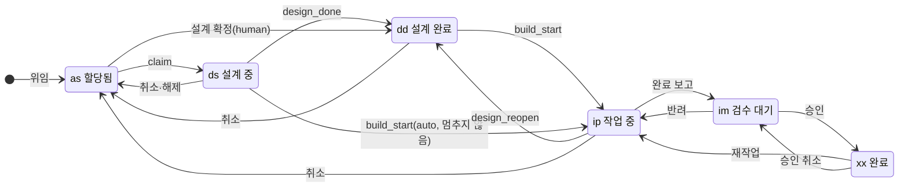
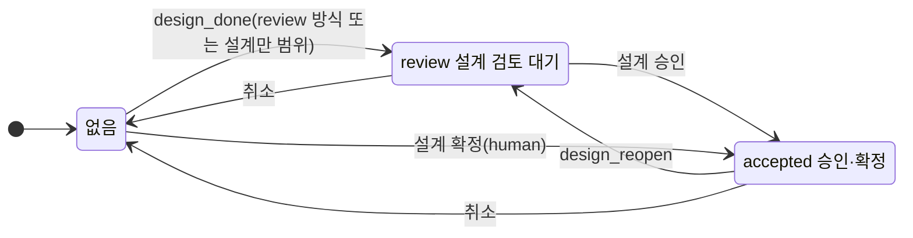

# 설계 상태와 개발자동 모드

2026-09-26 · 설계 확정본(스펙 승인 대기)

작업마다 설계 방식(완전자동·설계 검토·사람 설계)을 지정하고, 서버에 설계 상태와 새 단계 `dd`(설계 완료)를 기록한다. 승인 관문은 서버 라우트가
집행하고, 팀장이 할 일도 서버가 계산한다. 그래서 어떤 경로(옛 킷, `/dflow-poll`, 재개, 수동 실행)로도 승인되지 않은 설계로 구현이 시작되지 않는다.

선행 문서: [dflow-dev 분할·실행 범위 설계 §14](2026-09-26-dflow-dev-skill-router-design.md), [병렬성·토큰 설계 §6](2026-09-26-dflow-parallel-token-design.md)(설계 선행),
[idea.md](../../idea.md) 「완전자동/개발자동/수동」. 검토 경위는 10절(시뮬레이션 19건)에 있다.

## 1. 결정 기록

| # | 질문 | 결정 | 이유 |
| --- | --- | --- | --- |
| D1 | 모드를 어느 단위로 지정하나 | 작업마다(`wbs_items.design_mode`) | 팀장 하나가 한 번 떠서 작업별로 다르게 처리한다 |
| D2 | 수동 모드 | 위임 표식(`agent` 태그) 없음 | 이미 있는 표식으로 충분하다 |
| D3 | 사람 설계의 준비 신호 | 「설계 확정」 버튼 | 쓰다 만 설계를 커밋해도 구현이 시작되지 않는다 |
| D4 | 에이전트 설계가 마음에 들지 않을 때 | 사람이 agent 브랜치의 design.md 를 고친 뒤 「설계 승인」 | 새 상태 없이 review → accepted 하나로 끝난다 |
| D5 | 스킬 구성 | 나누지 않는다. `/dflow-dev` 하나에 `--scope` | 최대한 간단한 스킬 셋(9절) |
| D6 | 설계를 끝낸 상태 | 새 단계 `dd`(설계 완료)를 `ds` 와 `ip` 사이에 | 진행 중 단계(`ds`·`ip`) 뒤에 끝남·대기 단계(`dd`·`im`)가 짝을 이룬다 |
| D7 | 규칙을 어디에 두나 | 관문과 판단은 TS 순수 모듈 하나(`designGate.ts`), 라우트가 집행, RPC 는 CAS 조건만 | 선행 관문이 이미 라우트에서 판정된다(0107 머리말). 규칙 원본이 하나여야 표 테스트 하나로 고정된다(5절) |
| D8 | 승인 우회를 어떻게 막나 | claim·build-start 가 의도한 범위(`scope`)를 밝히고 서버가 설계 방식·상태와 대조 | 옛 킷·`/dflow-poll`·재개·수동 실행을 한 장치로 막는다. 수동 실행도 예외 없음(5.2) |
| D9 | 설계 상태 값·버튼 이름 | 값 `review`·`accepted`, 버튼 「설계 승인」(에이전트 설계)·「설계 확정」(사람 설계) | 주문 상태 `approved`·완료 「승인」과 겹치지 않게 한다 |
| D10 | 승인·확정 권한 | 둘 다 위임 권한(`requireDelegationRight`) | 완료 승인 권한(`loadOrderForAdmin`)은 담당자 본인을 제외해, 사람 설계를 쓴 담당자가 확정하지 못한다 |
| D11 | 설계가 틀렸다며 반려할 때 | 새 선택지 없이 일반 반려. 사람이 agent 브랜치의 design.md 를 고친 뒤 반려하고, 재작업은 design.md 를 고치지 못한다 | 새 UI·RPC 변형 없이 "승인된 설계만 구현"이 지켜진다(6.5) |
| D12 | 승인 대상 버전 고정(sha) | 하지 않는다. 알려진 한계로 둔다 | 서버에 GitHub 연동이 없어 누른 순간의 sha 를 알 수 없다. 재개는 늘 원격 최신으로 ff 한다(11절) |
| D13 | 점유 해제(release) | 설계 상태를 건드리지 않는다. 단계는 설계 상태가 있으면 `dd`, 없으면 `as` | 다시 claim 하면 같은 agent 브랜치로 이어 가므로(claim.md) 브랜치 내용과 서버 상태가 맞는다 |
| D14 | 취소(위임 해제·「중단」·개발 워크플로 끄기·스텁 제거) | 설계 상태를 지우고 `dd` 를 `as` 로. 공용 헬퍼 하나로 | 새 주문은 새 id8·새 브랜치라 처음부터 다시가 맞다 |
| D15 | review 작업의 선행 대기 설계 | 미충족 선행이 모두 `dd` 또는 `ip` 면 설계 허용(설계 선행 조건을 `dd` 까지 넓힘) | 선행이 사람 검토를 기다리는 동안 후행 설계를 막지 않는다 |
| D16 | 설계만 하는 워커를 설계 선행 상한에 세나 | 세지 않는다 | 설계만 멈춤은 워크트리를 남기지 않는다. 상한은 선행 대기 워크트리 수를 막는 장치다 |
| D17 | 새 작업의 설계 방식 기본값 | `auto` | 지금과 같다 |
| D18 | `dd` 실적 크레딧 | 20(선택 키, `ds 10` 과 `ip 30` 사이) | 설계 완료를 실적에 반영 |
| D19 | 앞으로 가는 전이의 실적 | 낮추지 않는다(`max(현재, 크레딧)`) | 저장된 크레딧표와 선택 키 기본값이 어긋나도 역행하지 않는다(S11) |
| D20 | 옛 서버(계약 2.11 미만) | 모든 작업을 `auto` 로 본다(지금 동작). 팀장 인자 "설계만"·"구현부터"는 2.11 이상에서만 받는다 | 운영은 2.9 에서 2.11 로 바로 간다. 2.10 전용 경로(git 스캔)는 지운다(8절) |

## 2. 네 모드

| 모드 | 설계 방식 값 | 누가 설계하나 | 구현 전 사람의 행동 | 팀장이 하는 일 |
| --- | --- | --- | --- | --- |
| 완전자동 | `auto` (기본값) | 에이전트 | 없음 | 처음부터 끝까지(`full`) |
| 설계 검토 | `review` | 에이전트 | agent 브랜치의 design.md 를 검토·수정하고 「설계 승인」 | 설계만(`design`) → 승인되면 구현부터(`build`) |
| 개발자동 | `human` | 사람 | design.md 를 개발 브랜치 `<TASKS>/<TSK>/design.md` 에 올리고 「설계 확정」 | 확정된 작업만 구현부터(`build`) |
| 수동 | (위임 표식 없음) | 사람 | 직접 코딩하거나 `/dflow-dev` 를 손으로 실행 | 가져가지 않는다 |

사람 설계는 5개 절이 모두 있어야 한다. 서버는 파일을 볼 수 없으므로, 확정 뒤 design.md 가 없거나 절이 빠졌으면 워커가 착수하지 않고
`design_reopen` 으로 되돌린다(6.4). 화면에 사유가 보이고, 사람이 고친 뒤 다시 확정한다.

## 3. 상태 모델

작업 하나의 상태는 네 값의 조합이다. 주문 상태는 그대로 두고 칸 둘과 단계 하나를 더한다.

| 값 | 저장 위치 | 값의 범위 |
| --- | --- | --- |
| 설계 방식 | `wbs_items.design_mode`(새, DB CHECK) | `auto`·`review`·`human` |
| 주문 상태 | `agent_work_orders.status`(기존) | `ready`·`claimed`·`reported`·`approved`·`cancelled` |
| 설계 상태 | `agent_work_orders.design_state`(새, DB CHECK) | 없음·`review`·`accepted` |
| 단계 | `wbs_items.stage`(기존, CHECK 에 `dd` 추가) | `as`·`ds`·`dd`(새)·`ip`·`im`·`xx` |

| 단계 | 화면 문구 | 성격 |
| --- | --- | --- |
| `as` | 할당됨 | 착수 전 대기 |
| `ds` | 설계 중 | 진행 중 |
| `dd` | 설계 완료 | 설계를 끝내고 검토·확정·선행·착수를 기다림 |
| `ip` | 작업 중 | 진행 중 |
| `im` | 검수 대기 | 구현을 끝내고 검수를 기다림 |
| `xx` | 완료 | 완료 |

`dd` 에서는 설계 상태와 선행으로 사유를 나눠 보인다. 좌석·WBS·허브가 모두 이 표 하나로 판정한다(heartbeat `wait_review` 로 판정하지 않는다).

| 단계 + 설계 상태 | 선행 | 화면 문구 | 버튼 |
| --- | --- | --- | --- |
| `dd` + `review` | 무관 | 「설계 검토 대기」 | 「설계 승인」 |
| `dd` + `accepted` | 충족 | 「설계 승인됨」(에이전트 설계)·「설계 확정됨」(사람 설계), 팀장이 곧 가져감 | 없음 |
| `dd` + `accepted` | 미충족 | 「선행 대기(설계 승인됨)」 | 없음 |
| `dd` + 없음 | 미충족 | 「설계 완료·선행 대기」(auto 설계 선행) | 없음 |
| `as` + 없음, 방식 `human` | 무관 | 「사람 설계 대기」 | 「설계 확정」 |

## 4. 전이

### 4.1 사건 표

| 사건 | 받는 주문 상태 | 단계 | 설계 상태 | 실적 | 비고 |
| --- | --- | --- | --- | --- | --- |
| 위임(assign) | 없음 | 없음 → `as` | 없음 | 0 | |
| claim | `ready` | `as` → `ds`. 이미 `dd` 면 유지 | 유지 | `ds` 10, `dd` 유지면 그대로 | 범위 대조(5.2) |
| design_done(새) | `claimed` | `ds` → `dd`. `dd` 면 변화 없음(멱등). `ip` 이상이면 skip | 없음 → `review`(방식 `review` 이거나 범위 `design` 일 때). `accepted` 는 건드리지 않음 | 20 | 워커가 설계를 끝내고 멈출 때 |
| design_accept(새) | review 는 `claimed`, human 은 `ready` | review 는 `dd` 유지, human 은 `as` → `dd` | `review` → `accepted`, human 은 없음 → `accepted` | human 확정만 20 | 사람의 「설계 승인」·「설계 확정」. 부모·지워진 항목은 거부 |
| design_reopen(새) | `claimed`·`ready` | `ip`·`dd` → `dd` | `accepted` → `review`(human 은 → 없음) | `dd` 20 으로 | 워커가 승인된 설계를 고쳐야 할 때, 게이트 불통, 확정 뒤 파일 없음 |
| build_start | `claimed` | `ds`·`dd` → `ip` | 유지 | 30 | 범위 대조(5.2) |
| 완료 보고 | `claimed` | `ip` → `im` | 유지 | 80 | |
| 승인(approve) | `reported` | `im` → `xx` | 유지 | 100 | 완료 승인 |
| 반려(reject) | `reported` | → `ip` | 유지 | 50(rw) | 6.5 |
| 재작업(rework) | `approved` | → `ip` | 유지 | 50(rw) | 6.5 |
| 승인 취소(unapprove) | `approved` | `xx` → `im` | 유지 | 80 | |
| 점유 해제(release) | `claimed` | 설계 상태가 있으면 → `dd`, 없으면 → `as` | 유지 | `dd` 20 또는 0 | D13 |
| 취소(공용 헬퍼) | `ready`·`claimed` | `ds`·`dd`·`ip` → `as` | → 없음 | 0 | D14. 위임 해제·「중단」·개발 워크플로 끄기·스텁 제거가 모두 이 헬퍼를 쓴다 |

앞으로 가는 사건(claim·design_done·design_accept·build_start·완료 보고·승인)은 실적을 낮추지 않는다(D19). 크레딧표에 선택 키(`ds`·`dd`)가 없으면
기본값을 쓰되 이웃 키 사이로 맞춘다.

### 4.2 단계 전이

### 4.3 설계 상태 전이

## 5. 관문과 판단 함수

### 5.1 규칙이 사는 곳

| 규칙 | 위치 | 성격 |
| --- | --- | --- |
| 관문: 이 범위로 claim·build-start 해도 되나 | `src/lib/domain/designGate.ts` 의 `canClaim`·`canBuildStart`(순수 함수), claim·build-start 라우트가 호출 | 집행. 거부하면 아무것도 바뀌지 않는다 |
| 판단: 팀장이 지금 이 작업을 어떻게 띄우나 | 같은 모듈의 `nextAgentAction`, 작업 목록·상세 응답이 `action`·`action_reason` 으로 싣는다 | 안내. 팀장은 이 값대로 띄운다 |
| 경쟁 방지 | 전이 RPC 의 CAS 조건에 `design_state` 를 더한다 | 라우트 판정과 쓰기 사이에 상태가 바뀌면 conflict |
| 실행 방법 | 스킬(`/dflow-dev`·`/dflow-team`) | 설계 작성·게이트·커밋 |

10절의 경우들을 `designGate.ts` 의 "입력 → 기대 출력" 표 테스트로 고정한다.

### 5.2 관문: 범위 대조

claim 과 build-start 는 `scope`(`full`·`design`·`build`)를 함께 보낸다. `scope` 가 없으면(옛 킷) `legacy` 로 본다.

| 범위 | 허용 조건 | 거부 코드 |
| --- | --- | --- |
| `full` | 방식 `auto` ∧ 설계 상태 없음 | `design_gate` |
| `design` | 방식 `auto`·`review` ∧ 설계 상태 없음 | `design_gate` |
| `build` | 설계 상태 `accepted` | `design_not_accepted` |
| `legacy` | `full` 과 같다(방식 `auto` ∧ 설계 상태 없음) | `design_gate` |

- build-start 도 같은 표로 대조한다. `design` 범위는 build-start 를 부르지 않는다.
- 사람이 `/dflow-dev <id> --scope build` 를 손으로 돌려도 같다. 승인되지 않았으면 "설계 승인 필요"로 거부되고, 사람이 버튼을 먼저 누른다. 우회 플래그는 두지 않는다.
- 옛 킷은 review·human 작업의 claim 에서 거부되어 `skipped` 로 끝난다(일시 제외). 반복되거나 사람 설계를 덮어쓰지 않는다.
- 좌석 재개 요청(`requestResumeOnOrder`)도 설계 상태가 `review` 면 거부한다.

### 5.3 판단: `nextAgentAction(작업, 주문, 팀장 필터)`

| 조건(위에서부터 처음 맞는 것) | `action` | 사유 |
| --- | --- | --- |
| 주문이 `reported`·`approved`·`cancelled`, 또는 단계 `ip` 이상 | `skip` | 진행 중이거나 검수 대기 |
| 선행 미충족이고 설계 선행도 불가 | `wait` | 선행 대기 |
| 설계 상태 `review` | `wait` | 설계 검토 대기 |
| 단계 `dd` ∧ `accepted`, 선행 미충족 | `wait` | 선행 대기(설계 승인됨) |
| 단계 `dd` ∧ `accepted` ∧ 필터가 "설계만"이 아님 | `build` | 승인된 설계 |
| 방식 `human` ∧ 설계 상태 없음 | `skip` | 사람 설계 대기 |
| 방식 `review`, 또는 필터 "설계만" | `design` | 설계만 |
| 방식 `auto` ∧ 필터가 "구현부터"가 아님 | `full` | 처음부터 끝까지 |
| 그 밖 | `skip` | 필터에 맞지 않음 |

작업 목록 조회는 `ready` 주문 외에 이 신원이 점유한 `claimed` 주문 중 `action` 이 `build` 인 것도 돌려준다(S3). 팀장은 git 스캔 없이 이 응답만 본다.

## 6. 팀장·워커 동작

### 6.1 팀장 인자

"설계만"과 "구현부터"는 5.3 의 필터로만 쓰인다. 기본은 필터 없음이다. "개발자동"은 human 방식의 이름으로만 쓰고 팀장 인자 별칭에서는 뺀다.

| 팀장 실행 | `auto` 작업 | `review` 작업 | `human` 작업 |
| --- | --- | --- | --- |
| 기본 | 처음부터 끝까지 | 설계만 → 승인되면 구현 | 확정된 것만 구현 |
| 설계만 | 설계만 하고 검토 대기로 멈춤 | 설계만 하고 멈춤 | 건드리지 않음 |
| 구현부터 | 승인된 것만 구현(설계만 실행으로 멈췄던 것) | 승인된 것만 구현 | 확정된 것만 구현 |

"설계만" 실행으로 멈춘 작업은 방식과 관계없이 검토 대기가 된다(design_done 이 범위 `design` 을 보고 `review` 를 쓴다). 그래서 사람의 승인 없이는
어떤 실행도 그 작업을 구현하지 않는다.

### 6.2 발견과 기상

- 승인된 작업은 작업 목록 응답의 `action: build` 로 찾는다(5.3). scope.md 「2」 의 git 스캔은 지운다.
- design_accept 는 재개 요청 표식(0099)도 남긴다. 그래서 떠 있는 팀장이 다음 poll 까지 기다리지 않고 곧 깬다.
- 다른 신원이 점유한 승인 작업은 가져가지 않고 시작·마감 보고의 「멈춤」 표에 `다른 신원 점유` 로 올린다(S19).

### 6.3 설계만 멈춤의 순서(워커)

1. design.md 커밋 → 2. state.json(`phase=wait_review`) 커밋 → 3. `git push origin <agent 브랜치>` 성공 → 4. `dflow.sh design-done <ref>` →
5. heartbeat. push 가 실패하면 design-done 을 부르지 않고 실패로 보고한다(원격에 없는 설계가 승인되지 않게). design-done 은 멱등이다.
팀장은 재시작 복구(restart.md 4-2)와 `design_review` 결과 처리 때 서버 설계 상태가 없으면 design-done 을 대신 다시 부른다(S4).

설계 선행으로 `wait_pred` 에 멈출 때도 같은 순서로 design-done 을 부른다(단계 `dd`, 설계 상태는 방식이 `review` 일 때만 `review`).

### 6.4 승인된 설계를 바꿔야 할 때

- build 로 재개한 워커는 원격 agent 브랜치를 ff 로 받은 뒤 Design 게이트를 다시 돈다. 불통이면 `design-reopen <ref> --reason <빠진 절>` 을 부르고
  `design_review` 로 끝난다. 화면이 다시 「설계 검토 대기」와 사유를 보인다(S6).
- human 작업에서 개발 브랜치에 design.md 가 없거나 절이 빠졌으면 같은 방식으로 되돌린다. 설계 상태는 없음, 단계는 `as` 로 돌아가 「사람 설계 대기」가 된다.
- 설계 선행 재개에서 선행 계약이 바뀌어 설계를 고쳐야 하면, 방식이 `review`·`human` 이거나 설계 상태가 `accepted` 일 때 고친 뒤 design-reopen 으로
  멈춘다. 에이전트가 고친 설계로 곧바로 구현하지 않는다(S5). `auto` 는 지금처럼 고친 뒤 이어 간다.

### 6.5 반려와 재작업

- 반려·재작업은 지금과 같다(단계 `ip`, 실적 50). 설계 상태는 그대로 `accepted` 다.
- 설계 상태가 `accepted` 인 작업의 재작업은 design.md 를 고치지 못한다. 반려 사유가 설계를 바꿔야 한다면, 사람이 agent 브랜치의 design.md 를 먼저
  고치고 반려한다. 재작업 워커가 설계를 바꿔야 한다고 판단하면 design-reopen 으로 멈춘다(D11).
- `/dflow-poll` 의 자동 재작업도 같은 규칙을 따른다(규칙이 워커 쪽에 있으므로).

### 6.6 설계 선행

| 설계 방식 | 선행이 미충족일 때 |
| --- | --- |
| `auto` | 지금과 같다. 설계 선행 뒤 design-done 으로 `dd`(설계 상태 없음), 선행이 풀리면 사람 개입 없이 구현 |
| `review` | 미충족 선행이 모두 `dd`·`ip` 면 설계만 하고 검토 대기(D15). 승인 뒤에도 선행이 남으면 `wait`(5.3), 풀리면 `build` |
| `human` | 설계 선행 후보에서 뺀다. 확정됐어도 선행이 풀릴 때까지 `wait` |

- 설계 선행 허용 조건(`designFirstTooEarly`)은 `ip` 에 더해 `dd` 도 받는다(D15). 선행이 `as`·`ds` 면 여전히 거부한다.
- 설계 선행 상한(`DFLOW_DESIGN_AHEAD_MAX`)은 선행 대기 워크트리만 센다. 설계만 하는 워커는 세지 않는다(D16).
- 선행 대기 워크트리의 재개 판정(design-ahead.md 「2」)은 서버가 `claimed`·`mine` 이 아니면 목록과 상한에서 빼고 「멈춤」 표에 `서버 <status>` 로
  올린다. 미충족 선행의 단계가 `as` 면 `선행 주문 없음` 으로 보고한다(S10, 기존 결함).
- 설계만 멈춤이 끝나 선행 대기 중인 review 작업도 워크트리가 없으므로 상한을 차지하지 않는다.

## 7. 화면과 권한

- WBS 작업 패널: 위임 표식과 설계 방식을 같은 곳에서 고른다. 한 서버 액션이 둘을 함께 쓴다.
- 설계 방식은 주문이 없거나 `ready` 이고 설계 상태가 `accepted` 가 아닐 때만 바꿀 수 있다. 조건부 UPDATE 로 막는다(경쟁 방지). human 이 확정된 뒤
  방식을 바꾸려면 먼저 위임을 해제한다(S16).
- 버튼: 「설계 승인」(설계 상태 `review`), 「설계 확정」(방식 `human` ∧ 설계 상태 없음). 허브 동작 종류도 완료 승인과 분리한다(D9).
- 권한: 두 버튼과 설계 방식 변경은 위임 권한(`requireDelegationRight`)(D10).
- 좌석의 「이어서 시작」은 설계 상태가 `review` 인 좌석에서 숨긴다(재개 요청도 서버가 거부한다). 좌석 표시는 3절의 표로 판정한다.
- 결재 대기 배지는 완료 승인만 센다. 설계 검토 대기는 별도 배지로 센다.

## 8. 호환과 이전

- **계약 2.11**: 작업 목록·상세에 `design_mode`·`design_state`·`action`·`action_reason`, claim·build-start 의 `scope`, 동사 `design-done`·
  `design-reopen`, 거부 코드 `design_gate`·`design_not_accepted`.
- **옛 서버(2.11 미만)**: 스킬은 응답에 `action` 이 없으면 모든 작업을 `auto` 로 보고 지금처럼 동작한다. dmes 는 본 체크아웃 스킬로 운영 API(2.9)를 부르므로
  이 경로가 반드시 살아 있어야 한다. 팀장 인자 "설계만"·"구현부터"는 2.11 미만에서 거부하고 이유를 알린다. `/dflow-dev --scope` 수동 실행은 옛 서버에서도
  지금처럼 로컬 state.json 으로 돈다(서버 관문이 없을 뿐이다).
- **2.10 전용 경로 제거**: heartbeat `wait_review` 로 좌석을 판정하던 것과 scope.md 「2」 의 git 스캔을 지운다. 2.10 은 스테이징에만 있고 운영은 2.9 에서
  2.11 로 바로 간다. heartbeat `wait_review` 값 자체는 좌석 자세용으로 받아 두되 판정에 쓰지 않는다.
- **기존 작업 이전(마이그레이션)**: 방식은 모두 `auto` 로 채운다. `claimed` 이고 heartbeat 가 `wait_review` 인 주문은 설계 상태 `review`·단계 `dd`·
  실적 20 으로 채우고 변경 이력을 남긴다. 표식을 잃은 검토 대기 작업은 팀장 재시작 복구가 design-done 을 다시 불러 올린다(6.3).
- **반영 순서**: 스테이징 리허설 → 운영 DB → main → 킷. 되돌리기 SQL 은 `dd` 행을 `ds` 로 옮긴 뒤 CHECK 를 좁힌다(0107 과 같은 순서).
- **본 체크아웃 pull**: dmes 의 팀원이 돌지 않는지 확인받은 뒤에 한다.

## 9. 스킬 구성

스킬은 나누지 않는다. `/dflow-dev` 하나에 `--scope`(`full`·`design`·`build`)만 두고, 새 스킬이나 새 진입점을 만들지 않는다.

- 설계 방식은 서버 데이터에 있고, 팀장은 서버가 계산한 `action` 을 `--scope` 로 옮겨 넘긴다. 워커 스킬은 범위만 안다.
- 스킬 문서는 오히려 줄어든다. scope.md 의 후보 규칙과 git 스캔이 서버의 `action` 으로 대체된다.
- 팀장의 spawn·재개·재시작·해소가 모두 쓰는 진입점 `/dflow-dev <id8> --worker` 는 바뀌지 않는다.

## 10. 시뮬레이션 검토 대응(2026-09-26)

네 묶음(모드×팀장 실행, 선행·단계 전이, 실패·동시성·버전 혼재, 중간 취소·반려)으로 경우를 추적해 나온 19건과 반영 위치다.

| # | 문제 | 반영 |
| --- | --- | --- |
| S1 | 서버가 승인 관문을 집행하지 않음(옛 킷·`/dflow-poll`·재개 요청·수동 실행이 우회, 옛 킷이 사람 설계를 덮어씀) | D7·D8, 5.2 |
| S2 | "approved 면 구현 후보"가 너무 넓음(반려·재작업 뒤 재spawn, 선행 대기 루프) | 5.3(단계 `dd` ∧ `accepted` ∧ 선행 충족) |
| S3 | 승인된 작업을 찾을 경로·깨울 신호 없음 | 5.3 끝, 6.2 |
| S4 | design_done 순서·멱등·옛 서버·approved 강등 | 4.1, 6.3, 8 |
| S5 | 승인된 설계를 에이전트가 고쳐 검토 없이 구현 | 6.4 셋째 항목 |
| S6 | 승인 뒤 게이트 불통·확정 뒤 파일 없음이 공회전 | design_reopen(4.1), 6.4 |
| S7 | 승인 대상 버전을 고정하지 않음 | 알려진 한계(D12, 11절) |
| S8 | 설계가 틀렸다며 반려할 길 없음 | D11, 6.5 |
| S9 | 취소·해제의 흔적(설계 상태 잔존, 다른 취소 경로, release) | D13·D14, 4.1 |
| S10 | 설계 선행 대기 잔재가 상한을 영구히 차지(기존 결함) | 6.6 셋째 항목 |
| S11 | 실적 역행(기존 결함 포함) | D19, 4.1 끝 |
| S12 | review 설계가 선행 사슬에서 한 건씩만 진행 | D15, 6.6 |
| S13 | 담당자가 「설계 확정」을 못 누름 | D10 |
| S14 | 이름 겹침 | D9, 6.1("개발자동" 별칭 정리) |
| S15 | 좌석 표시 어긋남 | 3절 표, 7 |
| S16 | 설계 방식 변경 경쟁 | 7 둘째 항목 |
| S17 | 부모·지워진 항목의 새 사건 | 4.1 design_accept 비고(거부), design_done 은 0107 의 skip |
| S18 | 기존 검토 대기 이전이 heartbeat 표식에 의존 | 8 이전 항목, 6.3 |
| S19 | 다른 신원 점유 승인 작업이 보고 없이 대기 | 6.2 |

## 11. 알려진 한계와 범위 밖

- **승인 뒤 수정**: 설계 승인·확정 뒤에 누군가 design.md 를 다시 고치면, 재개가 원격 최신으로 ff 하므로 고친 설계로 구현된다. 서버에 GitHub 연동이
  없어 승인한 버전을 고정하지 않는다(D12).
- **재개 때 담당자 재확인 없음**: 담당자 확인은 claim 때만 한다(기존 동작).
- **완료 항목 재위임의 실적 하락**: `xx` 항목을 위임 해제 뒤 다시 위임하면 claim 이 실적을 100 에서 10 으로 낮춘다. D19 의 "앞으로 가는 전이는 낮추지
  않는다"가 이 경우도 막는지는 구현 때 확인하고, 막지 못하면 별도 과제로 둔다.
- **설계 선행 깊이**: D15 로 선행이 `dd` 인 경우도 허용하므로, 선행 자신이 설계 선행으로 만든 설계 위에 후행 설계를 쌓을 수 있다. 선행 계약이 바뀌면
  6.4 의 되돌림이 잡는다.

구현은 이 스펙을 승인받은 뒤 계획서(writing-plans)를 쓰고, 계획서도 승인받은 뒤에 시작한다.
