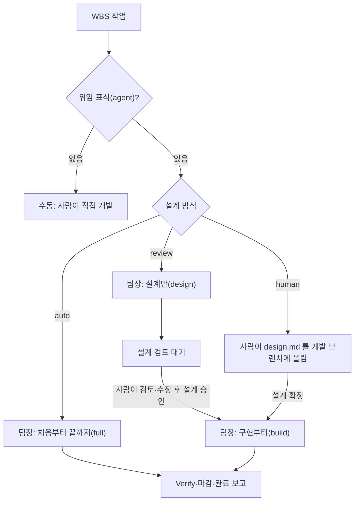
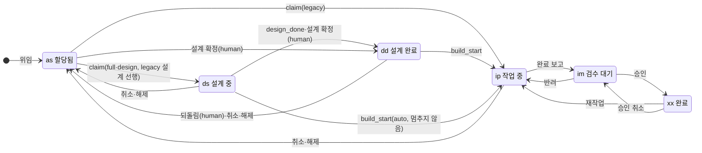
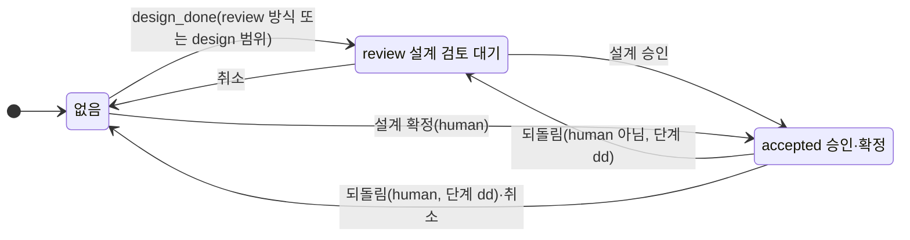

# 설계 상태와 구현자동 모드

2026-09-27 · 설계 확정본 5판 + 예외 상황 대응표(12절) · 스펙 승인 대기

작업마다 설계 방식(완전자동·설계 검토·구현자동)을 지정하고, 서버에 설계 상태와 새 단계 `dd`(설계 완료)를 기록한다. 승인 관문, "지금 이 작업을
어떻게 할지", "이 PC 가 이어 갈 작업인지"는 서버 코드(`designGate.ts`) 한 곳에서 계산하고, 팀장과 워커는 그 값을 따른다. 그래서 어떤 경로(옛 킷,
`/dflow-poll`, 재개, 재시작, 수동 실행)로도 승인되지 않은 설계로 구현이 시작되지 않고, 같은 작업을 워커 둘이 구현하지 않는다.

5판은 5차 검토 뒤 사용자 결정(2026-09-27)에 따라 범위를 줄였다.
1. 팀장 인자 "설계만"·"구현부터"를 없앤다. 작업마다의 설계 방식이 그 역할을 대신한다(D27).
2. 승인·확정된 설계는 구현이 시작되면(단계 `ip` 이상) 그 주문이 끝날 때까지 고정한다. 재작업 중 설계 변경을 감지하던 장치(4판 D24)를 없앤다(D24).
3. claimed 주문을 이어 가는 모든 길은 서버의 `action`·`mine` 과 "이 PC 에 그 주문의 워크트리가 있는가"만 보고 정한다(D25, 6.2).

선행 문서: [dflow-dev 분할·실행 범위 설계 §14](2026-09-26-dflow-dev-skill-router-design.md), [병렬성·토큰 설계 §6](2026-09-26-dflow-parallel-token-design.md)(설계 선행),
[idea.md](../../idea.md) 「완전자동/개발자동/수동」(이 스펙은 개발자동을 구현자동으로 부른다). 검토 경위는 10절(시뮬레이션 여섯 차례)에 있다.
4판 규칙의 상태 공간 모델은 [2026-09-26-design-state-model.py](2026-09-26-design-state-model.py) 에 있다(5차 검토가 만들었다. 계획 단계에서 5판 규칙으로
고쳐 `designGate.ts` 표 테스트로 옮긴다).

## 1. 결정 기록

| # | 질문 | 결정 | 이유 |
| --- | --- | --- | --- |
| D1 | 모드를 어느 단위로 지정하나 | 작업마다(`wbs_items.design_mode`) | 팀장 하나가 한 번 떠서 작업별로 다르게 처리한다 |
| D2 | 수동 모드 | 위임 표식(`agent` 태그) 없음 | 이미 있는 표식으로 충분하다 |
| D3 | 사람 설계의 준비 신호 | 「설계 확정」 버튼 | 쓰다 만 설계를 커밋해도 구현이 시작되지 않는다 |
| D4 | 에이전트 설계가 마음에 들지 않을 때 | 사람이 agent 브랜치의 design.md 를 고쳐 push 한 뒤 「설계 승인」 | 새 상태 없이 review → accepted 하나로 끝난다 |
| D5 | 스킬 구성 | 나누지 않는다. `/dflow-dev` 하나에 `--scope`(사람이 손으로 돌릴 때 쓴다). 팀장 인자는 두지 않는다(D27) | 최대한 간단한 스킬 셋(9절) |
| D6 | 설계를 끝낸 상태 | 새 단계 `dd`(설계 완료)를 `ds` 와 `ip` 사이에 | 진행 중 단계(`ds`·`ip`) 뒤에 끝남·대기 단계(`dd`·`im`)가 짝을 이룬다 |
| D7 | 규칙을 어디에 두나 | 관문·판단·화면 판정·`mine` 계산은 TS 순수 모듈 하나(`designGate.ts`). 라우트가 집행하고, 전이 RPC 는 CAS 조건만 둔다 | 규칙 원본이 하나여야 표 테스트 하나로 고정된다. 5차 검토의 전수 모델에서 코드 한 곳에 모인 규칙(판단↔관문)은 어긋남 0건이었다 |
| D8 | 범위의 원본 | claim·build-start 가 범위(`scope`)를 밝히고, 서버가 claim 때 범위를 `claim_scope` 에 저장한다. 빈 값(`null`)은 `legacy` 로 본다. claimed 주문의 설계가 승인되면 design_accept 가 `build` 로 바꾼다 | 옛 킷·`/dflow-poll`·재개·수동 실행을 한 장치로 막는다. 설계만 하던 워커가 design-done 전에 죽어도 서버가 범위를 안다 |
| D9 | 설계 상태 값·버튼 이름 | 값 `review`·`accepted`. 버튼 「설계 승인」(에이전트 설계)·「설계 확정」(사람 설계)·「설계 되돌리기」(구현 전 승인·확정 취소) | 주문 상태 `approved`·완료 「승인」과 겹치지 않게 한다 |
| D10 | 버튼 권한 | 세 버튼과 설계 방식 변경은 위임 권한(`requireDelegationRight`) | 완료 승인 권한(`loadOrderForAdmin`)은 담당자 본인을 제외해, 사람 설계를 쓴 담당자가 확정하지 못한다 |
| D11 | 설계가 틀렸다며 반려할 때 | 새 선택지 없이 일반 반려. 사람이 먼저 설계를 고친다(설계 검토: agent 브랜치에 push, 구현자동: 개발 브랜치). 재작업 워커는 최신 설계를 받아 구현만 한다(6.5) | 새 UI·RPC 변형 없이 "승인된 설계만 구현"이 지켜진다. 사람이 고친 설계는 사람이 승인한 것으로 본다(D4 와 같다) |
| D12 | 승인 대상 버전 고정(sha) | 하지 않는다. 알려진 한계로 둔다 | 서버에 GitHub 연동이 없어 누른 순간의 sha 를 알 수 없다(11절) |
| D13 | 점유 해제(release) | 설계 상태가 있거나, `claim_scope` 가 `design` 이면서 단계가 `ds`·`dd` 면 409 로 거부하고 「중단」으로 안내한다. 받으면 `claim_scope`·`runner` 를 비운다 | 해제가 `ready`+`review` 같은 빠져나올 수 없는 상태를 만든다(2차). 설계만 하던 주문을 해제하면 다음 `full` claim 이 검토 안 된 설계로 구현한다(3차). 단계가 `ds`·`dd` 가 아니면(claim 때 단계를 건너뛴 부모·지워진 항목) 풀어 준다(5차 W22). release 는 사람이 `dflow.sh release` 로만 부른다 |
| D14 | 취소(위임 해제·「중단」·개발 워크플로 끄기·스텁 제거) | 공용 헬퍼 하나. 설계 상태·`claim_scope`·`runner` 를 지운다. 단계는 `claimed` 취소면 `as`(지금과 같음), `ready` 취소면 `dd` 만 `as` 로 | 지금 `ready` 취소는 단계를 건드리지 않는다. 그 동작을 `dd` 에만 넓힌다 |
| D15 | review 작업의 선행 대기 설계 | 미충족 선행이 모두 `dd` 또는 `ip` 면 설계를 허용한다. 깊이 제한은 두지 않는다 | 선행이 사람 검토를 기다리는 동안 후행 설계를 막지 않는다. 선행 설계가 검토에서 바뀌면 후행은 재개 때 선행 기준 재확인(6.4)에서 되돌아간다. claim 라우트의 "한 단계 깊이" 주석은 구현 때 고친다 |
| D16 | 설계만 하는 워커를 설계 선행 상한에 세나 | 세지 않는다 | 설계만 멈춤은 워크트리를 남기지 않는다 |
| D17 | 새 작업의 설계 방식 기본값 | `auto`. 칸은 `NOT NULL DEFAULT 'auto'` | 운영 DB 를 먼저 올린 기간에 2.9 앱이 만든 항목도 값을 가진다 |
| D18 | `dd` 실적 크레딧 | 20. 크레딧표에 `dd` 가 없으면 `min(20, ip − 5)` 로 채우되 `ds` 보다 작아지지 않게 한다. `ds`·`dd` 는 간격 규칙에서 뺀다 | 설계 완료를 실적에 반영한다. 저장된 표의 `ip` 가 낮아도 `dd` 가 `ip` 보다 작다(5차 W20) |
| D19 | 앞으로 가는 전이의 실적 | 낮추지 않는다(`max(현재, 크레딧)`) | 저장된 크레딧표와 선택 키 기본값이 어긋나도 역행하지 않는다 |
| D20 | 옛 서버(계약 2.11 미만) | 모든 작업을 `auto` 로 본다(지금 동작) | 운영은 2.9 에서 2.11 로 바로 간다(8절) |
| D21 | 워커가 따르는 범위 | 새 claim 은 팀장 포인터가 서버 `action` 을 늘 명시해 넘긴다(`--scope full` 포함). 사람의 수동 실행은 `--scope`, 없으면 서버 `action` 을 따르고 `skip`·`wait` 이면 사유를 알리고 멈춘다. 이미 claim 된 주문은 워커가 서버 `claim_scope` 를 읽어 따르고(`design`→`design`, `full`·`legacy`→`full`, `build`→`build`) state.json 의 `scope` 를 덮어쓴다. 수동 `--scope` 도 이것을 이기지 못한다. build-start 의 `scope` 인자는 재작업 실행이면 `rework`, 아니면 위 범위다 | 범위의 원본을 서버 하나로 둔다. 포인터·state.json·서버 셋을 대조하는 규칙은 승인 뒤 승격(`design`→`build`)을 막았다(4차) |
| D22 | 승인을 팀장에 알리는 신호 | watch 응답에 "이 신원·이 PC 가 띄울 `action: build` 주문 id 목록"을 싣는다. 서버는 팀장이 poll 에 쓰는 거르기 인자(WP·태그)를 watch 요청에서 그대로 받아 목록을 계산한다. 목록에서 슬롯에 있는 id 와 팀장이 일시 제외·멈춤으로 기록한 id 를 뺀 나머지가 있으면 TICK 건너뛰기를 하지 않는다. 승인에서 구현 착수까지는 다음 TICK(기본 30분) 안이다 | 0099 재개 요청 표식은 사람의 「이어서 시작」·같은 PC 용 장치라 신원 단위 승인에 맞지 않는다. 개수만 보면 하나가 시작되고 하나가 승인된 순간을 놓친다. watch 는 TICK 판정 안에서만 불리므로 "곧 깨운다"는 약속은 하지 않는다(5차 W27) |
| D23 | 거부의 HTTP 코드와 exit | 409 `design_gate`·`design_not_accepted` → dflow.sh exit 11(stderr 표지 `DESIGN_GATE`). 409 `runner_active` → exit 12(`RUNNER_ACTIVE`) | 옛 킷이 403 을 받으면 실패로 쌓아 차단기가 걸린다. 409 는 옛 킷에서 일시 제외(30분 뒤 재시도)로 끝난다. 새 킷이 이것을 다른 409 처럼 exit 4 로 받으면 워커가 선행 대기(`wait_pred`)로 잘못 빠진다(4차) |
| D24 | 승인된 설계의 고정 | 설계 상태는 단계 `ip` 이상에서 바뀌지 않는다. design_reopen 은 단계 `dd` 에서만 받는다. review·human 작업의 재작업은 `build` 범위라 Design 단계를 돌지 않고 기존 설계로 구현하며, 설계를 바꿔야 하면 고치지 않고 멈춘다. 워커는 단계 `ip` 이상에서 design.md 를 고치지 않는다(게이트가 적는 기록 절은 예외) | 4판의 재작업 중 설계 변경 감지(해시·`ip` 되돌림)는 2차부터 매 회차 새 문제를 낳았다(5차 W1·W2·W14 등). 사람이 고친 뒤 반려하는 D11 과 같은 방향이라 장치가 필요 없다 |
| D25 | 워커가 겹치지 않게 하는 장치 | 서버가 주문마다 "도는 PC"(`runner`)와 그 PC 의 마지막 신호 시각(`runner_seen_at`)을 둔다. claim 은 점유자로, build-start 는 호출자로 적는다. 완료 보고·설계 검토 멈춤(design_done 이 review 를 만들 때)·해제·취소·human 되돌림은 비운다. heartbeat 가 그 PC 에서 오면 `runner_seen_at` 을 갱신한다. `mine`(5.3)과 build-start 의 원자 조건(5.2)이 같은 식을 쓴다: runner 가 없거나, 호출 PC 이거나, `runner_seen_at` 이 30분 넘게 지났으면 통과하고 runner 를 호출 PC 로 적는다 | 팀장 리스는 신원+프로젝트당 하나라 팀장끼리는 겹치지 않는다. 겹침은 팀장과 사람의 다른 PC `--resume` 사이에서 생긴다(5차 W7). 이어가기 판정이 경로마다 달랐던 것(`claimed_by`·마지막 heartbeat)도 이 값 하나로 모은다(W6·W7). 30분은 긴 명령 하나가 heartbeat 없이 도는 시간보다 길게 잡은 값이다 |
| D26 | 이미 진행된 항목의 위임 | 주문 발행(`ensureOrder` 와 import·담당자 변경·백필 경로)이 단계 `ip` 이상·실적 100·`approved` 주문이 있는 항목에는 새 주문을 만들지 않는다. 이전 때 이미 있는 그런 `ready` 주문은 취소한다. 그래도 생긴 `ready` 주문은 claim 관문이 409 로 거부하고, 판단은 `skip` 을 낸다 | 판단은 건너뛰는데 관문은 허용하던 어긋남을 없애고, 완료 항목에 `ready` 주문이 생겨 「재작업」이 0077 유니크 인덱스에 막히던 길도 닫는다(5차 W9). 완료 항목 재위임이 실적을 낮추던 기존 결함과, 사람이 넣은 실적 100 이 선행 충족으로 보이던 경로도 닫힌다(W21) |
| D27 | 팀장 인자 "설계만"·"구현부터" | 없앤다(사용자 결정 2026-09-27) | 작업마다 고르는 설계 방식이 같은 일을 한다. 판단 조합이 1/3 로 준다. 2.10 인자는 스테이징에만 있었고 킷·운영에는 없다 |
| D28 | 검토에서 찾은 예외 상황을 어떻게 끝내나 | 없애는 것이 목표가 아니다. 감지해서 **막거나**(거부·차단), **다시 시작하거나**(자동 재시도·재개), **경고를 띄워**(화면·멈춤 표·메시지) 사람이 처리할 수 있으면 해결된 것으로 본다. 머리말의 두 보증(승인 안 된 설계로 구현하지 않음, 같은 작업을 둘이 구현하지 않음)에 걸리는 것은 막기로 대응한다. 검토는 모든 발견에 대응이 정해지면 끝낸다(사용자 결정 2026-09-27) | 시뮬레이션은 회차마다 팀장 스킬과 맞물리는 곳에서 새 틈을 찾는다. 틈을 0 으로 만드는 대신 틈마다 빠져나올 길을 정한다. 이전의 종료 기준(치명·높음 0건)을 대신한다 |

## 2. 네 모드

| 모드 | 설계 방식 값 | 누가 설계하나 | 구현 전 사람의 행동 | 팀장이 하는 일 |
| --- | --- | --- | --- | --- |
| 완전자동 | `auto` (기본값) | 에이전트 | 없음 | 처음부터 끝까지(`full`) |
| 설계 검토 | `review` | 에이전트 | agent 브랜치의 design.md 를 검토·수정해 push 하고 「설계 승인」 | 설계만(`design`) → 승인되면 구현부터(`build`) |
| 구현자동 | `human` | 사람 | design.md 를 개발 브랜치 `<TASKS>/<TSK>/design.md` 에 올리고 「설계 확정」 | 확정된 작업만 구현부터(`build`) |
| 수동 | (위임 표식 없음) | 사람 | 직접 코딩하거나 `/dflow-dev` 를 손으로 실행 | 가져가지 않는다 |

사람 설계는 5개 절이 모두 있어야 한다. 서버는 파일을 볼 수 없으므로, 확정 뒤 design.md 가 없거나 절이 빠졌으면 팀장(띄우기 전 검사)이나 워커가
구현 전에 `design_reopen` 으로 되돌린다(6.4). 화면에 사유가 보이고, 사람이 고친 뒤 다시 확정한다.

## 3. 상태 모델

작업 하나의 상태는 아래 값의 조합이다. 주문 상태는 그대로 두고 칸 다섯과 단계 하나를 더한다.

| 값 | 저장 위치 | 값의 범위 |
| --- | --- | --- |
| 설계 방식 | `wbs_items.design_mode`(새, `NOT NULL DEFAULT 'auto'`, CHECK) | `auto`·`review`·`human` |
| 주문 상태 | `agent_work_orders.status`(기존) | `ready`·`claimed`·`reported`·`approved`·`cancelled` |
| 설계 상태 | `agent_work_orders.design_state`(새, CHECK) | 없음·`review`·`accepted` |
| claim 범위 | `agent_work_orders.claim_scope`(새) | 없음(=`legacy`)·`full`·`design`·`build`·`legacy` |
| 되돌림 사유 | `agent_work_orders.design_note`(새, 자유 문장) | design_reopen 이 쓰고 design_accept 가 지운다 |
| 도는 PC | `agent_work_orders.runner`·`runner_seen_at`(새) | 에이전트 라벨과 시각. 비어 있으면 어느 PC 든 이어 갈 수 있다(D25) |
| 단계 | `wbs_items.stage`(기존, CHECK 에 `dd` 추가) | `as`·`ds`·`dd`(새)·`ip`·`im`·`xx` |

PC 는 에이전트 라벨(`<신원>/<host>/<슬롯>`)의 둘째 칸으로 가른다. 형식이 다른 옛 라벨은 라벨 전체를 PC 로 본다.

| 단계 | 화면 문구 | 성격 |
| --- | --- | --- |
| `as` | 할당됨 | 착수 전 대기 |
| `ds` | 설계 중 | 진행 중 |
| `dd` | 설계 완료 | 설계를 끝내고 검토·확정·선행·착수를 기다림 |
| `ip` | 작업 중 | 진행 중 |
| `im` | 검수 대기 | 구현을 끝내고 검수를 기다림 |
| `xx` | 완료 | 완료 |

**화면 판정(`designScreen`)**. 좌석·WBS·허브가 모두 이 표를 쓴다. 위에서부터 처음 맞는 행을 쓰고, 어느 행에도 맞지 않으면 지금의 단계 문구(할당됨·설계 중·
작업 중·검수 대기·완료)를 그대로 보인다. 좌석은 먼저 BLOCKED 와 신선한 heartbeat(ACTIVE)를 보고 그다음 이 표를 보므로, 죽은 워커가 대기 문구 뒤에
가려지지 않는다. "활성 주문"은 `ready`·`claimed`·`reported` 주문이다(0077).

| # | 조건 | 화면 문구 | 버튼·안내 |
| --- | --- | --- | --- |
| 1 | 주문 `claimed` ∧ 설계 상태 `review` | 「설계 검토 대기」, 되돌림 사유 | 「설계 승인」. agent 브랜치·design.md 경로와 "고쳤으면 push 한 뒤 승인하라" |
| 2 | 설계 상태 `accepted` ∧ 단계 `dd` ∧ 선행 미충족 | 「선행 대기(설계 승인됨)」 또는 「선행 대기(설계 확정됨)」 | 「설계 되돌리기」 |
| 3 | 설계 상태 `accepted` ∧ 단계 `dd` | 「구현 대기(설계 승인됨·확정됨)」. 다른 PC 가 도는 중이면 그 라벨도 | 「설계 되돌리기」 |
| 4 | 주문 `claimed` ∧ 설계 상태 없음 ∧ 단계 `dd` | 선행 미충족이면 「설계 완료·선행 대기」, 충족이면 「설계 완료·구현 대기」(auto 설계 선행) | 없음 |
| 5 | 주문 `claimed` ∧ 단계 `ip` ∧ 마지막 완료 리포트가 반려·재작업 요청 | 「재작업 대기」 | "사람이 `/dflow-dev` 로 재작업을 돌린다(팀장은 가져가지 않는다)" |
| 6 | 방식 `human` ∧ 단계 `as`·`ds` ∧ 설계 상태 없음 ∧ 위임 표식 있음 ∧ `ready` 주문 있음 | 「사람 설계 대기」, 되돌림 사유 | 「설계 확정」. 개발 브랜치 경로와 필수 5개 절 |
| 7 | 방식 `human` ∧ 단계 `as`·`ds` ∧ 설계 상태 없음 | 「사람 설계 대기(위임 안 됨)」 | "위임 표식을 달고(프로젝트의 에이전트 위임이 켜져 있어야 한다) 확정하라" |
| 8 | 위임 표식 있음 ∧ `ready` 주문 있음 ∧ 단계 `ip` 이상 | 「위임 보류(단계가 이미 진행됨)」 | "위임을 해제하고 단계를 되돌린 뒤 다시 위임하라" |
| 9 | 위임 표식 있음 ∧ 활성 주문 없음 ∧ `approved` 주문 있음 ∧ 단계가 `xx` 아님 | 「위임 보류(승인된 주문 있음)」 | "「재작업」을 쓰라" |
| 10 | 위임 표식 있음 ∧ 활성 주문 없음 ∧ `approved` 주문 없음 ∧ (단계 `ip` 이상 ∨ 실적 100) | 「위임 보류(단계가 이미 진행됨)」 | "위임 표식을 떼고 단계를 되돌린 뒤 다시 위임하라(표식이 있는 동안은 단계 변경이 잠긴다)" |
| 11 | 방식 `review` ∧ `ready` 주문 ∧ 설계 상태 없음 ∧ 선행 미충족 ∧ 설계 선행 불가 | 「선행 대기」 | 없음 |

정상 완료된 작업(`approved` 주문, 단계 `xx`)은 9·10행에 걸리지 않고 「완료」로 보인다. review·human 작업의 첫 구현(`claimed`·`ip`·`accepted`)도 어느 행에도
걸리지 않아 「작업 중」으로 보인다.

## 4. 전이

### 4.1 사건 표

| 사건 | 받는 조건 | 단계 | 설계 상태 | 실적 | 비고 |
| --- | --- | --- | --- | --- | --- |
| 위임(assign) | 항목에 활성 주문 없음 ∧ 단계 `ip` 미만 ∧ 실적 100 미만 ∧ `approved` 주문 없음 | → `as` | 없음 | 0 | 조건에 안 맞으면 주문을 만들지 않는다(D26). 화면은 3절 8~10행 |
| claim | `ready` ∧ 단계 `ip` 미만 | `full`·`design`: → `ds`. `build`: `dd` 유지(단계 `dd` 에서만). `legacy`: 0107 과 같다(`design_first` 면 `ds`, 아니면 `ip`) | 유지 | 크레딧대로(`build` 는 `dd` 키), 낮추지 않음 | 범위를 `claim_scope` 에, 점유자를 `runner` 에 적는다. 관문 5.2 |
| design_done(새) | `claimed` ∧ 단계 `ds`·`dd` | `ds` → `dd`. `dd` 면 그대로(멱등) | 없음 → `review`(방식 `review` 이거나 `claim_scope` 가 `design`). `accepted` 는 그대로 | 20 | review 가 되면 `runner` 를 비운다(설계만 멈춤은 워크트리를 남기지 않는다, D25). 부모·지워진 항목은 0107 처럼 skip. 단계 `ip` 이상이면 409 `design_gate` |
| design_accept ① 「설계 승인」 | `claimed` ∧ 설계 상태 `review` ∧ 단계 `dd` | 유지 | → `accepted` | 유지 | `claim_scope` 를 `build` 로 바꾼다(D8). `design_note` 를 지운다 |
| design_accept ② 「설계 확정」 | `ready` ∧ 방식 `human` ∧ 위임 표식 있음 ∧ 단계 `as`·`ds` ∧ 설계 상태 없음 | → `dd` | → `accepted` | 20 | `design_note` 를 지운다 |
| design_reopen(새) | 단계 `dd` ∧ 설계 상태 `accepted`. 설계 상태 `review` 면 사유만 고친다. 그 밖은 409 `design_gate` | human 은 → `as`. 그 밖은 유지 | human 은 → 없음. 그 밖은 → `review` | human 은 0, 그 밖은 유지 | human 이고 `claimed` 면 주문을 `ready` 로 되돌리고 점유·heartbeat·재개 요청 표식·`claim_scope`·`runner` 를 release 처럼 비운다. 사유를 `design_note` 에 쓴다. 부르는 쪽은 점유자, 그 `ready` 주문을 후보로 받는 에이전트 PAT, 사람(「설계 되돌리기」)이다 |
| build_start | `claimed` | `ds`·`dd` → `ip`. `ip` 이상이면 그대로(멱등) | 유지 | 30 | 관문 5.2(도는 PC 조건 포함). 통과하면 `runner` 를 호출자로 적는다 |
| 완료 보고 | `claimed` ∧ 설계 상태가 `review` 아님 | → `im` (지금처럼) | 유지 | 80 | `runner` 를 비운다. 설계 상태가 `review` 면 409 `design_gate`(5차 W23) |
| 승인(approve) | `reported` | `im` → `xx` | 유지 | 100 | 완료 승인 |
| 반려(reject) | `reported` | → `ip` | 유지 | 50(rw) | 6.5 |
| 재작업(rework) | `approved` | → `ip` | 유지 | 50(rw) | 6.5 |
| 승인 취소(unapprove) | `approved` | `xx` → `im` | 유지 | 80 | |
| 점유 해제(release) | `claimed` ∧ 설계 상태 없음 ∧ (`claim_scope` 가 `design` 이 아니거나 단계가 `ds`·`dd` 가 아님) | → `as` | 없음 | 0 | 거부는 409 와 「중단」 안내. `claim_scope`·`runner` 를 비운다(D13) |
| 취소(공용 헬퍼) | `ready`·`claimed` | `claimed` 면 → `as`. `ready` 면 `dd` 만 → `as` | → 없음 | `as` 로 갈 때 0 | D14. 위임 해제·「중단」·개발 워크플로 끄기·스텁 제거 |
| 설계 방식 변경 | 설계 상태 없음 ∧ 항목에 `claimed`·`reported`·`approved` 주문 없음 | 유지 | 유지 | 유지 | 주문 행을 잠그는 RPC 로 한다(claim 과의 경쟁 방지, 5차 W28) |
| heartbeat | (지금과 같음) | | | | 라벨의 PC 가 `runner` 의 PC 와 같으면 `runner_seen_at` 을 갱신한다 |

앞으로 가는 사건(claim·design_done·design_accept·build_start·완료 보고·승인)은 실적을 낮추지 않는다(D19). 크레딧표에 선택 키가 없으면 `ds` 는 지금 코드처럼
기본값으로, `dd` 는 D18 규칙으로 채운다. 전이 RPC 의 CAS 에는 주문 상태에 더해 `design_state`, 라우트가 읽은 `design_mode`, 그리고 build-start 는 읽은
`runner`·`runner_seen_at` 을 넣는다(라우트 판정과 쓰기 사이에 바뀌면 conflict).

### 4.2 단계 전이

### 4.3 설계 상태 전이

설계 상태는 단계 `dd` 까지만 바뀐다. 단계 `ip` 이상에서는 취소 말고는 바뀌지 않는다(D24).

## 5. 관문과 판단 함수

### 5.1 규칙이 사는 곳

| 규칙 | 위치 | 성격 |
| --- | --- | --- |
| 관문: 이 범위로 claim·build-start 해도 되나(도는 PC 조건 포함) | `src/lib/domain/designGate.ts` 의 `canClaim`·`canBuildStart`(순수 함수). claim·build-start 라우트가 호출 | 집행. 거부하면 아무것도 바뀌지 않는다 |
| 판단: 지금 이 작업을 어떻게 하나, 이 PC 가 이어 갈 작업인가 | 같은 모듈의 `nextAgentAction`·`isMine`. 작업 목록·상세·watch 응답이 싣는다 | 안내. 팀장·워커는 이 값대로 움직인다 |
| 화면 판정 | 같은 모듈의 `designScreen`(3절 표) | 좌석·WBS·허브가 같은 함수를 쓴다 |
| 경쟁 방지 | 전이 RPC 의 CAS 에 `design_state`·`design_mode`·`runner` 조건 | 라우트 판정과 쓰기 사이에 바뀌면 conflict |
| 실행 방법 | 스킬(`/dflow-dev`·`/dflow-team`·`/dflow-poll`) | 설계 작성·게이트·커밋 |

`designGate.ts` 는 "입력 → 기대 출력" 표 테스트로 고정한다. 상태 공간 모델(머리말)을 5판 규칙으로 고쳐, 도달 가능한 조합 전체에서 ① 판단이 낸 범위를
관문이 거부하지 않는지 ② 앞으로 갈 길이 없는 상태가 없는지 ③ 화면 판정이 모든 도달 상태에 문구를 내는지를 같은 테스트에서 검사한다.

### 5.2 관문

claim 은 `scope`(`full`·`design`·`build`)를 보낸다. 없으면 `legacy` 다. 서버는 받은 범위를 `claim_scope` 에 저장한다(RPC 인자 기본값 `legacy`). 저장된
`claim_scope` 가 비어 있으면 라우트는 `legacy` 로 본다. 거부는 모두 409 다(D23).

**claim** — 모든 범위에 공통으로, 단계가 `ip` 이상인 항목은 거부한다(D26).

| 범위 | 허용 조건 |
| --- | --- |
| `full`·`legacy` | 방식 `auto` ∧ 설계 상태 없음. `design_first` 는 지금처럼 함께 보낼 수 있다(설계 선행) |
| `design` | 방식 `auto`·`review` ∧ 설계 상태 없음 ∧ 개발 브랜치에 사람 설계가 없음(워커가 claim 전에 확인, 6.3). 선행이 미충족이면 `design_first` 를 보낸 것으로 보고 설계 선행 허용 조건(`dd`·`ip`, D15)을 적용한다 |
| `build` | 방식 `human` ∧ 설계 상태 `accepted` ∧ 단계 `dd`. `design_first` 는 무시한다 |

**build-start** — 모든 범위에 공통으로 **도는 PC 조건**을 원자적으로 본다: `runner` 가 없거나, `runner` 의 PC 가 호출 PC 이거나, `runner_seen_at` 이 30분
넘게 지났으면 통과하고 `runner` 를 호출자로 적는다. 아니면 409 `runner_active`(D25).

| 범위 | 설계 조건 | 단계 |
| --- | --- | --- |
| `full` | 방식 `auto` ∧ 설계 상태 없음 ∧ `claim_scope` 가 `full`·`legacy`·빈 값 | `ds`·`dd` → `ip`. `ip` 이상이면 그대로 |
| `build` | 설계 상태 `accepted` | `dd` → `ip`. `ip` 이상이면 그대로 |
| `rework` | 주문 `claimed` ∧ 설계 상태가 `review` 아님 | `ip`(반려·재작업 뒤)에서만 |
| `legacy` | 설계 상태가 `review` 아님 | `ip` 이상이면 그대로(지금처럼). `ip` 미만이면 `full` 과 같다 |

- 선행 관문(지금 build-start 라우트의 `dependency_not_met`, 403)은 단계가 `ip` 미만일 때만 건다. `ip` 이상의 재호출과 `rework` 는 이미 시작된 구현이므로
  선행을 다시 보지 않는다. 선행이 재작업에 들어가도 후행 재작업이 선행 대기로 빠지지 않는다.
- 사람이 `/dflow-dev <id> --scope build` 를 손으로 돌려도 같다. 승인되지 않았으면 `design_not_accepted` 로 거부되고, 사람이 버튼을 먼저 누른다. 우회 플래그는 없다.
- `claim_scope` 가 `design` 인 주문은 `full` build-start 가 거부된다. 설계만 하던 워커가 죽고 다른 범위로 다시 띄워져도 구현이 시작되지 않는다.
- 옛 킷은 review·human 작업의 claim 에서 409 로 거부되어 일시 제외로 끝난다(30분마다 재시도, 무해).
- 좌석 재개 요청(`requestResumeOnOrder`)은 설계 상태가 있으면 거부한다.

### 5.3 판단: `nextAgentAction(작업, 주문)` 과 `isMine(주문, 요청 라벨)`

**action** — 위에서부터 처음 맞는 행을 쓴다.

| # | 조건 | `action` | 사유 |
| --- | --- | --- | --- |
| 1 | 주문이 `reported`·`approved`·`cancelled` | `skip` | 검수·완료·취소 |
| 2 | 주문 `claimed` ∧ (단계 `ip` 이상 ∨ 워커가 살아 있음) | `skip` | 구현 중·재작업. "살아 있음"은 `last_heartbeat_at` 기준으로 좌석 판정의 ACTIVE 또는 BLOCKED 이되, 마지막 phase 가 대기(`wait_review`·`wait_pred`)면 살아 있지 않은 것으로 본다 |
| 3 | 주문 `ready` ∧ 단계 `ip` 이상 | `skip` | 단계 확인 필요(D26) |
| 4 | 설계 상태 `review` | `wait` | 설계 검토 대기 |
| 5 | 설계 상태 `accepted` ∧ 단계가 `dd` 아님 | `skip` | 단계 확인 필요(import·수동 변경으로 단계가 어긋남) |
| 6 | 설계 상태 `accepted` ∧ 선행 미충족 | `wait` | 선행 대기 |
| 7 | 설계 상태 `accepted` | `build` | 승인·확정된 설계 |
| 8 | 주문 `claimed`(설계 상태 없음) | 단계가 `ds`·`dd` 가 아니면 `skip`. `claim_scope` 가 `design` 이면: 선행 미충족 ∧ 설계 선행 불가면 `wait`, 아니면 `design`. `full`·`legacy`·빈 값이면: (단계 `dd` ∧ 선행 미충족) 또는 (선행 미충족 ∧ 설계 선행 불가)면 `wait`, 아니면 `full`(선행 미충족이면 `deps_unmet`). `build` 면 `skip` | 정해진 범위를 이어 간다 |
| 9 | 방식 `human` | `skip` | 사람 설계 대기 |
| 10 | 선행 미충족 ∧ 설계 선행 불가 | `wait` | 선행 대기 |
| 11 | 방식 `review` | `design` | 설계만 |
| 12 | 방식 `auto` | `full` | 처음부터 끝까지(선행 미충족이면 `deps_unmet`) |

- 9~12행은 `ready` 주문이면서 설계 상태가 없을 때만 닿는다. 그래서 5.2 claim 관문과 늘 맞는다.
- 12행이 `deps_unmet` 이면 팀장은 지금의 설계 선행 경로(상한 `DFLOW_DESIGN_AHEAD_MAX`)로 보낸다. 11행은 선행이 미충족이어도(설계 선행 가능하면) 곧바로 띄운다(D16).

**mine** — `ready` 주문은 작업 목록 기준(지금 poll 목록과 같다: 프로젝트 바인딩·담당자·요청의 WP·태그 거르기)을 통과하면 참이다. `claimed` 주문은
"점유 사용자가 요청 신원 ∧ (`runner` 가 없음 ∨ `runner` 의 PC 가 요청 PC ∨ `runner_seen_at` 이 30분 넘게 지남)"이면 참이다. build-start 의 도는 PC 조건과 같은 식이다.

- 작업 목록 응답은 `ready` 후보와, 요청 신원이 점유한 `claimed` 주문을 `action`·`action_reason`·`mine`·`runner` 와 함께 싣는다. 다른 신원이 점유한 것은
  보고용으로만 싣는다(`mine=false`).

## 6. 팀장·워커 동작

### 6.1 팀장이 보는 값

팀장은 후보를 스스로 판정하지 않는다. 매 기상의 작업 목록 조회에서 받은 `action`·`mine` 과 "이 PC 에 그 주문의 워크트리가 있는가"로만 정한다. 팀장 인자
"설계만"·"구현부터"와 별칭 "개발자동"은 없다(D27). "구현자동"은 human 방식의 이름으로만 쓴다. 스킬 문서의 "개발자동" 표현(orch/start.md 등)은 "구현자동"으로 바꾼다.

### 6.2 띄우기와 이어가기

**새 작업(`ready` 주문)**: `action` 이 `full`·`design`·`build` 이고 `mine` 이면 「5. 팀원 spawn」으로 띄운다. 포인터에 `--scope <action>` 을 늘 명시한다.
`skip`·`wait` 은 제외로 기록하지 않는다(다음 기상에 다시 계산한다).

**띄우기 전 검사**(`ready` 주문에만, 개발 브랜치를 `git fetch` 한 뒤 원격 개발 브랜치 기준):
- `action: build`(human)면 design.md 가 있고 5개 절이 다 있는지 본다. 없으면 워커를 띄우지 않고 `design-reopen --reason <빠진 것>` 을 부른다(→ 「사람 설계 대기」와 사유).
- `action: design` 이면 design.md 가 이미 있는지 본다(사람 초안). 있으면 워커를 띄우지 않고 「멈춤」 표에 `사람 설계 초안 있음 — 방식을 human 으로 바꾸거나
  초안을 지우라` 로 올리고 30분 일시 제외한다.
- `git fetch` 가 실패하면 되돌리지도 띄우지도 않고 이번 기상을 넘긴다.

**이어가기(`claimed` 주문)** — claimed 주문을 이어 가는 팀장의 길(5-1 재개 spawn, 재시작 재투입(restart.md), 고아 스캔(「팀장 상태」 0~2번), 설계 선행
재개(design-ahead.md 2), 좌석 「이어서 시작」)은 모두 아래 표 하나로 정한다. 지금의 「1. 시작」 3번(워크트리 없는 claimed 는 멈춤·영구 제외)과 고아 스캔
0번(`wait_review` 는 재개하지 않음)은 이 표로 바꾼다. 워크트리를 거두는 일(정리·`parked`)은 지금 규칙 그대로이고, 이 표는 "띄울지"만 정한다.

| `mine` | 이 PC 워크트리 | `action` | 팀장 |
| --- | --- | --- | --- |
| 거짓 | 무관 | 무관 | 띄우지 않는다. 「멈춤」 표에 `다른 PC 도는 중(<runner>)`·`다른 신원 점유` 로 올린다 |
| 참 | 무관 | `wait` | 띄우지 않는다(검토 대기·선행 대기). 설계 선행 재개 판정은 `action` 이 `wait` 가 아니게 된 뒤에 한다 |
| 참 | 있음 | `skip`(2행) | 지금의 재시작 규칙대로 한다(결과 없이 죽은 이 PC 의 워커만 다시 띄운다) |
| 참 | 없음 | `skip`(2행, 단계 `ip` 이상) | 띄우지 않는다. 「멈춤」 표에 `워크트리 없음 — 구현 중` 으로 올린다(다른 PC 의 워크트리에 push 안 한 구현이 있을 수 있다) |
| 참 | 무관 | `skip`(그 밖) | 띄우지 않는다. 「멈춤」 표에 사유를 올린다 |
| 참 | 있음 | `full`·`design`·`build` | 같은 워크트리로 재개한다 |
| 참 | 없음 | `full`·`design`·`build` | 「5-1. 재개 spawn」. resume.md 3항이 워크트리를 만든다: 로컬 agent 브랜치가 원격보다 앞서 있으면 로컬로, 원격이 앞서거나 같으면 원격으로, 갈라졌으면 만들지 않고 「멈춤」(5차 W13) |

사람의 `--resume`·수동 실행도 같은 `mine` 을 본다. 거짓이면 워커가 이어 가지 않고 이유(`다른 PC 도는 중 — <runner>, 마지막 신호 <시각>`)를 알린다.
`runner_seen_at` 이 30분 넘게 지났으면 `mine` 이 참이 되어 이어받을 수 있고, 구현 시작 때 build-start 가 `runner` 를 넘겨받는다.

**기상**: D22. 승인·확정은 다음 TICK 안에 반영된다.

**결과 처리 문구**: 설계 검토 대기로 끝난 작업의 보고는 "「설계 승인」을 누르면 다음 TICK 에 팀장이 구현을 이어 간다"로 쓴다(지금 scope.md 의
"구현부터로 돌리거나 이어서 시작" 문구는 지운다).

### 6.3 설계만 멈춤과 이어받기

- **claim 전 확인(워커)**: 범위가 `design` 이면 개발 브랜치에 `<TASKS>/<TSK>/design.md` 가 이미 있는지 본다. 있으면(사람 초안) claim 하지 않고
  `skipped 사람 설계 초안 있음` 으로 끝낸다. 팀장의 띄우기 전 검사가 먼저 거르므로 이 확인은 수동 실행과 경쟁을 위한 방어다.
- **멈춤 순서**: 1. design.md 커밋 → 2. state.json(`phase=wait_review`) 커밋 → 3. `git push origin <agent 브랜치>` → 4. `dflow.sh design-done <ref>`(서버가
  단계 `dd`·설계 상태 `review`·heartbeat phase `wait_review` 로 두고 `runner` 를 비운다) → 결과 `design_review`.
  - push 실패: design-done 을 부르지 않고 `failed push` 로 끝낸다.
  - design-done 네트워크 실패(exit 6): `design_review`(사유 `design-done 미확인`)로 끝낸다. 팀장이 아래 규칙으로 마저 한다(5차 W10).
  - design-done 거부(exit 11): `failed design-done 거부(<code>)` 로 끝낸다.
- **끝나지 않은 멈춤 이어받기**(5차 W3): 재개한 워커든 팀장의 결과 처리·재시작 복구든, agent 브랜치 tip 의 state.json 이 `wait_review` 인데 서버 설계
  상태가 없으면 멈춤 3~4단계를 마저 한다. 로컬이 원격보다 앞서 있으면 먼저 push 한다. 원격이 앞서거나 같으면 push 하지 않는다. 갈라졌으면 `failed 브랜치
  갈라짐` 으로 끝낸다. 마치면 `design_review` 로 끝난다. 팀장 쪽에서 이것이 실패하면 워크트리를 지우지 않고 30분 일시 제외와 「멈춤」 표로 보낸다.
- **설계 선행 멈춤(`wait_pred`)**: 같은 순서로 design-done 을 부른다. auto 는 설계 상태가 없고 `runner` 가 남는다(워크트리가 이 PC 에 남는다).
  review 는 설계 상태 `review` 가 되고 `runner` 가 비워진다.

### 6.4 승인·확정 뒤의 설계(D24)

- **구현 전(단계 `dd`)**: `build` 로 재개·claim 한 워커는 먼저 설계를 받아 온다.
  - review: 원격 agent 브랜치를 받는다(로컬이 앞서면 로컬, 갈라졌으면 멈춤).
  - human: 원격 개발 브랜치의 `<TASKS>/<TSK>/design.md` 를 워크트리에 덮어쓰고, 바뀌었으면 그 파일을 커밋한다. 같은 주문 id 의 옛 agent 브랜치에 남은
    옛 사본으로 게이트가 되풀이해 실패하지 않게 한다.
  - `git fetch` 가 실패하면 되돌리지 않고 `failed fetch` 로 끝낸다(5차 W29).
  - 그다음 Design 게이트를 돈다. 불통이면 `design-reopen <ref> --reason <빠진 절>` 을 부른다. review 는 `design_review`, human 은 `design_reopened` 로 끝난다.
- **설계 선행 재개에서 선행 계약이 바뀐 경우(단계 `dd`)**: auto 는 지금처럼 고친 뒤 이어 간다. review 는 agent 브랜치 설계를 고쳐 push 한 뒤 design-reopen
  (→ review)으로 멈춘다. human 은 고치지 않고 design-reopen(→ 사람 설계 대기, 사유에 바뀐 계약)으로 멈춘다.
- **구현 뒤(단계 `ip` 이상)**: 설계는 고정이다. 워커는 design.md 를 고치지 않는다. 게이트가 적는 기록 절("도커 금지로 생략한 검증" 등)은 설계 내용이 아니므로
  예외다. 재개·재시작한 워커가 Design 게이트 불통을 보면 되돌리지 않고 `failed 설계 게이트 불통(구현 중)` 으로 끝낸다. 사람이 설계를 고친 뒤 `--resume` 한다.
- **선행 계약 찾기**: 선행 agent 브랜치 외에 개발 브랜치의 `<TASKS>/<선행>/design.md` 도 본다(선행이 human 이거나 아직 `dd` 인 경우).

### 6.5 반려와 재작업(D11·D24)

- 반려·재작업의 단계·실적은 지금과 같다(`ip`, 50). 팀장은 가져가지 않고(5.3 2행) 사람이 `/dflow-dev` 로 돌린다. `/dflow-poll` 의 자동 재작업도 같은 규칙을 따른다.
- 범위는 서버 `claim_scope` 를 따른다(D21). review·human 은 `build` 라 Design 단계를 돌지 않고 기존 설계로 구현한다. auto 는 지금처럼 설계부터 다시 판단한다.
- 설계 받기: review 는 원격 agent 브랜치를 받는다(이미 머지되어 없으면 개발 브랜치의 design.md). human 은 개발 브랜치의 design.md 를 덮어쓴다(5차 W11).
  `git fetch` 가 실패하면 `failed fetch` 로 끝낸다.
- build-start 는 `scope=rework` 로 부른다. 완료 보고가 `runner` 를 비워 두었으므로 어느 PC 에서 돌려도 통과한다.
- 반려 사유를 기존 설계로 풀 수 없으면(설계를 바꿔야 하면) 설계를 고치지 않고 `failed 설계 변경 필요 — <이유>` 로 끝낸다. 사람이 설계를 고친 뒤(review:
  agent 브랜치에 push, human: 개발 브랜치) 다시 돌린다.

### 6.6 설계 선행

| 설계 방식 | 선행이 미충족일 때 |
| --- | --- |
| `auto` | `action: full` + `deps_unmet` → 지금의 설계 선행 경로(상한 적용). 설계 뒤 design-done 으로 `dd`(설계 상태 없음), 선행이 풀리면 구현 |
| `review` | 미충족 선행이 모두 `dd`·`ip` 면 `action: design` 으로 곧바로(상한 미적용). 승인 뒤에도 선행이 남으면 `wait`, 풀리면 `build` |
| `human` | 설계 선행 후보에서 뺀다. 확정됐어도 선행이 풀릴 때까지 `wait` |

- 설계 선행 허용 조건(`designFirstTooEarly`)은 `ip` 에 더해 `dd` 도 받는다(D15). 선행이 `as`·`ds` 면 여전히 거부한다.
- 설계 완료 대기 워크트리의 재개 판정(design-ahead.md 「2」)은 6.2 이어가기 표를 먼저 본다. 미충족 선행의 단계가 `as` 면 `선행 주문 없음` 으로 보고한다(기존 결함 수정).

### 6.7 워커 결과와 거부 코드

| 상황 | exit | 워커 결과 | 팀장 처리 |
| --- | --- | --- | --- |
| claim 이 설계 관문에 거부됨 | 11 | `skipped 설계 관문(<code>)` | 슬롯 해제, 30분 일시 제외 |
| build-start 가 설계 관문에 거부됨 | 11 | `skipped 설계 관문(<code>)` | 슬롯 해제, 30분 일시 제외, 워크트리는 `skipped` 정리 규칙. 다음 기상이 `action` 을 다시 계산한다 |
| build-start 가 다른 PC 가 도는 중이라 거부됨 | 12 | `skipped 다른 PC 도는 중(<runner>)` | 슬롯 해제, 30분 일시 제외, 「멈춤」 표 |
| build-start 가 선행 미충족(403) | 4 | 지금과 같다(설계 선행 `wait_pred`) | 지금과 같다 |
| design-done 네트워크 실패 | 6 | `design_review`(사유 `design-done 미확인`) | 6.3 이어받기로 마저 한다 |
| design-done 거부 | 11 | `failed design-done 거부(<code>)` | 영구 제외, 「멈춤」 표 |
| 설계 검토 되돌림으로 끝남 | – | `design_review` | `done` 과 같다(설계는 push 되어 있다) |
| human 되돌림으로 끝남 | – | `design_reopened`(새) | 슬롯 해제, 제외 없음. 워크트리는 미커밋 변경이 있어도 지운다(설계 원본은 개발 브랜치다, 5차 W12) |
| push·fetch 실패, 브랜치 갈라짐, 게이트 불통(구현 중), 설계 변경 필요 | – | `failed <사유>` | 영구 제외, 「멈춤」 표(사람이 할 일을 함께 적는다) |

`blocked` 는 지금처럼 "답을 기다리는 워커"에만 쓴다. 관문 거부는 `blocked` 로 끝내지 않는다(5차 W8).

옛 킷(2.9)은 409 를 exit 4 로 받는다. claim 에서는 일시 제외로 끝나 무해하다. build-start 에서 409 를 받는 것은 킷을 섞었을 때뿐이다(예: 새 킷이 `design` 으로
잡은 작업을 옛 킷 PC 에서 `--resume`). 이때 옛 킷은 선행 대기로 잘못 빠져 되풀이하므로 8절의 킷 혼용 금지를 지킨다.

## 7. 화면과 권한

- WBS 작업 패널: 위임 표식과 설계 방식을 같은 곳에서 고른다. 한 서버 액션이 둘을 함께 쓴다.
- 설계 방식은 설계 상태가 없고 항목에 `claimed`·`reported`·`approved` 주문이 없을 때만 바꿀 수 있다(4.1). 거부되면 이유("에이전트가 작업 중", "설계가
  확정됨", "승인된 주문이 있음")와 할 일을 보인다.
- 위임 해제 확인 창은 설계 상태가 있으면 "agent 브랜치에서 고친 설계는 새 주문에 이어지지 않는다"고 경고한다.
- 버튼(서버 조건은 4.1 과 같다):
  - 「설계 승인」: 3절 1행(주문 `claimed` ∧ 설계 상태 `review` ∧ 단계 `dd`).
  - 「설계 확정」: 3절 6행(방식 `human` ∧ 위임 표식 ∧ 단계 `as`·`ds` ∧ 설계 상태 없음 ∧ `ready` 주문).
  - 「설계 되돌리기」: 3절 2·3행(설계 상태 `accepted` ∧ 단계 `dd`). review·auto 는 설계 검토 대기로, human 은 사람 설계 대기로 돌아간다.
  - 허브 동작 종류도 완료 승인과 분리한다.
- 사람의 단계 변경(set_stage)은 `dd` 를 받지 않는다. `dd` 는 design_done·design_accept 로만 생긴다.
- 설계를 지키며 빠져나오기: 승인된 설계가 걸린 작업이 갇혔을 때(점유자가 사라짐 등) 화면이 이 절차를 안내한다. 1. 「중단」 → 2. 다시 위임하고 방식을
  `human` 으로 고른다 → 3. agent 브랜치의 design.md 를 개발 브랜치 `<TASKS>/<TSK>/design.md` 로 옮긴다 → 4. 「설계 확정」. 「중단」이 주문을 취소하므로
  2번의 방식 변경이 허용된다.
- 권한: 세 버튼과 설계 방식 변경은 위임 권한(`requireDelegationRight`)(D10).
- 안내 문구는 3절 표의 "버튼·안내" 칸을 쓴다.
- 좌석의 「이어서 시작」은 설계 상태가 있는 좌석에서 숨긴다(서버도 거부한다).
- 결재 대기 배지는 완료 승인만 센다. 설계 검토 대기는 별도 배지로 센다.
- `/dflow-poll` 은 `action` 이 `full` 이 아니면 사유를 알리며 건너뛴다(review·human 작업은 팀장이나 사람이 맡는다).

## 8. 호환과 이전

- **계약 2.11**:
  - 작업 목록·상세·watch 응답: `design_mode`·`design_state`·`design_note`·`action`·`action_reason`·`deps_unmet`·`mine`·`runner`.
  - 요청: claim·build-start 의 `scope`, 작업 목록·watch 의 요청 라벨(PC 판정용)과 팀장 거르기 인자(WP·태그).
  - 동사: `design-done`·`design-reopen`(요청에 `reason`).
  - 409 코드 `design_gate`·`design_not_accepted`·`runner_active` 와 dflow.sh exit 11·12(6.7).
  - design-reopen 은 점유자, 또는 `ready` 주문이면 그 주문을 후보로 받는 에이전트 PAT 만 부를 수 있다.
- **옛 서버(2.11 미만)**: 스킬은 `contract-ge 2.11` 이 거짓이면 모든 작업을 `auto` 로 보고 지금처럼 동작한다. design-done·design-reopen 은 부르지 않는다
  (`DESIGN_STATE_UNSUPPORTED`). dmes 는 본 체크아웃 스킬로 운영 API(2.9)를 부르므로 이 경로가 반드시 살아 있어야 한다. `/dflow-dev --scope` 수동 실행은
  지금처럼 로컬 state.json 으로 돈다.
- **2.10 전용 경로 제거**: 팀장 인자 "설계만"·"구현부터"(D27), heartbeat `wait_review` 로 좌석을 판정하던 것, scope.md 「2」 의 git 스캔을 지운다. 모두
  스테이징에만 있었고 배포된 킷(운영)에는 없다. heartbeat `wait_review` 값은 받아 두되(design_done 도 이 값을 쓴다) 좌석 판정에 쓰지 않는다.
- **킷 혼용 금지**: 한 신원이 review·human 작업을 쓰기 전에, 그 신원이 도는 모든 PC 의 킷을 2.11 판으로 올린다. 옛 킷 PC 에서 새 킷이 잡은 작업을
  `--resume` 하지 않는다(6.7 끝).
- **스테이징 2.10 잔재 정리**: 스테이징에 2.11 을 반영하기 직전에, 2.10 "설계만"으로 멈춘 주문(서버 heartbeat phase 가 `wait_review` 이거나 agent 브랜치
  state.json 이 `wait_review` 인 것)을 목록으로 뽑아 사람이 확인한다. heartbeat 로 잡히지 않는 것은 「중단」하거나 방식을 `review` 로 둔 뒤 이전한다(5차 W25).
- **기존 작업 이전(마이그레이션)**:
  - `design_mode` 는 `NOT NULL DEFAULT 'auto'` 로 추가해 모든 항목을 `auto` 로 채운다.
  - `claimed` ∧ 단계 `ds` ∧ heartbeat phase `wait_review` 인 주문은 설계 상태 `review`·`claim_scope=design`·단계 `dd`·실적 `max(현재, 20)`·`runner` 없음으로
    채우고 변경 이력을 남긴다(단계 조건이 있어 `ip` 주문을 끌어내리지 않는다).
  - 나머지 `claimed` 주문은 `claim_scope=legacy`, `runner=claimed_by`, `runner_seen_at=last_heartbeat_at` 으로 채운다.
  - 단계 `ip` 이상·실적 100·`approved` 주문이 있는 항목의 `ready` 주문은 취소하고 이력을 남긴다(D26, 5차 W9).
- **반영 순서**: 스테이징 리허설 → 운영 DB → main → 킷. 새 칸은 기본값이 있거나 null 허용이고, RPC 의 새 인자도 기본값이 있어(`claim_scope` 는 `legacy`),
  운영 DB 를 먼저 올려도 2.9 앱이 그대로 돈다. 그 사이 2.9 앱이 claim 한 주문은 `legacy` 로 저장된다. 되돌리기 SQL 은 `dd` 행을 `ds` 로 옮긴 뒤 CHECK 를
  좁힌다(0107 과 같은 순서).
- **본 체크아웃 pull**: dmes 의 팀원이 돌지 않는지 확인받은 뒤에 한다.

## 9. 스킬 구성

스킬은 나누지 않는다. `/dflow-dev` 하나에 `--scope`(`full`·`design`·`build`)만 두고, 새 스킬이나 새 진입점을 만들지 않는다.

- 설계 방식은 서버 데이터에 있고, 팀장은 서버가 계산한 `action` 을 `--scope` 로 옮겨 넘긴다. 워커 스킬은 범위만 알고, claim 된 뒤에는 서버 `claim_scope` 를 따른다.
- 팀장 인자 "설계만"·"구현부터"와 scope.md 의 후보 규칙·git 스캔을 지운다(D27). 남는 결과 처리 문구는 SKILL.md 결과 표(6.7)로 옮긴다.
- 팀장의 이어가기 판정(1. 시작 3번, 고아 스캔 0~2번, restart.md 재투입 전 확인, design-ahead.md 2)은 6.2 이어가기 표 하나를 가리키게 바꾼다. 스킬 문서는 줄어든다.
- 팀장의 spawn·재개·재시작·해소가 모두 쓰는 진입점 `/dflow-dev <id8> --worker` 는 바뀌지 않는다.
- 안내 문구 "`/dflow-dev {TSK} --scope build` 로 이어 간다"(orch/start.md·orch/design.md)는 "「설계 승인」을 누르면 이어 간다"로 바꾼다(5차 W26).

## 10. 시뮬레이션 검토 대응

### 10.1 1차(초안, 19건)

| # | 문제 | 반영 |
| --- | --- | --- |
| S1 | 서버가 승인 관문을 집행하지 않음 | D7·D8, 5.2 |
| S2 | "approved 면 구현 후보"가 너무 넓음 | 5.3(3판 번호로 1~7행) |
| S3 | 승인된 작업을 찾을 경로·깨울 신호 없음 | 5.3 끝, 6.2, D22 |
| S4 | design_done 순서·멱등·옛 서버·강등 | 4.1, 6.3, 8 |
| S5 | 승인된 설계를 에이전트가 고쳐 구현 | 6.4 셋째 항목 |
| S6 | 승인 뒤 게이트 불통·확정 뒤 파일 없음 공회전 | design_reopen, 6.2 띄우기 전 검사, 6.4 |
| S7 | 승인 대상 버전 미고정 | 알려진 한계(D12) |
| S8 | 설계가 틀렸다며 반려할 길 없음 | D11, 6.5 |
| S9 | 취소·해제의 흔적 | D13·D14, 4.1 |
| S10 | 설계 선행 잔재가 상한을 차지(기존 결함) | 6.6 |
| S11 | 실적 역행(기존 결함 포함) | D19 |
| S12 | review 설계가 선행 사슬에서 한 건씩 | D15, 6.6 |
| S13 | 담당자가 「설계 확정」을 못 누름 | D10 |
| S14 | 이름 겹침 | D9, 6.1 |
| S15 | 좌석 표시 어긋남 | 3절 판정표, 7 |
| S16 | 설계 방식 변경 경쟁 | 4.1 CAS, 7 |
| S17 | 부모·지워진 항목 | 4.1 비고 |
| S18 | 기존 검토 대기 이전 | 8 |
| S19 | 다른 신원 점유 승인 작업 | 5.3 끝, 6.2 |

### 10.2 2차(1판, 세 묶음: 상태 공간 전수·흐름과 중간 개입·실패와 버전)

| # | 문제 | 반영 |
| --- | --- | --- |
| R1 | 점유 해제가 `ready`+`review`·`ready`+`accepted`(review) 같은 빠져나올 수 없는 상태를 만듦 | D13(설계 상태가 있으면 해제 거부) |
| R2 | human 되돌림이 4.1(`dd`)과 6.4(`as`)에서 어긋나고, `claimed` 로 남아 확정을 못 누름 | 4.1 design_reopen(human 은 `ready`·`as`), 4.2 |
| R3 | 판단 8행이 승인된 작업·human 에 `design` 을 내 관문이 거부 → 무한 재시도 | 5.3 순서 재배치, 11행(3판 번호) 조건 |
| R4 | "구현부터" 필터에서 review 새 작업을 설계 | 5.3 11행(3판 번호) |
| R5 | 서버가 claim 범위를 몰라, 설계만 하던 워커가 죽으면 full 로 구현될 수 있음 | D8 `claim_scope`, 5.2 build-start `full` 조건 |
| R6 | 재시작 복구가 push 확인 없이 design-done 호출 | 6.3 대리 호출 |
| R7 | build 범위에 배타 장치가 없어 워커 둘이 구현 | 5.2 build-start `build` 는 `dd` 에서만 |
| R8 | 설계 방식 변경과 claim 경쟁 | 4.1 CAS 에 `design_mode` |
| R9 | 재작업 build-start 가 관문에 막힘 | 5.2 `rework` 범위 |
| R10 | 재개 포인터의 범위가 서버 판단과 어긋남 | D21, 6.2 |
| R11 | 0099 표식이 승인 신호로 맞지 않음 | D22 |
| R12 | 거부 HTTP 코드 미정(403 이면 옛 킷 차단기) | D23 |
| R13 | 재작업이 설계를 바꿨는지 판정 장치 없음, 되돌리면 실적 역행 | D24, 6.5 |
| R14 | 재작업이 사람이 고친 원격 설계를 받지 않음(기존) | 6.5 fetch·ff |
| R15 | 설계 선행이 human 선행의 개발 브랜치 설계를 안 봄 | 6.4 넷째 항목 |
| R16 | 확정 뒤 파일 없음을 팀장 검사가 잡아도 되돌리지 않음 | 6.2 띄우기 전 검사 |
| R17 | 방식을 human 에서 바꾸면 잔재 격리가 사람 초안을 옮김 | 6.3 claim 전 확인 |
| R18 | `/dflow-poll` 이 review·human 을 처리하지 못함 | 7 끝 |
| R19 | D14 가 `ready` 취소에서 `ip` 까지 되돌림 | D14 수정 |
| R20 | 옛 킷 claim 이 `ds` 에 머묾 | 4.1 claim(`legacy` 는 `ip`) |
| R21 | 마이그레이션이 단계를 확인하지 않음 | 8 이전 조건에 단계 `ds` |
| R22 | 3절 표 누락 행, 좌석 우선순위, 문구가 사실과 다름("곧 가져감") | 3절 판정표 |
| R23 | 사람에게 안내가 없는 순간들 | 7 안내 항목 |
| R24 | 운영 DB 먼저 반영 때 2.9 앱 호환 | 8 반영 순서 |

### 10.3 3차(2판, 바뀐 곳 집중 검토)

치명 등급은 없었다. 높음 7건, 중간 6건, 낮음 3건과 빈칸 10개를 모두 3판에 반영했다.

| # | 등급 | 문제 | 반영 |
| --- | --- | --- | --- |
| T1 | 높음 | `claim_scope=design` 주문을 필터 없는 팀장이 `full` 로 재시작해 build-start 거부가 반복됨 | 5.3 8행(claimed 는 `claim_scope` 우선) |
| T2 | 높음 | build-start 직후 워커가 죽으면 `ip` 에서 재호출이 거부되어 「중단」 말고 빠져나올 길이 없음 | 3판은 워커 표식, 4판은 `ip` 멱등 유지 + PC 제한(D25) |
| T3 | 높음 | human 재작업 중 되돌림이 주문을 `ready`·`as`·실적 0 으로 무너뜨림 | 4.1 design_reopen(`ip` 는 설계 상태만), 4.3, 6.4 |
| T4 | 높음 | `claim_scope` 가 빈 주문(이전 전 claim, 2.9 앱 claim)을 관문이 거부 | D8(빈 값은 `legacy`), 5.2, 8 이전 |
| T5 | 높음 | 구현 중 재시작은 서버 `action` 이 `skip` 이라 범위를 뽑을 수 없음 | D21(재개·재시작은 `claim_scope`), 6.2 |
| T6 | 높음 | `ip` 이상 항목의 `ready` 주문을 판단은 건너뛰는데 관문은 허용 | D26, 3절, 5.2, 5.3 3행, 11 |
| T7 | 높음 | 같은 신원 두 PC 가 claimed `build` 주문에 워커를 겹쳐 띄우고, 띄우기 전 검사가 남의 claim 을 되돌림 | 5.3 2행(신선한 heartbeat 제외), 6.2 띄우기 전 검사는 `ready` 만 |
| T8 | 중간 | 옛 킷 설계 선행 claim 을 `ip` 로 적어 사실과 다름 | 4.1 claim(`legacy`+`design_first` 는 `ds`), 4.2 |
| T9 | 중간 | "설계만" 필터가 claimed `full` 주문에 `design` 을 거듭 냄 | 5.3 8행 |
| T10 | 중간 | 승인 기상 신호가 실제로 팀장을 깨우지 않고, 개수 비교가 변화를 놓침 | D22(id 목록, TICK 건너뛰기 해제), 6.2 |
| T11 | 중간 | D24 해시를 다시 적는 시점이 없어 재승인 뒤 또 되돌림 | D24, 6.5 |
| T12 | 중간 | 설계만 하던 주문을 해제하면 검토 없이 구현될 수 있음 | D13(`claim_scope=design` 해제 거부) |
| T13 | 중간 | 승인된 설계를 지키며 빠져나오는 길이 문서에 없음 | 7 "설계를 지키며 빠져나오기" |
| T14 | 낮음 | 사람 초안이 있어 claim 하지 않은 작업을 기상마다 다시 띄움 | 6.3(일시 제외) |
| T15 | 낮음 | 옛 킷 재작업이 되돌린 설계(`review`)를 무시 | 5.2 `legacy` 행 |
| T16 | 낮음 | D14 이유의 "ready+ip = 재작업 대기"가 사실과 다름 | D14 이유 수정(구현 때 delegation.ts 주석도 고친다) |

| 빈칸 | 내용 | 반영 |
| --- | --- | --- |
| B1 | `design` 범위 claim 의 선행 미충족 처리 | 5.2 claim `design` 행 |
| B2 | `full`·`build` 와 `design_first` 의 조합 | 5.2 claim 표 |
| B3 | 해제·취소·human 되돌림이 `claim_scope`·`design_note` 를 비우나 | D13, 4.1(해제·human 되돌림은 `claim_scope` 를 비우고, `design_note` 는 design_accept 만 지운다) |
| B4 | claim RPC 새 인자의 기본값과 빈 값 해석 | 5.2 머리, 8 |
| B5 | D24 해시를 적는 시점과 비교 파일 | 6.5(agent 브랜치판, `rework` 성공마다) |
| B6 | 띄우기 전 검사의 fetch 여부와 대상 | 6.2 |
| B7 | build 목록의 "이 신원" 기준 | 5.3 끝(지금 poll 목록 기준) |
| B8 | claim `build` 의 실적 키, `ready`·`xx` claim 의 목표 단계 | 4.1 claim(`dd` 키), D26 |
| B9 | 3절 판정표의 `ip`·`accepted` 행 | 3절 「재작업 대기(설계 재승인됨)」 |
| B10 | 주문이 없을 때(위임 꺼짐) 「설계 확정」 | 3절, 7 버튼 조건 |

### 10.4 4차(3판, 바뀐 곳 집중 검토)

치명 1건, 높음 2건, 중간 5건, 낮음 5건과 빈칸 10개가 나왔다. 대부분 3판이 덧댄 장치(범위 불일치 규칙, build-start 표식, 새 판단 행)에서 생겼다. 그래서
4판은 규칙을 더하지 않고 장치를 걷어냈다: 범위의 원본을 서버 `claim_scope` 하나로 두고(D8·D21), 워커 표식 대신 "claimed 주문은 도는 PC 에서만"
하나로 중복을 막는다(D25).

| # | 등급 | 문제 | 반영 |
| --- | --- | --- | --- |
| U1 | 치명 | 승인된 review 설계(`claim_scope=design`)가 구현으로 넘어가지 못하고 반복하거나 범위 불일치로 막힘 | design_accept 가 `claim_scope` 를 `build` 로(D8, 4.1), 불일치 규칙 삭제(D21, 6.2) |
| U2 | 높음 | build-start 표식이 재작업 해시 기록(D24)을 막음 | 표식 삭제, `rework`·`ip` 멱등(D24·D25, 5.2) |
| U3 | 높음 | 표식이 있는데 `already_started` 를 받는 경우 미정, 두 워커 구현 가능 | `already_started` 삭제, PC 제한(D25, 5.3 끝, 6.2) |
| U4 | 중간 | design_accept 조건이 방식 기준이라 human 재작업 중 되돌린 설계를 승인하지 못함 | 4.1 design_accept ①·②, 7 버튼 조건 |
| U5 | 중간 | 완료 항목에 `ready` 주문이 생겨 「재작업」이 유니크 인덱스에 막히고 안내가 실제로 안 됨 | D26 발행 쪽 차단, 3절 안내 문구, 4.1 위임 |
| U6 | 중간 | 새 409 가 exit 4 로 바뀌어 워커가 선행 대기로 잘못 빠짐 | D23 exit 11, 6.7 표 |
| U7 | 중간 | `full` 범위가 포인터에 빈 값으로 실림 | D21(`--scope full` 명시) |
| U8 | 중간 | human 재확정 뒤에도 옛 agent 브랜치의 설계로 게이트 반복 실패 | 6.4 개발 브랜치 design.md 덮어쓰기 |
| U9 | 낮음 | human `ready` 되돌림의 단계가 모호 | 4.1 design_reopen(human 은 둘 다 `as`) |
| U10 | 낮음 | claimed 인데 단계가 `as`·없음인 주문에 판단이 `full`·`design` | 5.3 8행(그 밖 단계는 `skip`) |
| U11 | 낮음 | 사람 초안이 있는 review 작업을 헛돌며 띄움 | 6.2 띄우기 전 검사로 옮김, 6.3 |
| U12 | 낮음 | 위임 표식 없는 항목을 확정하면 「구현 대기」에 머묾 | 3절, 7 버튼 조건(위임 표식) |
| U13 | 낮음 | 멈춘 워커의 마지막 heartbeat 가 승인 직후 구현을 늦춤 | 5.3 2행(대기 phase 는 신선하지 않음) |

| 빈칸 | 내용 | 반영 |
| --- | --- | --- |
| C1 | `wait`·`skip` 일 때 재개·재시작 여부 | 6.2 "무엇을 띄우나" |
| C2 | 새 409 의 exit 코드와 워커 처리 | D23, 6.7 |
| C3 | 표식의 수명 | 표식 삭제(D25) |
| C4 | `claim_scope` 갱신 주체 | D8, 4.1 design_accept |
| C5 | human 되돌림이 점유·heartbeat·재개 요청을 비우나 | 4.1 design_reopen |
| C6 | `rework` 의 선행 관문 | 5.2(단계 `ip` 이상은 선행을 보지 않음) |
| C7 | fetch 실패 처리와 design-reopen 호출 권한 | 6.2, 8 계약 |
| C8 | 제외·멈춤 id 가 TICK 건너뛰기를 영구히 끔 | D22, 6.2 |
| C9 | set_stage 의 `dd`, D26 탈출 순서 | 7, 3절 |
| C10 | 두 PC 동시 기상의 배타 장치 | D25(PC 제한) |

### 10.5 5차(4판 전체, 두 갈래: 상태 공간 전수 모델·흐름 시나리오)

치명 0건. 판단(5.3)과 관문(5.2)의 어긋남은 도달 가능한 조합 전수(모델 상태 17,040개, 9차원 1,737개)에서 0건이다. 서버 쪽 핵심 상태 기계는 수렴했다.
그러나 두 갈래를 합쳐 중복을 뺀 문제가 29건(높음 3, 중간 11, 낮음 15)이고, 높음 셋 중 둘(W1·W3)이 4판 변경에서 생겼다. 4차 뒤에 정한 수렴 기준
("최신 판이 만든 높음 이상 0건")을 넘지 못했으므로, 덧대기를 멈추고 구조를 먼저 정했다(10.6).

| # | 등급 | 원인 | 묶음 | 문제 |
| --- | --- | --- | --- | --- |
| W1 | 높음 | 4판 | 재작업 | build-start `build` 의 `ip` 멱등 통과에 설계 상태 조건이 없어, 재작업 중 되돌린 설계(review)로 구현·완료 보고가 이어짐 |
| W2 | 높음 | 이전·4판 | 재작업 | D24 되돌림 뒤 재승인해도 재개가 phase(verify)에서 이어져 build-start 를 부르지 않음 → 해시를 다시 적지 않아 되돌림 반복. 재작업 워커의 build-start 범위(`rework`/`build`)도 미정 |
| W3 | 높음 | 4판 | 이어가기 | 설계만 멈춤이 커밋 뒤 push·design-done 전에 끊기면, 8행 `design` 으로 재개 → 워커는 곧 `design_review` 종료 → 대리 호출은 원격≠로컬이라 안 부름 → 기상마다 반복 |
| W4 | 중간 | 4판 | 화면 | 3절 마지막 행이 정상 완료된 auto 작업(approved 는 활성 주문 아님) 전부에 걸림 |
| W5 | 중간 | 이전 | 화면 | 3절 `ip`·accepted 행이 review·human 첫 구현과 반려 직후에도 걸려 「재작업 대기(설계 재승인됨)」로 잘못 보임 |
| W6 | 중간 | 4판 | 이어가기 | D25 PC 제한이 설계만 멈춤(워크트리 없음)에도 걸려, 팀장이 PC 를 옮기면 승인된 작업을 아무도 띄우지 않음 |
| W7 | 중간 | 이전 | 이어가기 | 재시작·고아 재개는 `claimed_by` 로, D25 는 마지막 heartbeat 로 PC 를 판정 → 사람이 다른 PC 에서 이어받은 작업을 원래 PC 팀장이 겹쳐 띄움 |
| W8 | 중간 | 4판 | 이어가기 | `blocked 설계 관문` 은 끝난 워커인데 팀장은 blocked 를 "답을 기다리는 워커"로 다뤄 슬롯을 붙잡거나 영구 제외 |
| W9 | 중간 | 4판 | 이전·발행 | 이전 전 완료 항목에 이미 있던 `ready` 주문을 정리하지 않아 「재작업」이 0077 유니크 인덱스에 막힘 |
| W10 | 중간 | 이전 | 이어가기 | design-done 응답 유실 → `failed` → 영구 제외 → 승인해도 그 팀장 세션에서는 구현 안 됨 |
| W11 | 중간 | 이전 | 재작업 | human 반려 재작업이 개발 브랜치 design.md 를 받지 않고 agent 브랜치 옛 사본으로 구현 |
| W12 | 중간 | 이전 | 이어가기 | human 되돌림(claimed→ready) 뒤 남은 워크트리 때문에 재확정 spawn 이 worktree add 실패 |
| W13 | 중간 | 이전 | 이어가기 | 재개가 원격에서 `-B` 로 워크트리를 만들어 같은 PC 의 push 안 한 사람 수정이 지워짐 |
| W14 | 중간 | 이전 | 재작업 | D24 해시가 게이트가 design.md 에 적는 줄(도커 금지 생략 검증 등)까지 세어 설계가 안 바뀌어도 되돌림 |
| W15 | 낮음 | 4판 | 화면 | 4.1 ② 서버 조건에 위임 표식이 없는데 7절은 "같다"고 적음 |
| W16 | 낮음 | 4판 | 이전·발행 | approved 주문이 있고 단계가 `ip` 미만이면 다시 위임해도 주문이 없고 3절 행도 없음 |
| W17 | 낮음 | 4판 | 문서 | 6.7("옛 킷이 build-start 409 받는 경로 없음")과 8절 킷 혼용 항목이 모순 |
| W18 | 낮음 | 이전 | 문서 | 6.2 결과 문구 "설계 승인을 누르면 이어 간다"가 `ip` 되돌림에서는 거짓 |
| W19 | 낮음 | 이전 | 필터 | D22 목록이 팀장 필터·WP·태그 필터를 몰라 TICK 건너뛰기가 계속 꺼짐 |
| W20 | 낮음 | 이전 | 실적 | 선택 키 채움 규칙이 D18·4.1·현 코드에서 셋으로 갈림 |
| W21 | 낮음 | 이전(추정) | 실적 | D19 max 규칙이 사람이 넣은 실적 100 을 claim 뒤에도 남겨 선행 충족으로 보임 |
| W22 | 낮음 | 이전 | 이어가기 | 부모·지워진 항목의 `claim_scope=design` 주문은 판단 skip·해제 거부로 「중단」만 남음 |
| W23 | 낮음 | 이전 | 재작업 | 완료 보고에 설계 관문이 없어 review 가 걸린 채 수동 `done` 이 들어감 |
| W24 | 낮음 | 이전 | 문서 | 4.2 도표에 `dd → as` 해제 화살표 없음 |
| W25 | 낮음 | 이전·4판 | 필터 | 스테이징 2.10 "설계만" 주문이 이전 조건에 안 들면 legacy → `full` 로 검토 없이 구현 |
| W26 | 낮음 | 4판 | 필터 | 검토 대기 주문에 수동 `--scope build` 를 돌리면 D21 덮어쓰기로 옛 안내 문구가 나옴 |
| W27 | 낮음 | 이전 | 문서 | "곧 깨운다"는 사실이 아님(watch 는 TICK 판정 안에서만, 최대 30분) |
| W28 | 낮음 | 이전(추정) | 경쟁 | 방식 변경 조건부 UPDATE 와 claim 이 READ COMMITTED 에서 겹칠 수 있음 |
| W29 | 낮음 | 이전(추정) | 이어가기 | 워커 쪽 되돌림에는 fetch 실패 조건이 없어 낡은 클론이 확정 설계를 풀 수 있음 |

빈칸은 두 갈래 합쳐 약 30개(재작업 범위, 새 거부 코드의 exit, 이어가기 경로 사이 관계, `mine` 의 PC 판정, 크레딧 채움 등)이며 대부분 위 묶음에 속한다.

**구조 원인.** 문제는 두 묶음에 몰린다. ① **재작업 중 설계 변경(D24)**: 2차(R13)부터 매 회차 새 문제를 낳았다(W1·W2·W11·W14·W23).
재작업은 `ip` 에서 설계 상태가 다시 review 로 뒤집힐 수 있고, 워커 재개는 서버가 아닌 state.json phase 로 이어지며, design.md 는 게이트·사람·두 브랜치가
함께 고친다. ② **claimed 주문을 이어 가는 길이 여럿**(새 spawn·5-1 재개·재시작 재투입·고아 스캔·설계 선행 재개·좌석 「이어서 시작」·사람 `--resume`·
수동 실행·옛 킷): 경로마다 "누가·어느 PC 에서·어떤 범위로·언제" 를 따로 판정한다(W3·W6~W8·W10·W12·W13·W22·W29). 이 둘은 스킬 문서의 산문 규칙이라
전수 검사가 안 되고, 회차마다 다른 읽기로 새 틈이 나온다. 서버 판단·관문처럼 코드 한 곳에 모인 규칙은 5차에서 전수 모델로 0건이 되었다.

### 10.6 5판 반영(5차 29건)

사용자 결정(2026-09-27): 범위를 줄여 5판을 만들고 6차 전체 검토를 한다. 종료 기준은 치명·높음 0건, 중간 모두 해결이며, 낮음과 빈칸은 구현 계획서의
표 테스트 항목으로 넘길 수 있다. 팀장 인자 "설계만"·"구현부터"는 없앤다(D27).

| # | 반영 |
| --- | --- |
| W1 | D24(단계 `ip` 이상에서 설계 상태 고정), 5.2 `build` 행의 설계 조건 |
| W2 | D24(해시·`ip` 되돌림 삭제), 6.5 |
| W3 | 6.3 "끝나지 않은 멈춤 이어받기", 6.2 이어가기 표 |
| W4 | 3절 9·10행 조건(정상 완료는 걸리지 않음) |
| W5 | 3절(재승인 행 삭제, 5행은 마지막 완료 리포트가 반려·재작업 요청일 때만) |
| W6 | D25(설계 검토 멈춤은 `runner` 를 비움), 5.3 `mine` |
| W7 | D25(`runner`·`runner_seen_at`, build-start 의 원자 조건), 6.2 사람의 `--resume` |
| W8 | 6.7(관문 거부는 `skipped`, `blocked` 로 끝내지 않음) |
| W9 | 8절 이전(`ready` 주문 취소), D26 |
| W10 | 6.3(design-done 네트워크 실패는 `design_review`, 팀장이 마저 함) |
| W11 | 6.5(human 재작업은 개발 브랜치 설계 덮어쓰기) |
| W12 | 6.7(`design_reopened` 결과, 워크트리 정리) |
| W13 | 6.2 이어가기 표 마지막 행, 6.4, 3절 1행 안내 |
| W14 | D24(해시 삭제) |
| W15 | 4.1 design_accept ② 에 위임 표식 |
| W16 | 3절 9행 |
| W17 | 6.7 끝, 8절 킷 혼용 금지 |
| W18 | 6.2 결과 처리 문구 |
| W19 | D22(watch 요청이 팀장 거르기 인자를 싣는다) |
| W20 | D18 채움 규칙 |
| W21 | D26(실적 100) |
| W22 | D13(단계 `ds`·`dd` 일 때만 거부) |
| W23 | 4.1 완료 보고(설계 상태 `review` 면 409) |
| W24 | 4.2 도표(`dd → as` 되돌림·취소·해제) |
| W25 | 8절 스테이징 2.10 잔재 정리 |
| W26 | D21(claimed 주문은 서버 범위가 수동 `--scope` 를 이김), 9절 안내 문구 |
| W27 | D22(다음 TICK 안), 11절 |
| W28 | 4.1 설계 방식 변경(주문 행을 잠그는 RPC) |
| W29 | 6.4(fetch 가 성공했을 때만 되돌림) |

5차 빈칸 가운데 규칙이 필요한 것은 본문에 적었다: 재작업 범위(6.5), 새 거부 코드의 exit(6.7), 설계 상태 없음에서의 되돌림(4.1), 방식 변경과 승인된
주문(4.1), claim `build` 의 단계(5.2), `mine` 의 PC 판정(5.3), 이어가기 경로 사이 관계(6.2), 수동 실행의 범위(D21), design-done 실패 처리(6.3),
`design_mode` 빈 값(D17), human 의 단계 `ds` 확정(4.1), 승인·확정 취소(「설계 되돌리기」), 설계 선행 깊이(D15), 신선함의 기준(5.3 2행), 이전 실적(8절).
구현 계획서로 넘기는 것: 사람 초안이 있는 review 작업의 화면 표시, 크레딧 채움값의 반올림 세부, 라벨 형식별 PC 파싱, 상태 공간 모델의 5판 갱신과
표 테스트 이식.

### 10.7 6차(5판 전체, 두 갈래: 상태 공간 전수 모델 `model5.py`·흐름 시나리오) — 12절 대응표로 정리

판단(5.3)↔관문(5.2) 어긋남과 실적 역행은 모든 판에서 0건이다(모델 최대 1,457,472 상태). 서버 쪽 핵심 규칙은 5차에 이어 두 번째로 수렴했다.
두 갈래를 합쳐 중복을 뺀 문제는 치명 3(1건 추정)·높음 3·중간 7·낮음 약 14건이다. 5판 변경이 만든 높음 이상은 Y3·Y4·Y6 셋이고, 모두 스펙이
기존 팀장 스킬(poll·슬롯·제외·재시작·설계 선행)과 맞물리는 부분에서 나왔다. 치명 Y1·Y2 는 5판 이전부터 있던 것이며, 상태 공간 갈래가 모델에서
수정안을 켜 0건이 되는 것까지 확인했다(`2026-09-26-design-state-model/model5.py`·`probe5.py`).

| # | 등급 | 원인 | 문제 | 검증된 수정안 또는 제안 |
| --- | --- | --- | --- | --- |
| Y1 | 치명 | 이전(5판이 좁힘) | runner 를 잃은 워커가 그 사실을 모른 채 구현·완료 보고를 이어 감(heartbeat·완료 보고가 runner 를 안 봄, 재개가 build-start 를 다시 부르지 않으면 runner 를 안 넘겨받음) | heartbeat 가 mine 식이면 runner 를 넘겨받고 아니면 409 `runner_active` 로 훅이 워커를 멈춤, 완료 보고는 runner 의 PC 만(모델 검증: 두 구현자 0) |
| Y2 | 치명 | 이전 | 수동 `dflow.sh done` 이 단계 `ds` 에서 통과 → 반려 뒤 승인 안 된 설계로 재작업 | 완료 보고는 리프면 단계 `ip` 에서만(모델 검증: 0), rework 관문에 "accepted 이거나 auto·설계 상태 없음" |
| Y3 | 치명(추정) | 5판 | 6.2 이어가기 표가 기존 조건(살아 있는 슬롯·최종 결과·제외·재시도 상한·PARKED·design-ahead 2)을 대체하는 것처럼 읽힘 → 같은 워크트리에 두 세션, 실패 주문 반복 | "표는 기존 조건에 더해 좁히기만 한다"를 명시하고, 새로 여는 길(승인된 주문의 원격 재개)만 따로 적음 |
| Y4 | 높음 | 5판 | poll.sh 가 action 을 몰라 skip·wait `ready` 주문으로 곧바로 exit 0 → 팀장이 poll 재기동을 끝없이 반복 | poll 은 action 이 full·design·build 이고 mine 인 `ready` 만 돌려줌(목록에 action·mine 칸) |
| Y5 | 높음 | 이전(5판 표로 드러남) | 선행이 `im`(미승인)이고 자동 머지가 꺼져 있으면, 승인된 후행의 재개가 선행 미반영으로 `design_waiting` 을 되풀이 | claimed 재개에도 새 작업과 같은 선행 반영 사전 검사(pred-reflected) |
| Y6 | 높음(스테이징) | 5판 | 2.10 "설계만" 잔재가 legacy·auto 로 이전되어 이어받기 뒤에도 review 가 안 생기고 반복 | 2.10 팀장을 모두 멈춘 뒤 목록을 이전 SQL 이 review·design·`dd` 로 채움, 이어받기 뒤 설계 상태가 없으면 `failed 방식 확인 필요` |
| Y7 | 중간 | 이전·5판 | 되돌리기·CAS 경합으로 build-start 가 409 `conflict` → exit 4 → 선행 대기 오진입, 남은 워크트리로 재확정 spawn 실패 | 주문이 claimed 아님·CAS 불일치도 exit 11 로, 워커는 `design_reopened` 처럼 끝나고 워크트리를 지움 |
| Y8 | 중간 | 5판 | 설계 선행 잔재가 상한을 차지(4판의 S10 수정 문장이 빠짐) | 서버가 claimed·mine·`dd` 가 아니면 목록과 상한에서 뺌 |
| Y9 | 중간 | 5판 | 팀장이 사람이 손으로 시작한 주문(표식 없음·WP 밖)을 이어받음 | claimed 의 mine 에도 목록 거르기, 점유 라벨이 팀원 라벨일 때만 |
| Y10 | 중간 | 5판 | 좌석 「이어서 시작」이 사실상 무효, accepted 숨김은 이유가 없어짐 | 재개 요청 표식 ∧ mine 이면 2행 skip 이어도 재개, 숨김 삭제 |
| Y11 | 중간 | 5판 | 워커의 fetch·push 일시 실패가 영구 제외(팀장은 "기상 넘김") | `skipped`(30분 일시 제외) |
| Y12 | 중간 | 5판(추정) | BLOCKED 뒤 죽은 워커는 영구 skip, `--resume` 지목도 무효 | 사람의 지목은 mine 만 봄, BLOCKED 에 나이 상한 |
| Y13 | 중간 | 이전 | 구현 중 사람이 agent 브랜치에 push 하면 마감 push 가 non-ff 로 failed | 승인 뒤 push 금지 안내, 실패 사유 문구 |

낮음(약 14건): 수동 세션 라벨(`claude-<host>`)의 PC 파싱, 「재작업 대기」 문구가 재작업 중에도 뜸, D24 와 auto 재작업의 문장 충돌, 이어받기를
`wait_pred` 에도 적용·이전에서 `ds`·`wait_pred` 를 `dd` 로, 사람 초안 검사를 full 에도, 실적 100 을 claim 관문에도, import 가 표식을 뗄 때 취소,
위임 때 단계를 `as` 로 내릴지, 비-human 되돌림도 runner 를 비움, 11절 문구, 초안 `skipped` 의 팀장 처리, 이전의 runner 채움, 6.3 `wait_pred` 문장,
claimed·`ds` 선행 대기의 화면 문구.

**구조 판단.** 서버 규칙(판단·관문·실적)은 5·6차 두 번 연속 전수 모델에서 0건이다. 치명 Y1·Y2 도 서버 규칙이라 모델로 수정안이 검증됐다. 반면 5판이
만든 높음 이상(Y3·Y4·Y6)과 중간 대부분은 스펙 산문이 기존 팀장 스킬과 맞물리는 부분이다. 스펙 수준 문장으로는 그 맞물림을 정확히 적을 수 없어,
회차마다 다른 읽기로 새 틈이 나온다(Y3 는 문구 해석 문제 그 자체다).

## 11. 알려진 한계와 범위 밖

- **승인 뒤 수정**: 단계 `dd` 에서 승인·확정한 뒤 누군가 design.md 를 다시 고치면, 구현은 고친 설계로 한다(D12).
- **재개 때 담당자 재확인 없음**: 담당자 확인은 claim 때만 한다(기존 동작).
- **구현 전 워커 겹침**: 사람이 다른 PC 에서 `--resume` 을 `mine` 이 참인 순간(도는 PC 가 30분 넘게 조용함)에 돌렸는데, 원래 PC 의 워커가 사실은 살아서
  설계 중이었다면 둘이 잠시 함께 설계할 수 있다. 구현 시작은 build-start 의 원자 조건이 하나만 통과시킨다.
- **같은 이름의 두 PC**: PC 판정은 라벨의 host 칸으로 하므로, 이름이 같은 두 PC 는 한 PC 로 보인다(킷의 PC 이름 규칙은 바꾸지 않는다).
- **발행 규칙 변경**: 단계 `ip` 이상·실적 100·승인된 주문이 있는 항목에는 새 주문이 생기지 않는다(D26). 지금 `/dflow-poll` 이 완료 항목의 새 주문을 가져가던
  동작은 없어진다. 사람이 단계를 되돌리거나 「재작업」을 쓴다.
- **다른 PC 에서 구현 중이던 작업**: 팀장은 워크트리가 없는 구현 중 작업을 자동으로 이어받지 않는다(6.2). 사람이 그 PC 에서 팀장을 띄우거나 `--resume` 한다.
- **`dd` 선행 위의 설계**: D15 로 선행이 `dd` 일 때 설계한 후행은, 선행 구현 뒤 계약 재확인에서 되돌아갈 수 있다(6.4).
- **팀장이 없을 때·승인 반영 시간**: 승인·확정해도 팀장이 뜨기 전까지는 구현되지 않는다. 팀장이 떠 있으면 다음 TICK(기본 30분) 안에 가져간다(D22).

## 12. 예외 상황 대응표(D28)

6차 검토까지 남은 문제마다 대응을 하나씩 정한다. 대응은 셋 중 하나이거나 그 조합이다.
- **막기**: 서버나 스킬이 거부해 잘못된 일이 일어나지 않게 한다.
- **다시 시작**: 자동 재시도·재개로 사람 없이 회복한다.
- **경고**: 화면·「멈춤」 표·메시지로 알리고, 사람이 할 일을 함께 적는다.

본문(1~9절)과 다른 곳은 이 표가 우선한다. 구현 계획서는 이 표를 본문보다 먼저 따르고, 본문 반영은 계획서를 쓸 때 한다. 계획서 단계에서 새로
나오는 예외도 같은 원칙으로 대응만 정한다.

### 12.1 두 보증에 걸리는 것(반드시 막기)

| # | 무슨 일이 생기나 | 대응 | 방법 |
| --- | --- | --- | --- |
| Y1 | 다른 PC 가 구현을 넘겨받았는데 원래 워커가 모른 채 계속 구현·완료 보고 | 막기 + 경고 | 완료 보고는 도는 PC(`runner`)에서 온 것만 받는다(서버, 확실한 보증). heartbeat 도 `mine` 과 같은 식이면 `runner` 를 넘겨받고, 아니면 409 `runner_active` 로 거부해 훅이 워커를 멈춘다(새 훅을 깐 PC 에서 일찍 멈춤). 멈춘 워커는 "다른 PC(<runner>)가 이어받음"을 알린다. 사람이 다른 PC 에서 구현 중 작업을 이어받을 때는 "원래 PC 의 세션이 살아 있으면 먼저 끄라"고 경고한다 |
| Y2 | 사람이 설계 단계에서 `dflow.sh done` 을 잘못 불러 보고가 통과 → 반려 뒤 승인 안 된 설계로 재작업 | 막기 | 완료 보고는 리프면 단계 `ip` 에서만 받는다(서버). rework 관문에 "설계 상태 accepted 이거나 방식 auto·설계 상태 없음"을 더한다(이중 막기) |

### 12.2 멈추거나 반복되는 것

| # | 무슨 일이 생기나 | 대응 | 방법 |
| --- | --- | --- | --- |
| Y3 | 6.2 이어가기 표가 기존 안전장치를 대체하는 것처럼 읽혀, 살아 있는 워커 폴더에 두 번째 워커를 띄우거나 실패 작업을 반복 | 막기 | 표는 기존 안전장치(살아 있는 슬롯·최종 결과·제외·재시도 상한·PARKED·설계 선행 반영 검사)를 통과한 작업에만 적용하고, 띄우지 않게 막기만 한다. 새로 여는 길은 "승인된 claimed 주문의 원격 재개" 하나뿐이다 |
| Y4 | `poll.sh` 가 "지금 할 일"을 몰라, 기다리는 작업 때문에 팀장이 끝없이 깨어남 | 막기 | 작업 목록에 `action`·`mine` 을 싣고, poll 은 `action` 이 full·design·build 이고 `mine` 인 `ready` 만 돌려준다. 기다리는 작업은 승인 신호(D22)로 깨운다 |
| Y5 | 선행이 검수 대기(미반영)인데 승인된 후행을 재개해 곧 멈추고 다시 띄우기를 반복 | 막기 + 다시 시작 | 재개 전에도 새 작업과 같은 선행 반영 사전 검사를 한다. 미반영이면 띄우지 않고 선행 대기로 두며, 반영되면 다음 기상에 자동으로 재개한다 |
| Y6 | 스테이징의 2.10 "설계만" 잔재가 이전 뒤 검토 대기 없이 반복 | 막기 + 경고 | 스테이징 반영 전에 2.10 팀장을 모두 멈추고, 잔재 목록을 이전 SQL 이 설계 검토 대기(`review`·`design`·`dd`)로 채운다. 이어받기 뒤에도 서버 설계 상태가 없으면 워커가 `failed 방식 확인 필요` 로 멈추고 「멈춤」 표에 올린다 |
| Y7 | 「설계 되돌리기」와 준비 중인 워커가 겹쳐, 워커가 거절을 선행 대기로 잘못 알아듣고 폴더를 남김 → 재확정 뒤 새 워커가 못 뜸 | 막기 + 다시 시작 | build-start 는 "주문이 claimed 아님·CAS 불일치"도 409 `design_gate`(exit 11)로 거부한다. 워커는 `design_reopened` 처럼 끝나고 팀장이 폴더를 지운다. 사람이 다시 확정하면 다음 기상에 새로 띄운다 |
| Y8 | 다른 PC 로 옮긴 뒤 옛 PC 의 설계 선행 잔재가 동시 설계 선행 한도를 차지 | 막기 + 경고 | 서버가 claimed·`mine`·단계 `dd` 가 아니라고 하면 한도와 목록에서 빼고, 「멈춤」 표에 서버 상태로 올린다 |
| Y11 | 네트워크가 잠깐 끊겨 fetch·push 가 실패하면 그 작업이 영구 제외 | 다시 시작 + 경고 | fetch·push 실패는 `skipped`(30분 뒤 자동 재시도)로 끝낸다. 같은 작업에서 세 번 연속 실패하면 「멈춤」 표에 경고한다 |
| Y12 | 워커가 질문(BLOCKED)한 뒤 죽으면 계속 "살아 있음"으로 보여 아무도 이어 가지 않음 | 다시 시작 + 경고 | BLOCKED 에 나이 상한을 둔다(2 TICK 동안 답도 heartbeat 도 없으면 살아 있지 않은 것으로 보고 재시작 대상). 사람의 `--resume` 지목은 `action` 을 보지 않고 `mine` 만 본다 |

### 12.3 안내가 틀리거나 사람이 손대야 하는 것

| # | 무슨 일이 생기나 | 대응 | 방법 |
| --- | --- | --- | --- |
| Y9 | 사람이 손으로 시작한 작업(위임 표식 없음·WP 밖)을 설계 승인 뒤 팀장이 가져감 | 막기 | claimed 주문의 `mine` 에도 목록 거르기(표식·WP)를 적용하고, 점유 라벨이 팀원 라벨(`/w<n>`)일 때만 팀장이 이어받는다 |
| Y10 | 좌석 「이어서 시작」이 사실상 아무 일도 안 함 | 다시 시작 | 재개 요청 표식이 있고 `mine` 이면 5.3 2행 skip 이어도 재개한다. 숨김은 설계 검토 대기(`review`)에만 둔다 |
| Y13 | 구현 중 사람이 agent 브랜치에 push 하면 워커의 마감 push 가 충돌해 실패 | 경고 | 승인·확정 뒤 화면에 "구현 중에는 agent 브랜치에 push 하지 말라"를 보인다. 충돌로 실패하면 사유를 "원격 agent 브랜치에 사람 커밋 — 받은 뒤 `--resume`"으로 알린다 |
| L1 | 같은 PC 의 수동 세션 라벨(`claude-<host>`)이 다른 PC 로 판정됨 | 막기 | `claude-` 접두어를 떼고 PC 로 본다 |
| L2 | 「재작업 대기」 문구가 재작업이 도는 중에도 뜸 | 경고(문구) | 살아 있는 heartbeat 가 없을 때만 보인다. 「멈춤」 사유는 마지막 완료 리포트로 갈라 적는다 |
| L3 | D24 "ip 이상에서 설계를 고치지 않는다"가 auto 재작업과 부딪힘 | 막기(문구) | 고정은 review·human(accepted 주문)에만 적용한다. auto 재작업은 지금처럼 설계부터 다시 판단한다 |
| L4 | auto 설계 선행 멈춤이 push 뒤 design-done 전에 끊기면 `ds` 에 남음 | 다시 시작 | 6.3 이어받기를 `wait_pred` 에도 적용한다. 이전 SQL 은 claimed·`ds`·heartbeat `wait_pred` 도 `dd` 로 옮긴다 |
| L5 | 개발 브랜치에 사람 초안이 있는 auto 작업을 full 로 띄우면 초안이 옮겨지고 덮임 | 막기 + 경고 | 띄우기 전 검사와 워커의 claim 전 확인을 full 에도 한다. 초안이 있으면 띄우지 않고 「멈춤」 표에 "방식을 human 으로 바꾸거나 초안을 지우라" |
| L6 | 이미 있던 `ready` 주문에 실적 100 을 넣은 뒤 claim 이 통과 | 막기 | claim 관문과 5.3 3행에 D26 조건 전체(단계 `ip` 이상·실적 100·approved 주문)를 적용한다 |
| L7 | import 가 위임 표식을 떼면서 주문은 취소하지 않아 확정 상태가 떠 버림 | 막기 | import 가 표식을 뗄 때 D14 공용 취소 헬퍼를 부른다 |
| L8 | 4.1 위임 행("→ as")과 코드(단계가 비었을 때만 as)가 다름 | 막기(문구) | 코드대로 둔다(단계가 비었을 때만 `as`). 3절·4.1 문구를 맞춘다 |
| L9 | human 이 아닌 되돌림이 `runner` 를 비우지 않아 재승인 뒤 다른 PC 가 30분 기다림 | 다시 시작 | 되돌림은 방식과 관계없이 `runner` 를 비운다 |
| L10 | 11절 "구현 전 워커 겹침" 문구가 Y1 수정 뒤 사실과 다름 | 문구 | Y1 반영 뒤 고친다 |
| L11 | `skipped 사람 설계 초안 있음` 의 팀장 처리가 6.7 에 없음 | 다시 시작 + 경고 | 30분 일시 제외와 「멈춤」 표. 6.7 에 한 줄 더한다 |
| L12 | 이전이 `runner=claimed_by` 로 채우면 다른 PC 가 이어받은 주문이 옛 PC 로 채워짐 | 막기 | heartbeat_agent 의 PC 로 채우고, 없을 때만 claimed_by 로 채운다 |
| L13 | 6.3 의 `wait_pred`·review 문장이 도달하지 않는 경우를 적음 | 문구 | 실제로 도달하는 경우(승인된 설계인데 선행이 퇴행해 403)로 고친다 |
| L14 | claimed·`ds` 주문이 선행 대기로 워커 없이 멈춰도 화면은 「설계 중」 | 경고 | 3절에 「선행 대기(설계 중 멈춤)」 행을 더한다 |

6차 빈칸 가운데 스펙에서 정할 것(heartbeat·완료 보고의 `runner` 확인, claimed `mine` 의 거르기, 「이어서 시작」, claimed 아닌 주문의 거부 코드, fetch·push
실패의 제외, import 취소, 위임 단계, BLOCKED 나이, auto 재작업)은 위 표로 정했다. 나머지 빈칸(RPC 인자 기본값, build-start 안의 검사 순서
runner → 설계 → 선행, exit 12 뒤 폴더 정리, 레거시 점유의 `mine` 등)은 계획서에서 같은 원칙으로 정한다.

구현은 이 스펙을 승인받은 뒤 계획서(writing-plans)를 쓰고, 계획서도 승인받은 뒤에 시작한다.
