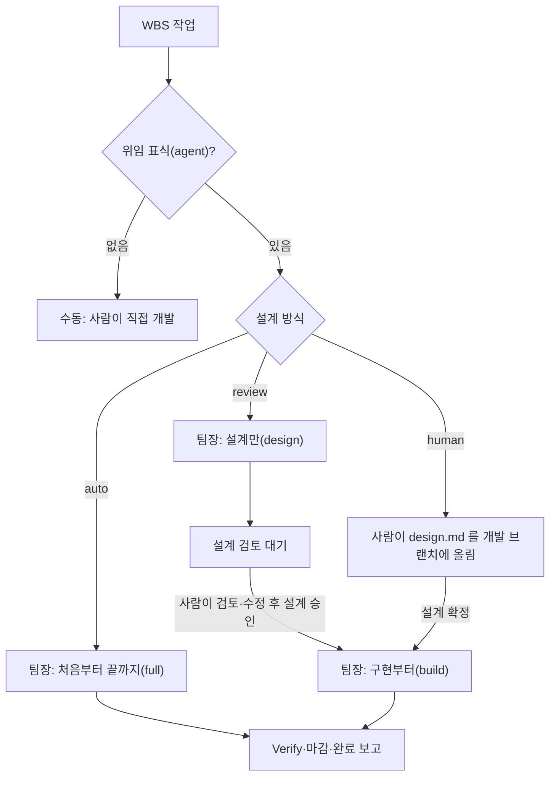
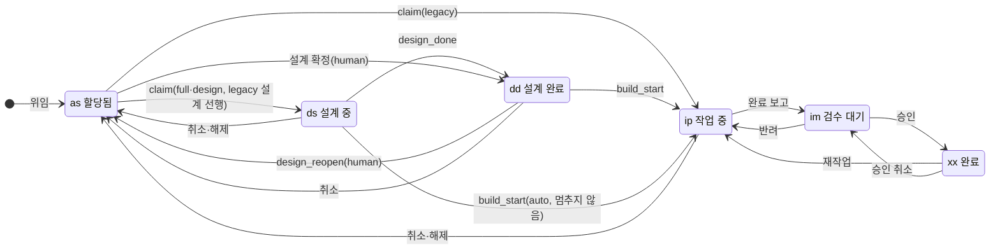
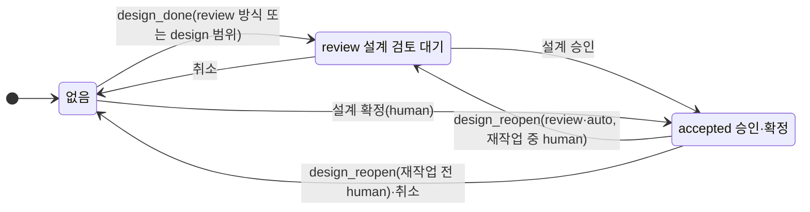

# 설계 상태와 구현자동 모드

2026-09-26 · 설계 확정본 3판(스펙 승인 대기)

작업마다 설계 방식(완전자동·설계 검토·사람 설계)을 지정하고, 서버에 설계 상태와 새 단계 `dd`(설계 완료)를 기록한다. 승인 관문은 서버 라우트가
집행하고, 팀장이 할 일도 서버가 계산한다. 그래서 어떤 경로(옛 킷, `/dflow-poll`, 재개, 수동 실행)로도 승인되지 않은 설계로 구현이 시작되지 않는다.

선행 문서: [dflow-dev 분할·실행 범위 설계 §14](2026-09-26-dflow-dev-skill-router-design.md), [병렬성·토큰 설계 §6](2026-09-26-dflow-parallel-token-design.md)(설계 선행),
[idea.md](../../idea.md) 「완전자동/개발자동/수동」(이 스펙은 개발자동을 구현자동으로 부른다). 검토 경위는 10절(시뮬레이션 세 차례)에 있다.

## 1. 결정 기록

| # | 질문 | 결정 | 이유 |
| --- | --- | --- | --- |
| D1 | 모드를 어느 단위로 지정하나 | 작업마다(`wbs_items.design_mode`) | 팀장 하나가 한 번 떠서 작업별로 다르게 처리한다 |
| D2 | 수동 모드 | 위임 표식(`agent` 태그) 없음 | 이미 있는 표식으로 충분하다 |
| D3 | 사람 설계의 준비 신호 | 「설계 확정」 버튼 | 쓰다 만 설계를 커밋해도 구현이 시작되지 않는다 |
| D4 | 에이전트 설계가 마음에 들지 않을 때 | 사람이 agent 브랜치의 design.md 를 고친 뒤 「설계 승인」 | 새 상태 없이 review → accepted 하나로 끝난다 |
| D5 | 스킬 구성 | 나누지 않는다. `/dflow-dev` 하나에 `--scope` | 최대한 간단한 스킬 셋(9절) |
| D6 | 설계를 끝낸 상태 | 새 단계 `dd`(설계 완료)를 `ds` 와 `ip` 사이에 | 진행 중 단계(`ds`·`ip`) 뒤에 끝남·대기 단계(`dd`·`im`)가 짝을 이룬다 |
| D7 | 규칙을 어디에 두나 | 관문과 판단은 TS 순수 모듈 하나(`designGate.ts`), 라우트가 집행, RPC 는 CAS 조건만 | 선행 관문이 이미 라우트에서 판정된다(0107 머리말). 규칙 원본이 하나여야 표 테스트 하나로 고정된다(5절) |
| D8 | 승인 우회를 어떻게 막나 | claim·build-start 가 범위(`scope`)를 밝히고, 서버가 claim 때 범위를 주문에 저장(`claim_scope`)해 뒤의 사건과 대조. 범위가 비어 있으면(`null`) `legacy` 로 본다 | 옛 킷·`/dflow-poll`·재개·수동 실행을 한 장치로 막는다. design-done 전에 죽어도 서버가 범위를 안다(5.2). 이전 전에 claim 된 주문도 관문을 지난다(8절) |
| D9 | 설계 상태 값·버튼 이름 | 값 `review`·`accepted`, 버튼 「설계 승인」(에이전트 설계)·「설계 확정」(사람 설계) | 주문 상태 `approved`·완료 「승인」과 겹치지 않게 한다 |
| D10 | 승인·확정 권한 | 둘 다 위임 권한(`requireDelegationRight`) | 완료 승인 권한(`loadOrderForAdmin`)은 담당자 본인을 제외해, 사람 설계를 쓴 담당자가 확정하지 못한다 |
| D11 | 설계가 틀렸다며 반려할 때 | 새 선택지 없이 일반 반려. 사람이 설계를 고친 뒤 반려하고, 재작업은 design.md 를 바꾸면 되돌린다(6.5) | 새 UI·RPC 변형 없이 "승인된 설계만 구현"이 지켜진다 |
| D12 | 승인 대상 버전 고정(sha) | 하지 않는다. 알려진 한계로 둔다 | 서버에 GitHub 연동이 없어 누른 순간의 sha 를 알 수 없다(11절) |
| D13 | 점유 해제(release) | 설계 상태가 있거나 `claim_scope` 가 `design` 이면 거부하고 「중단」으로 안내. 받으면 `claim_scope` 를 비운다 | 해제가 `ready`+`review` 같은 빠져나올 수 없는 상태를 만든다(2차 검토). 설계만 하던 주문을 해제하면 다음 `full` claim 이 같은 agent 브랜치의 검토 안 된 설계로 구현한다(3차 검토). release 는 사람이 `dflow.sh release` 로만 부른다 |
| D14 | 취소(위임 해제·「중단」·개발 워크플로 끄기·스텁 제거) | 공용 헬퍼 하나. 설계 상태를 지운다. 단계는 `claimed` 취소면 `as`(지금과 같음), `ready` 취소면 `dd` 만 `as` 로 | 지금 `ready` 취소는 단계를 건드리지 않는다. 그 동작을 `dd` 에만 넓힌다(`ready`+`ip` 는 사람이 단계를 직접 바꿨을 때만 생기고 설계 상태가 없다) |
| D15 | review 작업의 선행 대기 설계 | 미충족 선행이 모두 `dd` 또는 `ip` 면 설계 허용 | 선행이 사람 검토를 기다리는 동안 후행 설계를 막지 않는다 |
| D16 | 설계만 하는 워커를 설계 선행 상한에 세나 | 세지 않는다 | 설계만 멈춤은 워크트리를 남기지 않는다 |
| D17 | 새 작업의 설계 방식 기본값 | `auto` | 지금과 같다 |
| D18 | `dd` 실적 크레딧 | 20(선택 키, `ds 10` 과 `ip 30` 사이) | 설계 완료를 실적에 반영 |
| D19 | 앞으로 가는 전이의 실적 | 낮추지 않는다(`max(현재, 크레딧)`) | 저장된 크레딧표와 선택 키 기본값이 어긋나도 역행하지 않는다 |
| D20 | 옛 서버(계약 2.11 미만) | 모든 작업을 `auto` 로 본다(지금 동작). 팀장 인자 "설계만"·"구현부터"는 2.11 이상에서만 받는다 | 운영은 2.9 에서 2.11 로 바로 간다(8절) |
| D21 | 팀장이 워커에 넘기는 범위 | 새 spawn 은 서버 `action` 에서, 이미 claim 된 주문의 재개·재시작은 서버 `claim_scope` 에서 뽑는다(`design`→`design`, `full`·`legacy`→`full`, `build`→`build`). 팀장 인자는 서버 판단의 필터로만 쓴다 | 포인터마다 다른 범위가 실려 관문과 어긋나던 문제를 없앤다. 구현 중(`ip`)인 주문은 `action` 이 `skip` 이라 범위를 뽑을 수 없다(3차 검토) |
| D22 | 승인을 팀장에 알리는 신호 | watch 응답에 "이 신원이 띄울 `action: build` 주문 id 목록"을 싣는다. 목록에 슬롯에 없는 id 가 있으면 TICK 건너뛰기를 하지 않고 팀장을 깨운다. 재개 요청 표식(0099)은 쓰지 않는다 | 0099 는 사람의 「이어서 시작」·claimed·같은 PC 용 장치라 신원 단위 승인에 맞지 않는다. 개수만 보면 하나가 시작되고 하나가 승인된 순간을 놓친다 |
| D23 | 관문 거부의 HTTP 코드 | 409(`design_gate`·`design_not_accepted`·`already_started`) | 옛 킷이 403 을 받으면 실패로 쌓아 차단기가 걸린다. 409 는 옛 킷에서 일시 제외(30분 뒤 재시도, 무해)로 끝난다 |
| D24 | 재작업 중 설계 변경 | 재작업 build-start(`rework`)가 성공할 때마다 워크트리의 design.md 해시를 다시 적고, 완료 보고 직전에 바뀌었으면 완료 보고 대신 되돌린다. 되돌려도 단계·실적은 그대로 | 워커가 "설계를 바꿨는지"를 기계적으로 판정한다. 재승인 뒤 이어 갈 때 다시 적어야 같은 변경으로 또 되돌리지 않는다 |
| D25 | build-start 직후 워커가 죽었을 때 | 서버는 `ip` 에서 `build`·`full` 을 계속 거부한다. 워커가 build-start 를 부르기 직전에 state.json 에 `build_start_sent` 를 적고, 재실행 때 이 표식이 있고 서버가 `claimed`·내 점유·단계 `ip` 면 부르지 않고 이어 간다 | 서버 쪽 멱등은 같은 신원의 두 번째 워커(다른 PC)를 구별할 표식이 없다. 라벨은 재개 때 바뀔 수 있다 |
| D26 | 단계가 `ip` 이상인 항목의 `ready` 주문 | claim 관문이 모든 범위를 409 로 거부하고, 판단은 `skip`(사유 `단계 확인 필요`)을 낸다. 화면은 "단계를 되돌리거나 재작업을 쓰라"고 안내한다 | 판단은 영원히 건너뛰는데 관문은 허용하던 어긋남을 없앤다. 완료 항목 재위임이 실적을 낮추던 기존 결함의 경로도 닫힌다 |

## 2. 네 모드

| 모드 | 설계 방식 값 | 누가 설계하나 | 구현 전 사람의 행동 | 팀장이 하는 일 |
| --- | --- | --- | --- | --- |
| 완전자동 | `auto` (기본값) | 에이전트 | 없음 | 처음부터 끝까지(`full`) |
| 설계 검토 | `review` | 에이전트 | agent 브랜치의 design.md 를 검토·수정하고 「설계 승인」 | 설계만(`design`) → 승인되면 구현부터(`build`) |
| 구현자동 | `human` | 사람 | design.md 를 개발 브랜치 `<TASKS>/<TSK>/design.md` 에 올리고 「설계 확정」 | 확정된 작업만 구현부터(`build`) |
| 수동 | (위임 표식 없음) | 사람 | 직접 코딩하거나 `/dflow-dev` 를 손으로 실행 | 가져가지 않는다 |

사람 설계는 5개 절이 모두 있어야 한다. 서버는 파일을 볼 수 없으므로, 확정 뒤 design.md 가 없거나 절이 빠졌으면 팀장(띄우기 전 검사)이나 워커가
`design_reopen` 으로 되돌린다(6.4). 화면에 사유가 보이고, 사람이 고친 뒤 다시 확정한다.

## 3. 상태 모델

작업 하나의 상태는 아래 값의 조합이다. 주문 상태는 그대로 두고 칸 셋과 단계 하나를 더한다.

| 값 | 저장 위치 | 값의 범위 |
| --- | --- | --- |
| 설계 방식 | `wbs_items.design_mode`(새, DB CHECK) | `auto`·`review`·`human` |
| 주문 상태 | `agent_work_orders.status`(기존) | `ready`·`claimed`·`reported`·`approved`·`cancelled` |
| 설계 상태 | `agent_work_orders.design_state`(새, DB CHECK) | 없음·`review`·`accepted` |
| claim 범위 | `agent_work_orders.claim_scope`(새) | 없음·`full`·`design`·`build`·`legacy` |
| 되돌림 사유 | `agent_work_orders.design_note`(새, 자유 문장) | design_reopen 이 쓰고 design_accept 가 지운다 |
| 단계 | `wbs_items.stage`(기존, CHECK 에 `dd` 추가) | `as`·`ds`·`dd`(새)·`ip`·`im`·`xx` |

| 단계 | 화면 문구 | 성격 |
| --- | --- | --- |
| `as` | 할당됨 | 착수 전 대기 |
| `ds` | 설계 중 | 진행 중 |
| `dd` | 설계 완료 | 설계를 끝내고 검토·확정·선행·착수를 기다림 |
| `ip` | 작업 중 | 진행 중 |
| `im` | 검수 대기 | 구현을 끝내고 검수를 기다림 |
| `xx` | 완료 | 완료 |

화면 판정표. 좌석·WBS·허브가 모두 이 표를 쓴다. 좌석은 먼저 BLOCKED 와 신선한 heartbeat(ACTIVE)를 보고, 그다음 이 표를 본다. 그래서 죽은 워커가
대기 문구 뒤에 가려지지 않는다.

| 단계 | 설계 상태 | 조건 | 화면 문구 | 버튼·안내 |
| --- | --- | --- | --- | --- |
| `dd`·`ip` | `review` | | 「설계 검토 대기」(`ip` 면 「설계 검토 대기(재작업)」), 되돌림 사유 | 「설계 승인」, agent 브랜치·design.md 경로 링크 |
| `ip` | `accepted` | 주문 `claimed` | 「재작업 대기(설계 재승인됨)」 | "사람이 `/dflow-dev` 로 재작업을 이어 간다" |
| `dd` | `accepted` | 선행 충족 | 「구현 대기」(설계 승인됨·확정됨) | 없음 |
| `dd` | `accepted` | 선행 미충족 | 「선행 대기」(설계 승인됨·확정됨) | 없음 |
| `dd` | 없음 | 선행 미충족 | 「설계 완료·선행 대기」(auto 설계 선행) | 없음 |
| `dd` | 없음 | 선행 충족 | 「설계 완료·구현 대기」(auto 설계 선행이 풀린 직후) | 없음 |
| `as` | 없음 | 방식 `human`, 주문 `ready` | 「사람 설계 대기」, 되돌림 사유가 있으면 함께 | 「설계 확정」, 개발 브랜치 경로와 필수 5개 절 안내 |
| `as` | 없음 | 방식 `human`, 주문 없음 | 「사람 설계 대기(위임 꺼짐)」 | 「설계 확정」을 숨기고 "프로젝트의 에이전트 위임이 꺼져 있다"고 안내 |
| `as` | 없음 | 방식 `review`, 선행 미충족 | 「선행 대기」 | 없음 |
| `ip`·`im`·`xx` | 없음 | 주문 `ready` | 「단계 확인 필요」 | "단계를 되돌리거나 재작업을 쓰라"(D26) |

"구현 대기"는 팀장이 가져가기를 기다린다는 뜻이다. 팀장이 없거나 다른 신원이 점유했으면 그 사실을 함께 보인다(6.2).

## 4. 전이

### 4.1 사건 표

| 사건 | 받는 주문 상태 | 단계 | 설계 상태 | 실적 | 비고 |
| --- | --- | --- | --- | --- | --- |
| 위임(assign) | 없음 | 없음 → `as` | 없음 | 0 | |
| claim | `ready` | `as` → `ds`(범위 `full`·`design`). 범위 `build` 면 `dd` 유지. 범위 `legacy` 면 0107 과 같다(`design_first` 면 `ds`, 아니면 `ip`). 단계가 `ip` 이상이면 거부(D26) | 유지 | 크레딧대로(`build` 는 `dd` 키), 낮추지 않음 | 범위를 `claim_scope` 에 저장. 관문(5.2) |
| design_done(새) | `claimed` | `ds` → `dd`. `dd` 면 변화 없음(멱등). `ip` 이상이면 skip(설계 상태도 불변) | 없음 → `review`(방식 `review` 이거나 `claim_scope` 가 `design`). `accepted` 는 건드리지 않음 | 20 | 워커가 설계를 끝내고 멈출 때. 부모·지워진 항목은 0107 처럼 skip |
| design_accept(새) | review 는 `claimed`, human 은 `ready` | review 는 유지(`dd`·`ip`), human 은 `as` → `dd` | `review` → `accepted`, human 은 없음 → `accepted` | human 확정만 20 | 「설계 승인」·「설계 확정」. `design_note` 를 지운다. 부모·지워진 항목은 거부 |
| design_reopen(새) | `claimed`·`ready` | 단계 `ip`(재작업 중)는 방식과 관계없이 유지. 그 밖에 review·auto 는 유지, human 은 `claimed` 면 주문을 `ready` 로 되돌리고 `claim_scope` 를 비우며 단계 → `as` | 단계 `ip` 거나 review·auto 면 `accepted` → `review`. `ip` 가 아닌 human 은 → 없음 | `ip` 거나 review·auto 면 그대로, 그 밖의 human 은 0 | 사유를 `design_note` 에 쓴다. 부모·지워진 항목은 거부 |
| build_start | `claimed` | `ds`·`dd` → `ip` | 유지 | 30 | 관문(5.2). 범위 `build` 는 `dd` 에서만 성공 |
| 완료 보고 | `claimed` | `ip` → `im` | 유지 | 80 | |
| 승인(approve) | `reported` | `im` → `xx` | 유지 | 100 | 완료 승인 |
| 반려(reject) | `reported` | → `ip` | 유지 | 50(rw) | 6.5 |
| 재작업(rework) | `approved` | → `ip` | 유지 | 50(rw) | 6.5 |
| 승인 취소(unapprove) | `approved` | `xx` → `im` | 유지 | 80 | |
| 점유 해제(release) | `claimed` | → `as` | 없음일 때만 받음 | 0 | 설계 상태가 있거나 `claim_scope` 가 `design` 이면 409 로 거부하고 「중단」 안내. 받으면 `claim_scope` 를 비운다(D13) |
| 취소(공용 헬퍼) | `ready`·`claimed` | `claimed` 면 → `as`. `ready` 면 `dd` 만 → `as` | → 없음 | `as` 로 갈 때 0 | D14. 위임 해제·「중단」·개발 워크플로 끄기·스텁 제거 |

앞으로 가는 사건(claim·design_done·design_accept·build_start·완료 보고·승인)은 실적을 낮추지 않는다(D19). 크레딧표에 선택 키(`ds`·`dd`)가 없으면
이웃 키 사이 값으로 채운다. 전이 RPC 의 CAS 에는 주문 상태에 더해 `design_state` 와, 라우트가 읽은 `design_mode` 를 넣는다(방식 변경과 claim 의 경쟁 방지).

### 4.2 단계 전이

### 4.3 설계 상태 전이

## 5. 관문과 판단 함수

### 5.1 규칙이 사는 곳

| 규칙 | 위치 | 성격 |
| --- | --- | --- |
| 관문: 이 범위로 claim·build-start 해도 되나 | `src/lib/domain/designGate.ts` 의 `canClaim`·`canBuildStart`(순수 함수), claim·build-start 라우트가 호출 | 집행. 거부하면 아무것도 바뀌지 않는다 |
| 판단: 팀장이 지금 이 작업을 어떻게 띄우나 | 같은 모듈의 `nextAgentAction`, 작업 목록·상세·watch 응답이 싣는다 | 안내. 팀장은 이 값대로 띄운다 |
| 경쟁 방지 | 전이 RPC 의 CAS 에 `design_state`·`design_mode` 조건 | 라우트 판정과 쓰기 사이에 바뀌면 conflict |
| 실행 방법 | 스킬(`/dflow-dev`·`/dflow-team`·`/dflow-poll`) | 설계 작성·게이트·커밋 |

10절의 경우들을 `designGate.ts` 의 "입력 → 기대 출력" 표 테스트로 고정한다. 5.2 가 허용하는 범위와 5.3 이 내는 `action` 이 늘 맞는지도 같은 표에서
검사한다(판단이 낸 범위를 관문이 거부하는 조합이 없어야 한다).

### 5.2 관문

claim 은 `scope`(`full`·`design`·`build`)를 보낸다. 없으면 `legacy` 다. 서버는 받은 범위를 `claim_scope` 에 저장한다(RPC 인자 기본값 `legacy`). build-start 도
`scope` 를 보낸다(재작업은 `rework`). 저장된 `claim_scope` 가 비어 있으면 라우트는 `legacy` 로 본다.

**claim** — 모든 범위에 공통으로, 단계가 `ip` 이상인 항목은 거부한다(D26).

| 범위 | 허용 조건 |
| --- | --- |
| `full`·`legacy` | 방식 `auto` ∧ 설계 상태 없음. `design_first` 는 지금처럼 함께 보낼 수 있다(설계 선행) |
| `design` | 방식 `auto`·`review` ∧ 설계 상태 없음 ∧ 개발 브랜치에 사람 설계가 없음(워커가 claim 전에 확인, 6.3). 선행이 미충족이면 `design_first` 를 보낸 것으로 보고 설계 선행 허용 조건(`dd`·`ip`, D15)을 적용한다 |
| `build` | 설계 상태 `accepted`(human 의 `ready` 주문). `design_first` 는 무시한다 |

**build-start**

| 범위 | 허용 조건 |
| --- | --- |
| `full` | 방식 `auto` ∧ 설계 상태 없음 ∧ `claim_scope` 가 `full`·`legacy`(비어 있음 포함) ∧ 단계 `ds`·`dd` |
| `build` | 설계 상태 `accepted` ∧ 단계 `dd`(`ip` 면 `already_started` — 두 번째 워커를 막는다. 먼저 부른 워커의 재실행은 D25 로 부르지 않는다) |
| `rework` | 단계 `ip` ∧ 주문 `claimed`(반려·재작업 뒤) ∧ 설계 상태가 `review` 가 아님(재작업 중 되돌린 설계는 승인 뒤에만 이어 간다) |
| `legacy` | 단계 `ip` 이상 ∧ 설계 상태가 `review` 가 아니면 지금처럼 멱등 통과. 단계가 `ip` 미만이면 `full` 과 같다 |

- 거부는 모두 409 다(D23).
- 사람이 `/dflow-dev <id> --scope build` 를 손으로 돌려도 같다. 승인되지 않았으면 "설계 승인 필요"로 거부되고, 사람이 버튼을 먼저 누른다. 우회 플래그는 없다.
- `claim_scope` 가 `design` 인 주문은 design-done 전이라도 `full` build-start 가 거부된다. 설계만 하던 워커가 죽고 다른 범위로 다시 띄워져도 구현이 시작되지 않는다.
- 옛 킷은 review·human 작업의 claim 에서 409 로 거부되어 일시 제외로 끝난다(30분마다 재시도, 무해).
- 좌석 재개 요청(`requestResumeOnOrder`)은 설계 상태가 있으면 거부한다. 설계가 걸린 작업의 재개는 서버 `action` 으로만 한다.

### 5.3 판단: `nextAgentAction(작업, 주문, 팀장 필터)`

위에서부터 처음 맞는 행을 쓴다.

| # | 조건 | `action` | 사유 |
| --- | --- | --- | --- |
| 1 | 주문이 `reported`·`approved`·`cancelled` | `skip` | 검수·완료·취소 |
| 2 | 주문 `claimed` ∧ (단계 `ip` 이상 또는 신선한 heartbeat) | `skip` | 진행 중·재작업(수동). 신선함은 좌석 판정의 ACTIVE 와 같은 기준이다 |
| 3 | 주문 `ready` ∧ 단계 `ip` 이상 | `skip` | 단계 확인 필요(D26) |
| 4 | 설계 상태 `review` | `wait` | 설계 검토 대기 |
| 5 | 설계 상태 `accepted` ∧ 선행 미충족 | `wait` | 선행 대기 |
| 6 | 설계 상태 `accepted` ∧ 필터가 "설계만"이 아님 | `build` | 승인된 설계 |
| 7 | 설계 상태 `accepted` | `skip` | 필터("설계만")에 맞지 않음 |
| 8 | 주문 `claimed`(설계 상태 없음, 단계 `ds`·`dd`) | `claim_scope` 를 따른다: `design` 이면 `design`(필터 "구현부터"면 `skip`). `full`·`legacy`·비어 있음이면 선행 미충족일 때 `wait`, 충족이면 `full`(필터가 있으면 `skip`). `build` 면 `skip` | 이미 정해진 범위를 이어 간다 |
| 9 | 방식 `human` | `skip` | 사람 설계 대기 |
| 10 | 선행 미충족 ∧ 설계 선행 불가 | `wait` | 선행 대기 |
| 11 | (방식 `review` ∧ 필터가 "구현부터"가 아님) 또는 (방식 `auto` ∧ 필터 "설계만") | `design` | 설계만 |
| 12 | 방식 `auto` ∧ 필터가 없음 | `full` | 처음부터 끝까지(선행 미충족이면 `deps_unmet` 표시) |
| 13 | 그 밖 | `skip` | 필터에 맞지 않음 |

- 9~12행은 `ready` 주문이면서 설계 상태가 없을 때만 닿는다(1~8행이 먼저 걸러낸다). 그래서 5.2 claim 관문과 늘 맞는다.
- 8행은 claim 된 주문이 필터 때문에 다른 범위로 다시 띄워지지 않게 한다. `claim_scope=design` 인 주문이 필터 없는 팀장에게 `full` 로 나가 build-start 에서
  거부되는 반복, "설계만" 필터가 `full` 주문에 `design` 을 거듭 내는 반복이 여기서 막힌다.
- 12행이 `deps_unmet` 이면 팀장은 지금의 설계 선행 경로(상한 `DFLOW_DESIGN_AHEAD_MAX`)로 보낸다. 11행은 선행이 미충족이어도(설계 선행 가능하면) 곧바로 띄운다(D16).
- 작업 목록 응답의 후보 기준은 지금 poll 목록과 같다(프로젝트 바인딩·담당자 조건). 그 위에 이 신원이 점유한 `claimed` 주문 중 `action` 이 `build` 인 것을 더한다.
  다른 신원이 점유한 `build` 대상은 보고용으로만 싣는다(`mine=false`).

## 6. 팀장·워커 동작

### 6.1 팀장 인자

"설계만"과 "구현부터"는 5.3 의 필터로만 쓰인다. 기본은 필터 없음이다. "구현자동"은 human 방식의 이름으로만 쓴다. 지금 팀장 인자 별칭 "개발자동"(SKILL.md·help.md)은 지우고, 스킬 문서의 "개발자동" 표현(orch/start.md 등)도 "구현자동"으로 바꾼다.

| 팀장 실행 | `auto` 작업 | `review` 작업 | `human` 작업 |
| --- | --- | --- | --- |
| 기본 | 처음부터 끝까지 | 설계만 → 승인되면 구현 | 확정된 것만 구현 |
| 설계만 | 설계만 하고 검토 대기로 멈춤 | 설계만 하고 멈춤 | 건드리지 않음 |
| 구현부터 | 승인된 것만 구현(설계만 실행으로 멈췄던 것) | 승인된 것만 구현 | 확정된 것만 구현 |

"설계만" 실행으로 멈춘 auto 작업은 검토 대기가 된다(design_done 이 `claim_scope=design` 을 보고 `review` 를 쓴다). 사람의 승인 없이는 어떤 실행도
그 작업을 구현하지 않는다.

### 6.2 띄우기·발견·기상

- 팀장이 워커에 넘기는 범위(포인터 `SCOPE=`)는 새 spawn 이면 서버 `action`, 이미 claim 된 주문의 재개·재시작이면 서버 `claim_scope` 에서 뽑는다(D21).
  구현 중(`ip`)인 주문의 재시작도 `claim_scope` 를 쓴다. 워커는 state.json 의 `scope` 가 포인터와 다르면 이어 가지 않고 `blocked 범위 불일치` 로 끝낸다.
- `action: build` 가 `ready` 주문(human)이면 「5. 팀원 spawn」(워커가 claim), `claimed` 주문(review)이면 「5-1. 재개 spawn」(워크트리가 없으면 resume.md 3항이
  원격 agent 브랜치에서 만든다)으로 띄운다. 같은 신원의 다른 PC 가 점유한 것도 가져올 수 있지만, 그 주문에 신선한 heartbeat 가 있으면 목록에 오지 않는다(5.3 2행).
- 띄우기 전 검사: `action: build` 인 human 작업이 `ready` 주문이면, 팀장이 개발 브랜치를 `git fetch` 한 뒤 원격 개발 브랜치의 design.md 가 있고 5개 절이 다
  있는지 본다. 없으면 워커를 띄우지 않고 `design-reopen --reason` 을 부른다(화면이 「사람 설계 대기」와 사유로 돌아간다). `claimed` 주문에는 이 검사를 하지
  않는다(그 워커가 스스로 본다, 6.4).
- 기상: watch 응답에 "이 신원이 띄울 `action: build` 주문 id 목록"을 싣는다. 목록에 슬롯에 없는 id 가 있으면 tick.sh 가 TICK 을 건너뛰지 않고, watch 가
  그 변화를 보면 곧 팀장을 깨운다(D22). 0099 재개 요청 표식은 승인에 쓰지 않는다.
- 다른 신원이 점유한 `build` 대상은 가져가지 않고 시작·마감 보고의 「멈춤」 표에 `다른 신원 점유` 로 올린다. 그 팀장이 영영 돌아오지 않으면 7절의
  "설계를 지키며 빠져나오기" 절차를 안내한다.
- 결과 처리 보고 문구는 "설계 승인 버튼을 누르면 이어 간다"로 바꾼다(지금 scope.md 의 "구현부터로 돌리거나 이어서 시작" 문구는 지운다).

### 6.3 설계만 멈춤(워커)

- claim 전: 범위가 `design` 이면 개발 브랜치에 `<TASKS>/<TSK>/design.md` 가 이미 있는지 본다. 있으면(사람 초안) claim 하지 않고
  `skipped 사람 설계 초안 있음` 으로 보고한다. 잔재 격리가 사람 초안을 옮기지 않게 한다. 팀장은 이 결과를 다른 `skipped` 처럼 일시 제외(30분)로 처리해,
  기상마다 다시 띄우지 않는다.
- 멈춤 순서: 1. design.md 커밋 → 2. state.json(`phase=wait_review`) 커밋 → 3. `git push origin <agent 브랜치>` 성공 → 4. `dflow.sh design-done <ref>` →
  5. heartbeat. push 가 실패하면 design-done 을 부르지 않고 실패로 보고한다. design-done 이 실패하면 워크트리를 남기고(`parked`) 실패로 보고한다.
- 팀장의 대리 호출: 재시작 복구(restart.md 4-2)와 `design_review` 결과 처리 때 서버 설계 상태가 없으면, `git ls-remote` 로 원격 tip 이 로컬 HEAD 와 같은지
  확인한 뒤에만 design-done 을 부른다. 범위는 서버의 `claim_scope` 가 알려 준다. 실패하면 워크트리를 정리하지 않는다.
- 설계 선행으로 `wait_pred` 에 멈출 때도 같은 순서로 design-done 을 부른다(단계 `dd`, 설계 상태는 방식 `review` 이거나 `claim_scope=design` 일 때만 `review`).

### 6.4 승인된 설계를 바꿔야 할 때

- build 로 재개한 워커는 원격 agent 브랜치를 ff 로 받은 뒤 Design 게이트를 다시 돈다. 불통이면 `design-reopen <ref> --reason <빠진 절>` 을 부르고
  `design_review` 로 끝난다.
- human 작업에서 개발 브랜치에 design.md 가 없거나 절이 빠졌으면(팀장 검사를 지나친 경우) 워커가 같은 방식으로 되돌린다. 단계가 `dd` 면 서버가 주문을
  `ready`·단계 `as`·설계 상태 없음으로 돌린다. 단계가 `ip`(재작업 중)면 review 와 같게 설계 상태만 `review` 로 바꾼다(4.1).
- 설계 선행 재개에서 선행 계약이 바뀌어 설계를 고쳐야 하면, 방식이 `review`·`human` 이거나 설계 상태가 `accepted` 일 때 고친 뒤 design-reopen 으로
  멈춘다(S5). `auto` 는 지금처럼 고친 뒤 이어 간다.
- 설계 선행의 선행 계약 찾기는 선행 agent 브랜치 외에 개발 브랜치의 `<TASKS>/<선행>/design.md` 도 본다(선행이 human 이거나 아직 `dd` 인 경우).

### 6.5 반려와 재작업

- 반려·재작업의 단계·실적은 지금과 같다(`ip`, 50). 재작업은 지금처럼 팀장이 가져가지 않고(5.3 2행) 사람이 `/dflow-dev` 로 돌린다.
- 재작업 워커는 먼저 `git fetch` 와 `merge --ff-only` 로 원격 agent 브랜치를 받는다(사람이 반려 전에 고친 설계를 받기 위해). 이미 머지되어 agent 브랜치가 없으면
  개발 브랜치의 design.md 를 기준으로 한다.
- 재작업 build-start(`scope=rework`, 5.2)가 성공할 때마다 워크트리의 `<TASKS>/<TSK>/design.md`(agent 브랜치판) 해시를 state.json 에 적는다. 완료 보고
  직전에 해시가 바뀌었고 설계 상태가 `accepted` 면 완료 보고 대신 design-reopen 으로 멈춘다(D24). 단계와 실적은 그대로(`ip`, 50)이고, 화면은
  「설계 검토 대기(재작업)」가 된다. 사람이 승인하면 화면이 「재작업 대기(설계 재승인됨)」가 되고, 다시 `/dflow-dev` 로 재작업을 이어 간다. 이어 갈 때의
  build-start 가 해시를 다시 적으므로 같은 변경으로 또 되돌리지 않는다.
- `/dflow-poll` 의 자동 재작업도 같은 규칙을 따른다(규칙이 워커 쪽에 있으므로).

### 6.6 설계 선행

| 설계 방식 | 선행이 미충족일 때 |
| --- | --- |
| `auto` | `action: full` + `deps_unmet` → 지금의 설계 선행 경로(상한 적용). 설계 뒤 design-done 으로 `dd`(설계 상태 없음), 선행이 풀리면 구현 |
| `review` | 미충족 선행이 모두 `dd`·`ip` 면 `action: design` 으로 곧바로(상한 미적용). 승인 뒤에도 선행이 남으면 `wait`, 풀리면 `build` |
| `human` | 설계 선행 후보에서 뺀다. 확정됐어도 선행이 풀릴 때까지 `wait` |

- 설계 선행 허용 조건(`designFirstTooEarly`)은 `ip` 에 더해 `dd` 도 받는다(D15). 선행이 `as`·`ds` 면 여전히 거부한다.
- 선행 대기 워크트리의 재개 판정(design-ahead.md 「2」)은 서버가 `claimed`·`mine` 이 아니면 목록과 상한에서 빼고 「멈춤」 표에 `서버 <status>` 로 올린다.
  미충족 선행의 단계가 `as` 면 `선행 주문 없음` 으로 보고한다(기존 결함 수정). 재개 범위는 서버 `claim_scope` 에서 뽑는다(D21).

### 6.7 build-start 재호출(D25)

- 워커는 build-start 를 부르기 직전에 state.json 에 `build_start_sent` 를 적는다(범위와 시각 포함).
- 재실행한 워커는 이 표식이 있고 서버가 `claimed`·내 점유·단계 `ip` 면 build-start 를 다시 부르지 않고 구현을 이어 간다. 서버 단계가 아직 `ds`·`dd` 면
  (호출이 닿지 않았음) 다시 부른다.
- 표식 없이 `already_started` 를 받으면(다른 PC 의 워커가 먼저 시작했거나 워크트리를 원격에서 다시 만들었음) 구현하지 않고 `blocked 이미 구현 시작됨` 으로
  끝낸다. 팀장은 「멈춤」 표에 올리고, 사람이 그 워크트리가 살아 있는지 보고 정한다.

## 7. 화면과 권한

- WBS 작업 패널: 위임 표식과 설계 방식을 같은 곳에서 고른다. 한 서버 액션이 둘을 함께 쓴다.
- 설계 방식은 설계 상태가 없고 주문이 없거나 `ready` 일 때만 바꿀 수 있다. 조건부 UPDATE 로 막는다. 거부되면 이유("에이전트가 작업 중" 또는 "설계가 확정됨")와
  "먼저 위임을 해제하라"는 안내를 보인다.
- 위임 해제 확인 창은 설계 상태가 있으면 "agent 브랜치에서 고친 설계는 새 주문에 이어지지 않는다"고 경고한다.
- 버튼: 「설계 승인」(설계 상태 `review`), 「설계 확정」(방식 `human` ∧ 단계 `as` ∧ 설계 상태 없음 ∧ `ready` 주문이 있음). 허브 동작 종류도 완료 승인과
  분리한다.
- 설계를 지키며 빠져나오기: 승인된 설계가 걸린 작업이 갇혔을 때(다른 신원이 점유한 채 사라짐, 6.7 의 `이미 구현 시작됨` 등) 화면이 이 절차를 안내한다.
  1. 「중단」 → 2. 다시 위임하고 방식을 `human` 으로 고른다 → 3. agent 브랜치의 design.md 를 개발 브랜치 `<TASKS>/<TSK>/design.md` 로 옮긴다 →
  4. 「설계 확정」. 방식 변경은 설계 상태 없음·`ready` 조건이라 2번에서 허용된다.
- 권한: 두 버튼과 설계 방식 변경은 위임 권한(`requireDelegationRight`)(D10).
- 안내: 「설계 검토 대기」에는 agent 브랜치와 design.md 경로, 「사람 설계 대기」에는 개발 브랜치 경로와 필수 5개 절, 되돌림 사유(`design_note`)를 보인다.
  반려된 작업에는 "사람이 `/dflow-dev` 로 재작업을 돌려야 한다"고 보인다.
- 좌석의 「이어서 시작」은 설계 상태가 있는 좌석에서 숨긴다. 좌석 표시는 3절 판정표로 한다.
- 결재 대기 배지는 완료 승인만 센다. 설계 검토 대기는 별도 배지로 센다.
- `/dflow-poll` 은 `action` 이 `full` 이 아니면 사유를 알리며 건너뛴다(review·human 작업은 팀장이나 사람이 맡는다).

## 8. 호환과 이전

- **계약 2.11**: 작업 목록·상세·watch 에 `design_mode`·`design_state`·`design_note`·`action`·`action_reason`·`deps_unmet`, claim·build-start 의 `scope`,
  동사 `design-done`·`design-reopen`(요청에 `reason`), 409 거부 코드 `design_gate`·`design_not_accepted`·`already_started`. design-reopen 은 점유자,
  또는 `ready` 주문이면 같은 프로젝트의 에이전트 PAT 가 부를 수 있다.
- **옛 서버(2.11 미만)**: 스킬은 `contract-ge 2.11` 이 거짓이면 모든 작업을 `auto` 로 보고 지금처럼 동작한다(2.9 에는 `design_mode` 칸이 없어 사람이 다른 방식을
  고를 수도 없다). design-done·design-reopen 은 부르지 않는다(`DESIGN_STATE_UNSUPPORTED`). dmes 는 본 체크아웃 스킬로 운영 API(2.9)를 부르므로 이 경로가 반드시
  살아 있어야 한다. 팀장 인자 "설계만"·"구현부터"는 2.11 미만에서 거부하고 이유를 알린다. `/dflow-dev --scope` 수동 실행은 지금처럼 로컬 state.json 으로 돈다.
- **2.10 전용 경로 제거**: heartbeat `wait_review` 로 좌석을 판정하던 것과 scope.md 「2」 의 git 스캔을 지운다. 2.10 과 "설계만" 인자는 스테이징에만 있었고,
  배포된 킷(운영)에는 없다. heartbeat `wait_review` 값 자체는 좌석 자세용으로 받아 두되 판정에 쓰지 않는다.
- **킷 혼용 금지**: 한 신원이 review·human 작업을 쓰기 전에, 그 신원이 도는 모든 PC 의 킷을 2.11 판으로 올린다. 옛 킷은 서버 관문 덕분에 해를 끼치지 않지만,
  새 킷이 `design` 범위로 claim 한 작업을 옛 팀장이 재개하면 409 로 멈춘다.
- **기존 작업 이전(마이그레이션)**: 방식은 모두 `auto` 로 채운다. `claimed` ∧ 단계 `ds` ∧ heartbeat `wait_review` 인 주문은 설계 상태 `review`·`claim_scope=design`·
  단계 `dd`·실적 20 으로 채우고 변경 이력을 남긴다(단계 조건이 있어 `ip` 주문을 끌어내리지 않는다). 나머지 `claimed` 주문은 `claim_scope=legacy` 로 채운다.
- **반영 순서**: 스테이징 리허설 → 운영 DB → main → 킷. 새 칸은 모두 null 허용이고, RPC 의 새 인자는 기본값이 있어(`claim_scope` 는 `legacy`), 운영 DB 를
  먼저 올려도 2.9 앱이 그대로 돈다. 그 사이 2.9 앱이 claim 한 주문은 `legacy` 로 저장되고, 혹시 비어 있어도 라우트가 `legacy` 로 본다(D8).
  되돌리기 SQL 은 `dd` 행을 `ds` 로 옮긴 뒤 CHECK 를 좁힌다(0107 과 같은 순서).
- **본 체크아웃 pull**: dmes 의 팀원이 돌지 않는지 확인받은 뒤에 한다.

## 9. 스킬 구성

스킬은 나누지 않는다. `/dflow-dev` 하나에 `--scope`(`full`·`design`·`build`)만 두고, 새 스킬이나 새 진입점을 만들지 않는다.

- 설계 방식은 서버 데이터에 있고, 팀장은 서버가 계산한 `action` 을 `--scope` 로 옮겨 넘긴다. 워커 스킬은 범위만 안다.
- 스킬 문서는 오히려 줄어든다. scope.md 의 후보 규칙과 git 스캔이 서버의 `action` 으로 대체된다.
- 팀장의 spawn·재개·재시작·해소가 모두 쓰는 진입점 `/dflow-dev <id8> --worker` 는 바뀌지 않는다.

## 10. 시뮬레이션 검토 대응

### 10.1 1차(초안, 19건)

| # | 문제 | 반영 |
| --- | --- | --- |
| S1 | 서버가 승인 관문을 집행하지 않음 | D7·D8, 5.2 |
| S2 | "approved 면 구현 후보"가 너무 넓음 | 5.3(3판 번호로 1~7행) |
| S3 | 승인된 작업을 찾을 경로·깨울 신호 없음 | 5.3 끝, 6.2, D22 |
| S4 | design_done 순서·멱등·옛 서버·강등 | 4.1, 6.3, 8 |
| S5 | 승인된 설계를 에이전트가 고쳐 구현 | 6.4 셋째 항목 |
| S6 | 승인 뒤 게이트 불통·확정 뒤 파일 없음 공회전 | design_reopen, 6.2 띄우기 전 검사, 6.4 |
| S7 | 승인 대상 버전 미고정 | 알려진 한계(D12) |
| S8 | 설계가 틀렸다며 반려할 길 없음 | D11, 6.5 |
| S9 | 취소·해제의 흔적 | D13·D14, 4.1 |
| S10 | 설계 선행 잔재가 상한을 차지(기존 결함) | 6.6 |
| S11 | 실적 역행(기존 결함 포함) | D19 |
| S12 | review 설계가 선행 사슬에서 한 건씩 | D15, 6.6 |
| S13 | 담당자가 「설계 확정」을 못 누름 | D10 |
| S14 | 이름 겹침 | D9, 6.1 |
| S15 | 좌석 표시 어긋남 | 3절 판정표, 7 |
| S16 | 설계 방식 변경 경쟁 | 4.1 CAS, 7 |
| S17 | 부모·지워진 항목 | 4.1 비고 |
| S18 | 기존 검토 대기 이전 | 8 |
| S19 | 다른 신원 점유 승인 작업 | 5.3 끝, 6.2 |

### 10.2 2차(1판, 세 묶음: 상태 공간 전수·흐름과 중간 개입·실패와 버전)

| # | 문제 | 반영 |
| --- | --- | --- |
| R1 | 점유 해제가 `ready`+`review`·`ready`+`accepted`(review) 같은 빠져나올 수 없는 상태를 만듦 | D13(설계 상태가 있으면 해제 거부) |
| R2 | human 되돌림이 4.1(`dd`)과 6.4(`as`)에서 어긋나고, `claimed` 로 남아 확정을 못 누름 | 4.1 design_reopen(human 은 `ready`·`as`), 4.2 |
| R3 | 판단 8행이 승인된 작업·human 에 `design` 을 내 관문이 거부 → 무한 재시도 | 5.3 순서 재배치, 11행(3판 번호) 조건 |
| R4 | "구현부터" 필터에서 review 새 작업을 설계 | 5.3 11행(3판 번호) |
| R5 | 서버가 claim 범위를 몰라, 설계만 하던 워커가 죽으면 full 로 구현될 수 있음 | D8 `claim_scope`, 5.2 build-start `full` 조건 |
| R6 | 재시작 복구가 push 확인 없이 design-done 호출 | 6.3 대리 호출 |
| R7 | build 범위에 배타 장치가 없어 워커 둘이 구현 | 5.2 build-start `build` 는 `dd` 에서만 |
| R8 | 설계 방식 변경과 claim 경쟁 | 4.1 CAS 에 `design_mode` |
| R9 | 재작업 build-start 가 관문에 막힘 | 5.2 `rework` 범위 |
| R10 | 재개 포인터의 범위가 서버 판단과 어긋남 | D21, 6.2 |
| R11 | 0099 표식이 승인 신호로 맞지 않음 | D22 |
| R12 | 거부 HTTP 코드 미정(403 이면 옛 킷 차단기) | D23 |
| R13 | 재작업이 설계를 바꿨는지 판정 장치 없음, 되돌리면 실적 역행 | D24, 6.5 |
| R14 | 재작업이 사람이 고친 원격 설계를 받지 않음(기존) | 6.5 fetch·ff |
| R15 | 설계 선행이 human 선행의 개발 브랜치 설계를 안 봄 | 6.4 넷째 항목 |
| R16 | 확정 뒤 파일 없음을 팀장 검사가 잡아도 되돌리지 않음 | 6.2 띄우기 전 검사 |
| R17 | 방식을 human 에서 바꾸면 잔재 격리가 사람 초안을 옮김 | 6.3 claim 전 확인 |
| R18 | `/dflow-poll` 이 review·human 을 처리하지 못함 | 7 끝 |
| R19 | D14 가 `ready` 취소에서 `ip` 까지 되돌림 | D14 수정 |
| R20 | 옛 킷 claim 이 `ds` 에 머묾 | 4.1 claim(`legacy` 는 `ip`) |
| R21 | 마이그레이션이 단계를 확인하지 않음 | 8 이전 조건에 단계 `ds` |
| R22 | 3절 표 누락 행, 좌석 우선순위, 문구가 사실과 다름("곧 가져감") | 3절 판정표 |
| R23 | 사람에게 안내가 없는 순간들 | 7 안내 항목 |
| R24 | 운영 DB 먼저 반영 때 2.9 앱 호환 | 8 반영 순서 |

### 10.3 3차(2판, 바뀐 곳 집중 검토)

치명 등급은 없었다. 높음 7건, 중간 6건, 낮음 3건과 빈칸 10개를 모두 3판에 반영했다.

| # | 등급 | 문제 | 반영 |
| --- | --- | --- | --- |
| T1 | 높음 | `claim_scope=design` 주문을 필터 없는 팀장이 `full` 로 재시작해 build-start 거부가 반복됨 | 5.3 8행(claimed 는 `claim_scope` 우선) |
| T2 | 높음 | build-start 직후 워커가 죽으면 `ip` 에서 재호출이 거부되어 「중단」 말고 빠져나올 길이 없음 | D25, 6.7 |
| T3 | 높음 | human 재작업 중 되돌림이 주문을 `ready`·`as`·실적 0 으로 무너뜨림 | 4.1 design_reopen(`ip` 는 설계 상태만), 4.3, 6.4 |
| T4 | 높음 | `claim_scope` 가 빈 주문(이전 전 claim, 2.9 앱 claim)을 관문이 거부 | D8(빈 값은 `legacy`), 5.2, 8 이전 |
| T5 | 높음 | 구현 중 재시작은 서버 `action` 이 `skip` 이라 범위를 뽑을 수 없음 | D21(재개·재시작은 `claim_scope`), 6.2 |
| T6 | 높음 | `ip` 이상 항목의 `ready` 주문을 판단은 건너뛰는데 관문은 허용 | D26, 3절, 5.2, 5.3 3행, 11 |
| T7 | 높음 | 같은 신원 두 PC 가 claimed `build` 주문에 워커를 겹쳐 띄우고, 띄우기 전 검사가 남의 claim 을 되돌림 | 5.3 2행(신선한 heartbeat 제외), 6.2 띄우기 전 검사는 `ready` 만 |
| T8 | 중간 | 옛 킷 설계 선행 claim 을 `ip` 로 적어 사실과 다름 | 4.1 claim(`legacy`+`design_first` 는 `ds`), 4.2 |
| T9 | 중간 | "설계만" 필터가 claimed `full` 주문에 `design` 을 거듭 냄 | 5.3 8행 |
| T10 | 중간 | 승인 기상 신호가 실제로 팀장을 깨우지 않고, 개수 비교가 변화를 놓침 | D22(id 목록, TICK 건너뛰기 해제), 6.2 |
| T11 | 중간 | D24 해시를 다시 적는 시점이 없어 재승인 뒤 또 되돌림 | D24, 6.5 |
| T12 | 중간 | 설계만 하던 주문을 해제하면 검토 없이 구현될 수 있음 | D13(`claim_scope=design` 해제 거부) |
| T13 | 중간 | 승인된 설계를 지키며 빠져나오는 길이 문서에 없음 | 7 "설계를 지키며 빠져나오기" |
| T14 | 낮음 | 사람 초안이 있어 claim 하지 않은 작업을 기상마다 다시 띄움 | 6.3(일시 제외) |
| T15 | 낮음 | 옛 킷 재작업이 되돌린 설계(`review`)를 무시 | 5.2 `legacy` 행 |
| T16 | 낮음 | D14 이유의 "ready+ip = 재작업 대기"가 사실과 다름 | D14 이유 수정(구현 때 delegation.ts 주석도 고친다) |

| 빈칸 | 내용 | 반영 |
| --- | --- | --- |
| B1 | `design` 범위 claim 의 선행 미충족 처리 | 5.2 claim `design` 행 |
| B2 | `full`·`build` 와 `design_first` 의 조합 | 5.2 claim 표 |
| B3 | 해제·취소·human 되돌림이 `claim_scope`·`design_note` 를 비우나 | D13, 4.1(해제·human 되돌림은 `claim_scope` 를 비우고, `design_note` 는 design_accept 만 지운다) |
| B4 | claim RPC 새 인자의 기본값과 빈 값 해석 | 5.2 머리, 8 |
| B5 | D24 해시를 적는 시점과 비교 파일 | 6.5(agent 브랜치판, `rework` 성공마다) |
| B6 | 띄우기 전 검사의 fetch 여부와 대상 | 6.2 |
| B7 | build 목록의 "이 신원" 기준 | 5.3 끝(지금 poll 목록 기준) |
| B8 | claim `build` 의 실적 키, `ready`·`xx` claim 의 목표 단계 | 4.1 claim(`dd` 키), D26 |
| B9 | 3절 판정표의 `ip`·`accepted` 행 | 3절 「재작업 대기(설계 재승인됨)」 |
| B10 | 주문이 없을 때(위임 꺼짐) 「설계 확정」 | 3절, 7 버튼 조건 |

## 11. 알려진 한계와 범위 밖

- **승인 뒤 수정**: 승인·확정 뒤 누군가 design.md 를 다시 고치면 재개가 원격 최신으로 ff 하므로 고친 설계로 구현된다(D12).
- **재개 때 담당자 재확인 없음**: 담당자 확인은 claim 때만 한다(기존 동작).
- **완료 항목 재위임**: `ip` 이상 항목의 `ready` 주문은 claim 이 거부된다(D26). 그래서 claim 이 실적을 낮추던 기존 결함의 경로가 닫힌다. 대신 지금
  `/dflow-poll` 이 이런 작업을 가져가던 동작은 없어진다. 사람이 단계를 되돌리거나 재작업을 쓴다.
- **build-start 뒤 워크트리를 잃은 경우**: 6.7 의 표식이 원격에 없으면 `이미 구현 시작됨` 으로 멈추고 사람이 정한다. 자동 복구는 하지 않는다.
- **`dd` 선행 위의 설계**: D15 로 선행이 `dd` 일 때 설계한 후행은, 선행 구현 뒤 계약 재확인에서 재검토가 필요할 수 있다(6.4).
- **팀장이 없을 때**: 승인·확정해도 팀장이 뜨기 전까지는 구현되지 않는다. 화면이 「구현 대기」와 팀장 부재를 보인다.

구현은 이 스펙을 승인받은 뒤 계획서(writing-plans)를 쓰고, 계획서도 승인받은 뒤에 시작한다.
