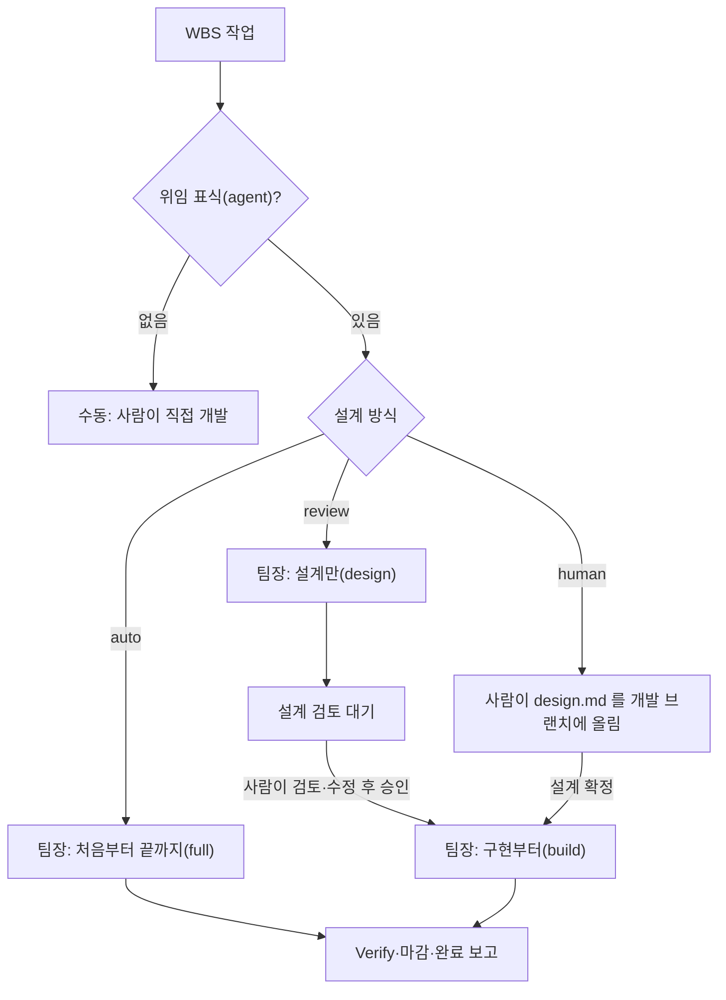
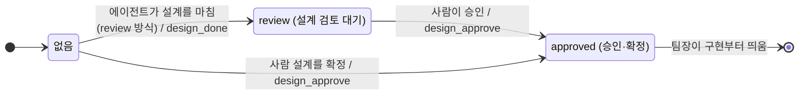
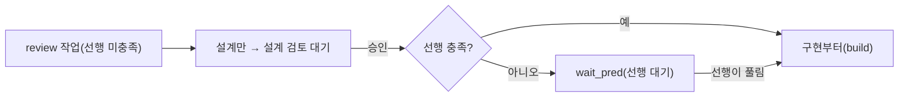
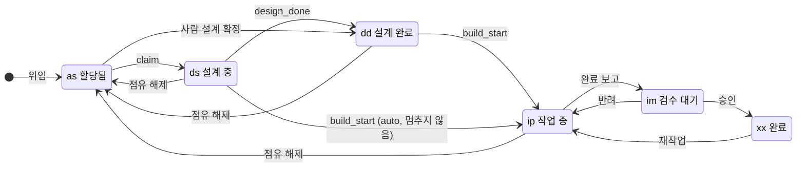

# 설계 상태와 개발자동 모드

2026-09-26 · 초안(방식 A 승인 대기)

작업마다 설계 방식(완전자동·검토·사람 설계)을 지정하고, 서버에 설계 상태(검토 대기·승인)를 기록해, 승인된 설계만 팀장이 구현하게 한다.
선행 문서: [dflow-dev 분할·실행 범위 설계 §14](2026-09-26-dflow-dev-skill-router-design.md), [idea.md](../../idea.md) 「완전자동/개발자동/수동」.

## 1. 확정된 결정

| 질문 | 결정 | 이유 |
| --- | --- | --- |
| 모드를 어느 단위로 지정하나 | 작업마다 지정 | 팀장 하나가 한 번 떠서 작업별로 다르게 처리한다. 모드를 섞으려고 팀장을 다시 띄우지 않는다 |
| 수동 모드는 무엇으로 표현하나 | 위임 표식(`agent` 태그) 없음 | 이미 있는 표식으로 충분하다. 새 값은 완전자동·검토·사람 설계 셋만 둔다 |
| 사람 설계의 준비 신호 | 화면의 「설계 확정」 버튼 | 쓰다 만 설계를 커밋해도 구현이 시작되지 않는다 |
| 에이전트 설계가 마음에 들지 않을 때 | 사람이 design.md 를 고친 뒤 「승인」 | 상태가 review → approved 하나뿐이라 단순하다. 다시 설계가 필요하면 주문을 취소하고 새로 맡긴다 |
| 승인 권한 | 완료 승인과 같음(관리자·서브트리 관리자) | 기존 가드 `loadOrderForAdmin` 을 그대로 쓴다 |
| 스킬을 나누나 | 나누지 않는다. `/dflow-dev` 하나에 `--scope` | 최대한 간단한 스킬 셋으로 간다(8절) |
| 설계를 끝낸 상태를 단계로 둘까 | 새 단계 `dd`(설계 완료)를 `ds` 와 `ip` 사이에 둔다 | 진행 중 단계(`ds`·`ip`) 뒤에는 끝남·대기 단계가 와야 한다. 구현 쪽 `ip` → `im` 과 짝을 맞춘다(7절) |

## 2. 네 모드의 흐름

모드는 WBS 작업의 "설계 방식" 값으로 정한다. 수동은 위임 표식을 켜지 않은 작업이라 팀장이 가져가지 않는다.

| 모드 | 설계 방식 값 | 누가 설계하나 | 구현 전 사람의 행동 | 팀장이 하는 일 |
| --- | --- | --- | --- | --- |
| 완전자동 | `auto` (기본값) | 에이전트 | 없음 | 처음부터 끝까지(`full`) 띄운다. 지금과 같다 |
| 설계 검토 | `review` | 에이전트 | design.md 를 검토·수정하고 「승인」 | 설계만(`design`) 띄워 멈춘다. 승인되면 구현부터(`build`)로 다시 띄운다 |
| 개발자동 | `human` | 사람 | design.md 를 개발 브랜치에 올리고 「설계 확정」 | 확정된 작업만 구현부터(`build`)로 띄운다. 확정 전에는 건드리지 않는다 |
| 수동 | (위임 표식 없음) | 사람 | 직접 코딩하거나 `/dflow-dev` 를 손으로 실행 | 가져가지 않는다 |

「승인」과 「설계 확정」은 화면에서 이름만 다르고, 서버에는 같은 값(`approved`)으로 기록된다. 사람 설계는 5개 절이 모두 있어야 하며, 빠진 절이
있으면 워커가 착수하지 않고 그 사실을 보고한다(지금 구현부터 규칙과 같다).

## 3. 설계 상태 전이

설계 상태는 주문(`agent_work_orders`)에 기록하고 값은 없음(`null`), `review`, `approved` 셋이다. 주문 상태(`ready`·`claimed`·`reported`)는
그대로 두고 이 칸만 더한다.

| 상황 | 주문 상태 | 단계 | 설계 상태 | 좌석·화면 표시 |
| --- | --- | --- | --- | --- |
| 에이전트가 설계를 마치고 멈춤(review 방식) | `claimed` | `dd` | `review` | 「설계 검토 대기」, 「승인」 버튼 |
| 검토자가 승인 | `claimed` | `dd` | `approved` | 「설계 승인됨」, 팀장이 곧 가져감 |
| 사람이 설계를 올리고 확정 | `ready` | `dd` | `approved` | 「설계 확정됨」, 팀장이 곧 가져감 |
| 주문 취소 후 새로 맡김 | `ready` | `as` | 없음 | 처음부터 다시 |

지금 좌석 표시에 쓰는 heartbeat `wait_review` 는 좌석 자세를 정하는 데만 남기고, WBS·허브 표시는 설계 상태 칸을 읽게 바꾼다.

## 4. 구현 방식 비교

방식 A 를 권한다. 설계 방식은 작업의 속성이고 주문보다 먼저 정해지므로 WBS 항목에, 설계 상태는 그 주문의 진행 이력이므로 주문에 둔다.

| 방식 | 설계 방식 저장 | 설계 상태 저장 | 장점 | 단점 |
| --- | --- | --- | --- | --- |
| A (권장) | `wbs_items.design_mode` (`auto`·`review`·`human`, DB CHECK) | `agent_work_orders.design_state` | 값 범위를 DB 가 막는다. 화면에서 고르기 쉽다. 주문을 새로 맡기면 설계 상태가 자연히 초기화된다 | 마이그레이션 1건 |
| B | 태그(`design:review`, `design:human`) | `agent_work_orders.design_state` | 설계 방식 쪽은 스키마 변경이 없다 | 오타를 막지 못하고 두 값이 동시에 붙을 수 있다. 태그 편집이 곧 모드 선택이라 불편하다 |
| C | (없음) | 주문 상태값을 늘림 | 칸이 늘지 않는다 | 상태를 나열하는 조회(`delegation.ts`, `ensureOrder.ts` 등)를 모두 고쳐야 하고, 빠뜨리면 조용히 누락된다 |

A 의 변경 범위:

- DB: 칸 둘, 새 단계 `dd`(7절), 전이 RPC(`apply_workflow_event`)에 사건 둘(`design_done`, `design_approve`), 되돌리기 SQL.
- 계약 2.11: 작업 목록·상세 응답에 `design_mode` 와 `design_state` 를 더하고, 워커가 부를 `design-done` 동사를 둔다.
- 화면: WBS 작업의 설계 방식 선택, 허브·좌석의 「승인」·「설계 확정」 버튼과 상태 표시.
- 스킬: 팀장의 후보 판정과 범위 결정, 워커의 설계만 멈춤·설계 선행 멈춤에서 `design-done` 호출.
- 운영 반영 순서: 스테이징 리허설 뒤 운영 DB 먼저, main 은 그다음.

## 5. 팀장 인자와 바뀌는 동작

팀장의 기본 동작은 작업별 설계 방식을 따른다. "설계만"과 "구현부터" 인자는 이번 실행에서 할 일을 좁히는 필터로 남긴다.

| 팀장 실행 | `auto` 작업 | `review` 작업 | `human` 작업 |
| --- | --- | --- | --- |
| 인자 없음(기본) | 처음부터 끝까지 | 설계만 하고 멈춤, 승인되면 구현 | 확정된 것만 구현 |
| 설계만 | 설계만 하고 멈춤 | 설계만 하고 멈춤 | 건드리지 않음 |
| 구현부터 | 건드리지 않음 | 승인된 것만 구현 | 확정된 것만 구현 |

기존 동작에서 바뀌는 점:

- 지금 "구현부터"는 이 PC 가 점유한 검토 대기 설계를 승인 없이 모두 이어 간다. 앞으로는 `approved` 인 작업만 이어 간다. "승인 전에는 구현하지
  않는다"는 기준을 지키려는 변경이다.
- 지금 "구현부터"는 개발 브랜치에 design.md 가 있기만 하면 후보로 본다. 앞으로는 「설계 확정」까지 눌러야 후보가 된다.
- 좌석의 「이어서 시작」은 「승인」으로 바뀐다. 승인하면 떠 있는 팀장이 다음 기상 때 가져가므로 별도의 재개 요청이 필요 없다.
- 사람이 `/dflow-dev` 를 손으로 돌릴 때의 `--scope` 동작은 바뀌지 않는다. 사람이 직접 실행하는 것 자체를 승인으로 본다.

## 6. 설계 선행과의 관계

설계 선행(계약 2.9, [병렬성·토큰 설계 §6](2026-09-26-dflow-parallel-token-design.md))은 그대로 둔다. 선행이 구현 중인 작업의 설계를 빈 슬롯에서 미리
해 두고 `wait_pred` 로 멈췄다가, 선행이 풀리면 같은 워크트리로 구현을 이어 가는 기능이다. 미리 설계하는 슬롯 수는 `DFLOW_DESIGN_AHEAD_MAX` 로 제한한다.

| 설계 방식 | 선행이 미충족일 때 |
| --- | --- |
| `auto` | 지금과 같다. 설계 선행 뒤 선행이 풀리면 사람 개입 없이 구현한다. 설계 상태 칸은 건드리지 않는다 |
| `review` | 설계만 하는 단계는 선행과 무관하게 돌므로 설계를 미리 해 둔다. 승인 뒤에도 선행이 남아 있으면 워커가 `wait_pred` 로 바꾸고, 선행이 풀리면 기존 설계 선행 재개 경로를 탄다. 구현은 승인과 선행 충족 두 조건을 모두 채워야 시작된다 |
| `human` | 사람이 설계하므로 설계 선행은 해당하지 않는다. 확정된 설계라도 선행이 풀릴 때까지는 팀장의 일반 선행 검사가 착수를 막는다 |

## 7. 진행 단계(stage)

새 단계 `dd`(설계 완료)를 `ds`(설계 중)와 `ip`(작업 중) 사이에 둔다. 단계는 `as`(할당됨) → `ds`(설계 중) → `dd`(설계 완료) → `ip`(작업 중) →
`im`(검수 대기) → `xx`(완료)가 된다. "~하는 중"인 단계는 `ds`·`ip` 둘이고, 각각 뒤에 "끝났고 다음을 기다리는" 단계(`dd`·`im`)가 온다.

| 코드 | 화면 문구 | 성격 |
| --- | --- | --- |
| `as` | 할당됨 | 착수 전 대기 |
| `ds` | 설계 중 | 진행 중 |
| `dd` (새) | 설계 완료 | 설계를 끝내고 검토·선행·구현 착수를 기다림 |
| `ip` | 작업 중 | 진행 중 |
| `im` | 검수 대기 | 구현을 끝내고 검수를 기다림 |
| `xx` | 완료 | 완료 |

이름을 「설계 검토 대기」가 아니라 「설계 완료」로 두는 이유: `dd` 에 머무는 이유가 셋이라서다(검토 대기, 사람 설계 확정 뒤 착수 대기, 설계 선행
뒤 선행 대기). 화면은 단계와 설계 상태를 조합해 이유를 보여 준다.

| 단계 + 설계 상태 | 화면 문구 |
| --- | --- |
| `dd` + `review` | 「설계 검토 대기」 |
| `dd` + `approved` | 「설계 승인됨」(에이전트 설계) 또는 「설계 확정됨」(사람 설계) |
| `dd` + 없음 | 「설계 완료」(auto 방식의 설계 선행 뒤 선행 대기) |

사건별 단계와 실적 크레딧(기본표 `as 0·ds 10·dd 20·ip 30·rw 50·im 80·xx 100`, `dd` 는 `ds` 처럼 선택 키):

| 사건 | 단계 | 실적 | 비고 |
| --- | --- | --- | --- |
| 위임(assign) | 없음 → `as` | 0 | |
| claim(계약 2.9 이상은 늘 설계 선행 claim) | `as` → `ds` | 10 | 이미 `dd` 면(사람 설계 확정) 단계를 내리지 않고 `dd` 를 유지한다 |
| design_done(새 사건) | `ds` → `dd` | 20 | 워커가 설계를 마치고 멈출 때 부른다(설계만 멈춤, 설계 선행의 `wait_pred`). 작업의 설계 방식이 `review` 면 서버가 설계 상태를 `review` 로 쓴다 |
| design_approve(새 사건) | `dd` 유지, 사람 설계 확정은 `as` → `dd` | 사람 설계 확정만 20 | 설계 상태를 `approved` 로 쓴다 |
| build_start | `ds`·`dd` → `ip` | 30 | auto 방식에서 멈추지 않고 이어 가면 `ds` 에서 바로 `ip` 로 간다 |
| 완료 보고(report_completion) | `ip` → `im` | 80 | |
| 승인(approve) | `im` → `xx` | 100 | |
| 반려·재작업(reject·rework) | → `ip` | 50(rw) | |
| 점유 해제(release) | → `as` | 0 | 설계 상태를 없음으로 되돌린다(설계는 처음부터 다시) |

설계 방식별 단계 흐름:

| 설계 방식 | 단계 흐름 |
| --- | --- |
| `auto` | `as` → `ds` → `ip` → `im` → `xx`. 설계 선행으로 멈추면 `ds` → `dd`(선행 대기) → `ip` |
| `review` | `as` → `ds` → `dd`(검토 대기 → 승인됨) → `ip` → `im` → `xx` |
| `human` | `as`(사람이 설계) → 「설계 확정」 → `dd` → claim(`dd` 유지) → `ip` → `im` → `xx` |

`dd` 를 더하면 0107 처럼 함께 고칠 곳: DB CHECK(`wbs_items_stage_check`), 전이 RPC, 크레딧표 기본값과 검증(`stageCredits.ts`, 설정 슬라이더),
단계 라벨과 i18n(`stageLabels.ts`), 단계 순서(`agentWork.ts` `STAGE_ORDER`), 엑셀·집계. 선행 판정은 바꾸지 않는다: 선행으로 인정하는 도달 단계는
`im`·`xx` 그대로이고, 설계 선행 허용 조건(미충족 선행이 모두 `ip`)에서 `dd` 는 `ds` 처럼 "구현 전"이다.

## 8. 스킬 구성

스킬은 나누지 않는다(사용자 결정, 최대한 간단한 스킬 셋). `/dflow-dev` 하나에 `--scope`(`full`·`design`·`build`)만 두고, 새 스킬이나 새 진입점을
만들지 않는다. 작업별 설계 방식은 데이터(WBS·주문)에 있고, 팀장이 그것을 읽어 `--scope` 를 정해 워커에 넘긴다. 워커 스킬은 범위만 알면 되고
설계 방식을 몰라도 된다.

- 토큰 이득은 이미 얻었다. 안내 본문이 단계 지도에 따라 그 단계 파일(`references/orch/`)만 읽게 하므로, 설계만 하는 워커는 구현 파일을 읽지 않는다.
- claim·브랜치·기준선·state.json·모델 결정·팀원 모드는 설계와 구현이 함께 쓰는 뼈대라 한 스킬에 두는 편이 어긋나지 않는다.
- 팀장의 spawn·재개·재시작·해소가 모두 `/dflow-dev <id8> --worker` 한 명령을 쓴다. 이 진입점은 바뀌지 않는다.

## 9. 다음에 정할 것

방식 A 를 승인하면 아래 항목을 권장안대로 설계에 적고, 다르게 정할 항목만 따로 받는다.

- [ ] 구현 방식 A 를 쓸지 (필수)
- [ ] 새 작업의 설계 방식 기본값: `auto` 로 둔다(권장). 프로젝트별 기본값은 필요해질 때 더한다.
- [ ] 설계 방식을 바꿀 수 있는 때: 주문이 `ready` 일 때만 허용한다(권장). 에이전트가 이미 점유한 뒤에 바꾸면 돌고 있는 워커와 어긋난다.
- [ ] 승인 취소: 두지 않는다(권장). 승인 뒤 설계를 다시 고쳐야 하면 주문을 취소하고 새로 맡긴다.
- [ ] 이미 검토 대기로 멈춘 작업: 마이그레이션이 좌석 heartbeat 가 `wait_review` 인 주문을 `review` 로 채운다(권장).
- [ ] 선행 미충족 `review` 작업의 설계 슬롯을 설계 선행 상한(`DFLOW_DESIGN_AHEAD_MAX`)에 센다(권장). 설계 검토 작업이 많을 때 모든
  슬롯이 설계에만 쓰여 구현이 밀리는 것을 막는다.
- [ ] 새 단계 코드 이름: `dd`(설계 완료)로 한다(권장).
- [ ] `dd` 실적 크레딧 기본값: 20 으로 한다(권장, `ds 10` 과 `ip 30` 사이). `ds` 처럼 선택 키로 둔다.
- [ ] auto 방식의 설계 선행 뒤 선행 대기도 `dd` 로 옮긴다(권장). 설계를 끝낸 작업이 "설계 중"으로 보이지 않게 한다.
- [ ] 운영 반영: 운영 서버는 아직 계약 2.9 라서, 이번 2.11 은 2.10 과 함께 운영에 올리게 된다. 시점은 따로 지시받을 때 정한다.

이 단계에서는 설계만 다루며, 구현은 설계 문서와 계획서를 승인받은 뒤에 시작한다.
